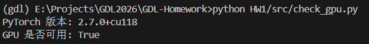
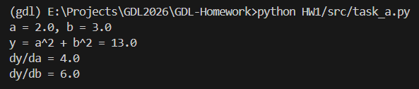
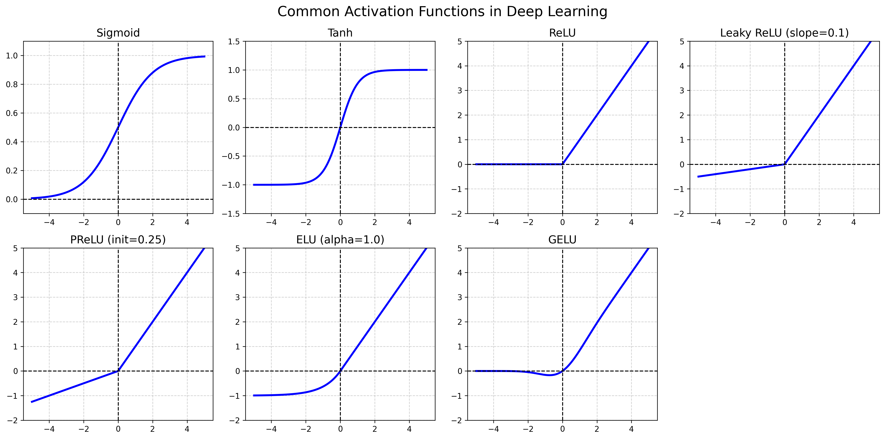
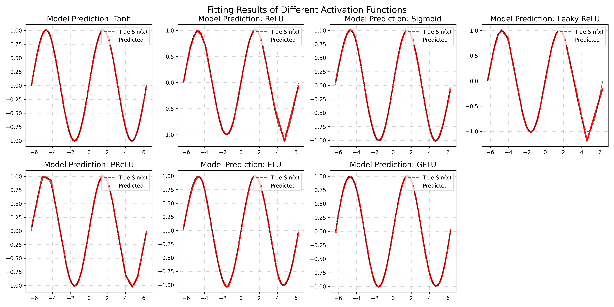

# Homework 1 实验报告

## 环境配置
* python 3.12
* torch 2.7.0 + cu118

[check_gpu.py](src/check_gpu.py) 运行结果：




## 任务 A：自动微分实验
在任务 A 中，我们利用 PyTorch 的 `autograd` 机制实现了对简单多元函数 $y = a^2 + b^2$ 的求导。通过设置 `requires_grad=True`，PyTorch 在前向传播时会动态构建计算图（Computational Graph），并在调用 `backward()` 时自动进行反向传播计算偏导数：$\frac{\partial y}{\partial a} = 2a$, $\frac{\partial y}{\partial b} = 2b$。这不仅验证了微积分的链式法则，同时也展示了深度学习框架能够解放手动求导的巨大作用。

[task_a.py](src/task_a.py) 运行结果：


---

## 任务 B & 任务 C：深度神经网络拟合正弦函数及激活函数分析

### 1. 数据集构建 (DataModule)
我们在 `SinDataModule` 中构建了用于拟合的正弦函数数据集：
* **数据范围**：在 $x \in [-2\pi, 2\pi]$ (即 `x_min = -6.283`, `x_max = 6.283`) 的连续区间内，均匀采样了 `num_samples = 10000` 个点。
* **数据生成**：特征为单维度的数值 $x$，目标标签为对应的正弦值 $y = \sin(x)$。
* **数据划分**：将生成的 10000 个样本按 `[0.8, 0.1, 0.1]` 的比例随机切分，即训练集 8000 个，验证集 1000 个，测试集 1000 个。
* **数据加载**：设置 `batch_size = 64`，并在训练集加载时开启 `shuffle=True`。

### 2. 模型架构 (SinNet & SinLitModule)
网络侧我们选用了一个基础的**单隐藏层多层感知机 (MLP)** 来完成非线性函数的拟合：
* **网络结构**：`输入层 (1) -> 隐藏层 (hidden_size=64) -> 激活函数层 -> 输出层 (1)`。整个网络通过 `nn.Sequential` 进行快速搭建。
* **损失函数 (Loss Function)**：我们使用均方误差 **MSE Loss** (`F.mse_loss`) 作为回归任务的损失函数。
* **优化器与调度器**：
  * 使用 **Adam 优化器**，初始学习率为 `0.01`。
  * 引入了 `ReduceLROnPlateau` 学习率调度器，监控 `val/loss`，当验证损失连续 10 个 epoch (patience) 不下降时，将学习率乘以 0.5。
* **训练配置**：最大迭代次数设定为 `50` 个 Epoch。

### 3. 激活函数发展史与改进点总结

在深度学习的演进中，激活函数扮演了解决线性不可分问题的核心角色：

1. **Sigmoid / Tanh (早期研究阶段)**
   - **特点**：平滑，将输出压缩到了 $(0, 1)$ 或 $(-1, 1)$的特定区间。早期常用于输出层（概率代表）和隐藏层的非线性变换。
   - **缺点**：
     - **梯度消失 (Vanishing Gradient)**：当输入值很大或很小时，曲线两端的斜率趋近于 0。这导致在进行反向传播时网络很难更新前层的参数。
     - **非零中心**：Sigmoid 的输出均值不是 0，会造成后续层的梯度更新方向出现“锯齿状”抖动。Tanh 解决了零中心问题，但梯度消失依然存在。
     - 包含指数运算，计算代销稍高。

2. **ReLU (里程碑阶段，Rectified Linear Unit)**
   - **特点**：$f(x) = \max(0, x)$。计算极快，且在正轴 $x>0$ 区间梯度恒为 1，直接**打破了梯度消失问题**，从而让训练更深层的神经网络（如 ResNet）成为可能。
   - **缺点**：**神经元死亡 (Dead ReLU)** 问题。如果初始化不好或学习率过大，导致神经元的输入陷入负数，则梯度永远为 0，该神经元永远无法更新。

3. **Leaky ReLU / PReLU / ELU / GELU (现代改进阶段)**
   - **Leaky ReLU**: $f(x) = \max(\alpha x, x), \alpha=0.01$。为了解决 Dead ReLU，给负半轴附带了微小的梯度 $\alpha$。
   - **PReLU (Parametric ReLU)**: 与 Leaky ReLU 类似，但参数 $\alpha$ 是可学习的，提高了网络在复杂数据集上的拟合能力，但代价是稍微增加了模型的参数量。
   - **ELU (Exponential Linear Unit)**: 在特征为负数时具有非零平滑梯度，能够产生平均值为零的输出有助于网络稳健性，减少了偏置偏移，但在负半轴的指数运算开销较大。
   - **GELU (Gaussian Error Linear Unit)**: 近些年 Transformer 模型和现代 CNN（如 ConvNeXt）中非常流行。它是平滑版的 ReLU，在 $x=0$ 附近拥有非零且平滑的导数，使得深度模型在复杂分布的拟合上拥有更稳定的性能。



### 4. 实验分析：正弦函数 $f(x) = \sin(x)$ 的拟合表现

在构建包含单隐层（设神经元数目即 `hidden_size=64`）的前馈网络以拟合正弦函数时，从损失曲线（Loss）的走势可以看出，由于我们要拟合的数据结构相对简单，所有网络最终**均能成功收敛，并在训练后期（约 4k steps 之后）将训练集和验证集的误差都降到了极小的量级**。然而，**在初期的收敛速度和训练稳定性上**，不同激活函数的表现大相径庭：

* **使用 PReLU 与 Tanh 激活函数 (初期收敛极快)**
  - **实际表现**：图中显示，**PReLU（蓝线）的收敛速度位居榜首**，损失值在极少的 step 内呈断崖式下降；**Tanh（紫线）紧随其后**，同样展现出极佳的快速收敛能力。
  - **原因分析**：Tanh 的优势在于其输出范围恰好为 $[-1, 1]$ 且具有 S 型曲率，在先验形状上与正弦波有着极高的契合度，网络只需极少步数便能对齐目标函数。而 PReLU 则凭借正半轴的无界性及负半轴**可学习的参数**，在保留线性非饱和特性的同时，提供了极其高效的梯度反向传播，从而在此类简单的一维拟合任务中斩获了最快的优化速度。

* **使用 ReLU 与 Leaky ReLU 激活函数 (速度尚可，稳定性存在差异)**
  - **实际表现**：基础 ReLU（粉线）初期下降较快，但在验证集（val/loss）的前 2k steps 中出现了**明显的震荡和毛刺（Spikes）**；相比之下，Leaky ReLU（浅绿线）的下降曲线则平滑稳定得多。
  - **原因分析**：这反映了基础 ReLU 的“硬截断”特性（负半轴梯度为 0）在拟合存在正负交替的正弦波时，容易导致部分神经元频繁进入非激活状态，引发训练初期的不振荡。而 Leaky ReLU 引入的微小负半轴梯度，有效提高了容错率，显著改善了初期的训练稳定性。

* **使用 Sigmoid 激活函数 (收敛较缓慢)**
  - **实际表现**：Sigmoid（橙线）的下降过程非常平稳，但初期收敛速度明显慢于 PReLU、Tanh 等函数。
  - **原因分析**：由于 Sigmoid 的输出属于 $(0, 1)$，非零中心特性会导致反向传播时的梯度发生偏移。为了让神经网络的输出映射回 $[-1, 1]$ 并对齐正弦线，网络不得不耗费更多的迭代步数（Steps）来调整偏置（Bias），从而抵消这种坐标轴漂移。

* **使用 ELU 与 GELU 激活函数 (表现出乎意料的分化)**
  - **实际表现**：在这组实验中，GELU（红线）表现中规中矩，下降速度处于中等水平。然而出乎意料的是，**ELU（黄线）在此次实验中呈现出最慢的初期收敛速度**，其损失值在前 3k steps 内始终处于最高位，直到中后期才逐渐追平其他函数。
  - **原因分析**：这与通常认为 ELU 具备极快收敛特性的直觉有所偏离。在视觉上，它们确实能拟合出极其柔和圆润的曲线，但在当前单隐层拟合正弦波的具体初始化或超参数设定下，ELU 负半轴的指数运算在初期的参数空间寻优中可能遇到了一定的阻力，导致前期误差下降缓慢。

> **不同激活函数的拟合结果对比图：**



> **不同激活函数的训练 Loss(MSE) 下降曲线对比：**

|  |  |
|:---:|:---:|
| **左：训练集 Loss 收敛曲线对比** | **右：验证集 Loss 收敛曲线对比** |

---

### 5. 如何在任务中切换激活函数

基于我们项目的 Hydra 和 PyTorch Lightning 模板架构，我们已经在 `HW1/src/models/components/sin_net.py` 中实现了对不同激活函数的动态路由。

当前可以通过以下命令行方式快速覆盖 YAML 的默认配置，随时对比不同表现：

```bash
# 使用基础的 Tanh (默认)
python HW1/src/train.py experiment=task_b_sin

# 使用 ReLU 查看"分段线性"折线现象
python HW1/src/train.py experiment=task_b_sin model.net.activation=relu

# 使用 Sigmoid
python HW1/src/train.py experiment=task_b_sin model.net.activation=sigmoid

# 使用进阶激活函数
python HW1/src/train.py experiment=task_b_sin model.net.activation=leaky_relu
python HW1/src/train.py experiment=task_b_sin model.net.activation=prelu
python HW1/src/train.py experiment=task_b_sin model.net.activation=elu
python HW1/src/train.py experiment=task_b_sin model.net.activation=gelu
```
