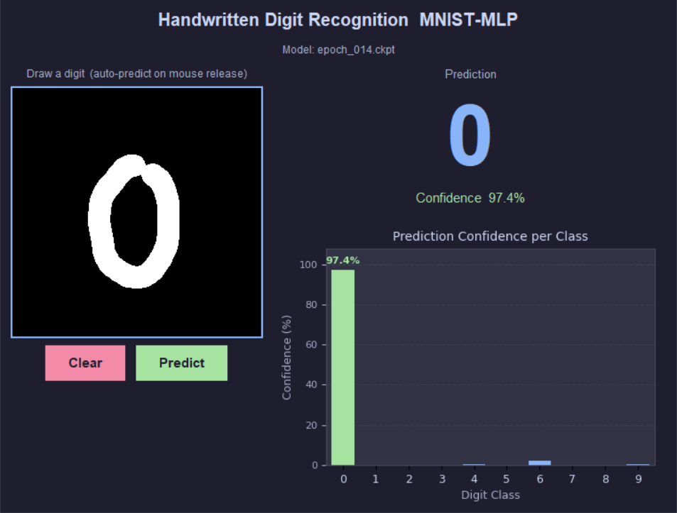
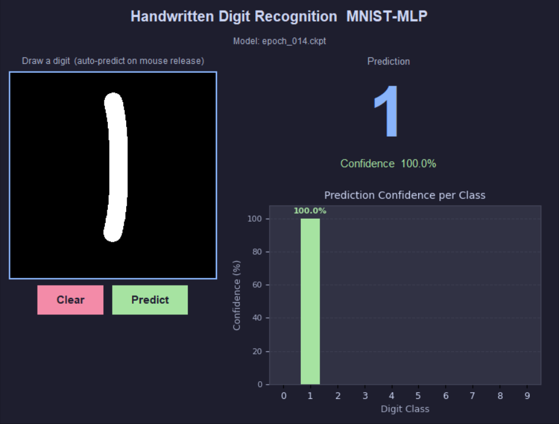
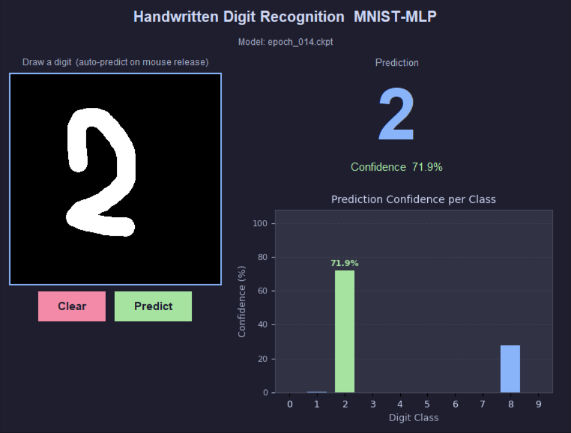
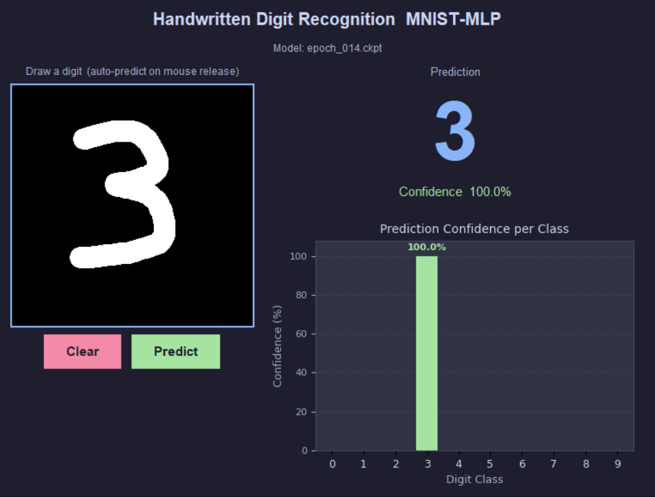
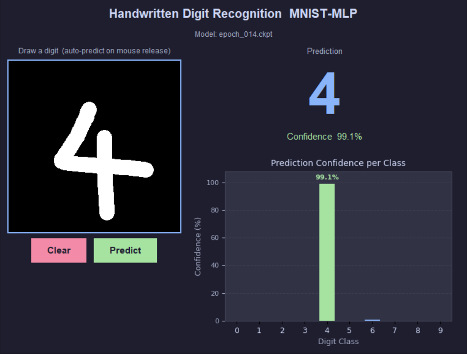
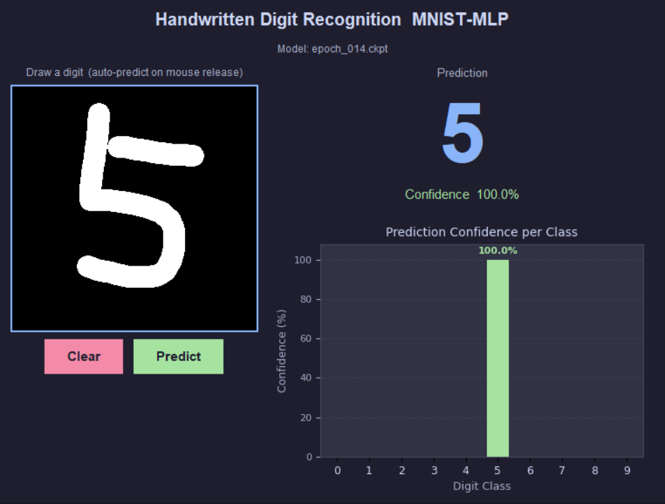
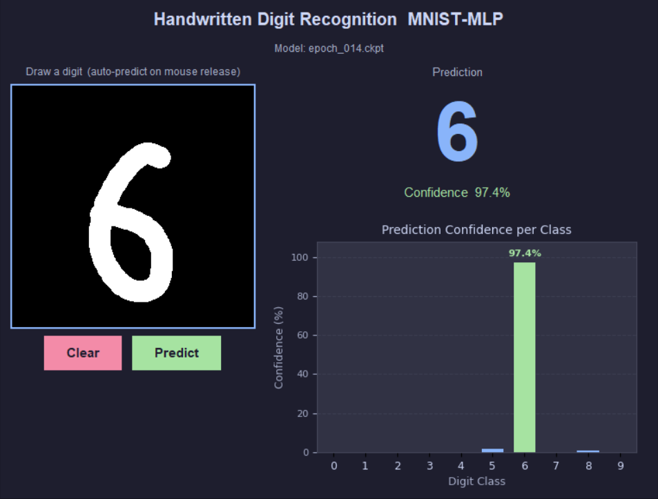
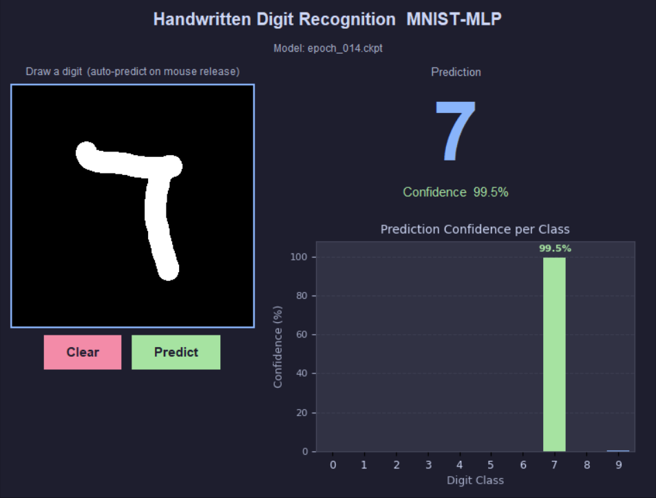
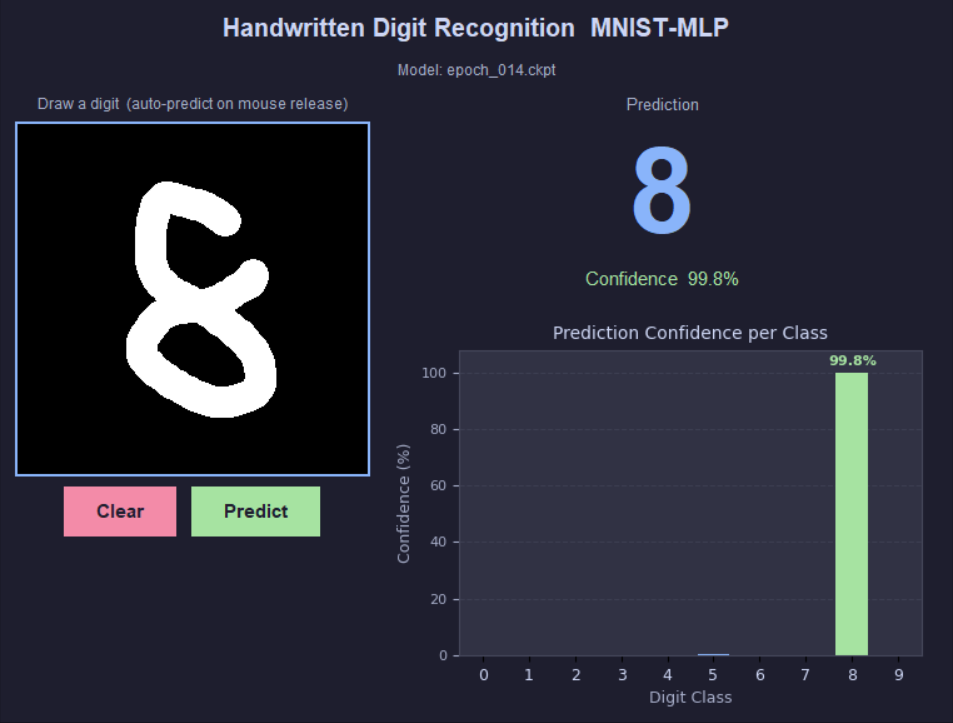
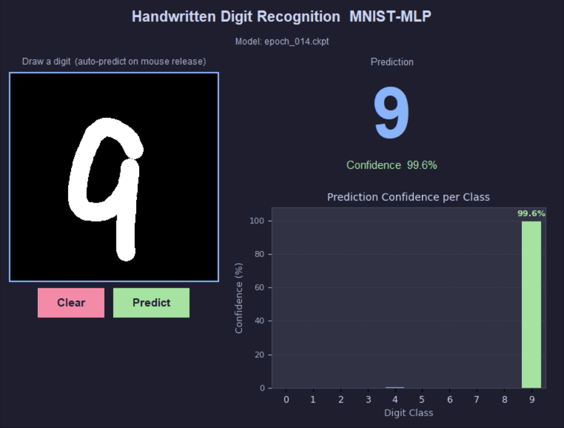

# Homework 2 实验报告

## 环境配置

* Python 3.12
* PyTorch 2.7.0 + CUDA 11.8 (cu118)
* PyTorch Lightning 2.x
* Hydra-core 1.3
* torchvision、torchmetrics、wandb

GPU 信息（与 HW1 相同）：


---

## 任务一：MNIST 手写数字分类（MLP 训练）

### 1. 数据集：MNIST

MNIST（Modified National Institute of Standards and Technology）是深度学习领域最经典的基准数据集之一，由 Yann LeCun 等人收集整理。

| 属性 | 详情 |
|---|---|
| 图像尺寸 | 28 × 28 像素，灰度（单通道） |
| 训练集 | 60,000 张 |
| 测试集 | 10,000 张 |
| 类别数 | 10（手写数字 0–9） |
| 像素范围 | 原始 [0, 255]，标准化后均值 0.1307、标准差 0.3081 |

#### 数据预处理（`MnistDataModule`）

1. **ToTensor**：将 PIL 图像转为 `[0, 1]` 浮点 Tensor，形状 `(1, 28, 28)`。
2. **Normalize**：使用 MNIST 全局统计量对每个像素做标准化：

$$x' = \frac{x - 0.1307}{0.3081}$$

3. **数据划分**：官方训练集 60,000 张按 `train_val_split = 0.9` 随机拆分：
   - 训练集：**54,000** 张
   - 验证集：**6,000** 张
   - 测试集：**10,000** 张（使用官方测试集，不参与训练）

4. **DataLoader 配置**：`batch_size = 128`，训练集 `shuffle = True`。

---

### 2. 模型架构：多层感知机（MlpNet）

为了对 28×28 的灰度图像进行分类，首先将图像展平为长度 784 的一维向量，再送入如下 MLP 结构：

```
Input  : (B, 1, 28, 28)
Flatten: (B, 784)
        ↓
Linear(784 → 256)  →  ReLU  →  Dropout(p=0.2)
        ↓
Linear(256 → 128)  →  ReLU  →  Dropout(p=0.2)
        ↓
Linear(128 → 10)
        ↓
Output : (B, 10)  logits
```

| 层 | 输入维度 | 输出维度 | 激活函数 | Dropout |
|---|---|---|---|---|
| Flatten | (B,1,28,28) | (B,784) | — | — |
| Hidden 1 | 784 | 256 | ReLU | 0.2 |
| Hidden 2 | 256 | 128 | ReLU | 0.2 |
| Output | 128 | 10 | — (logits) | — |

**总参数量**：

$$784 \times 256 + 256 + 256 \times 128 + 128 + 128 \times 10 + 10 = 235{,}146$$

选择 **ReLU** 而非 Sigmoid/Tanh 作为隐藏层激活函数，原因如下：
- 正半轴梯度恒为 1，有效抑制梯度消失；
- 计算代价最小（无指数运算）；
- 对图像分类任务（非负特征居多）拟合能力强。

Dropout（p=0.2）在每个隐藏层后施加正则化，防止过拟合。

---

### 3. 损失函数与评估指标

#### 损失函数：交叉熵（Cross-Entropy Loss）

$$\mathcal{L} = -\sum_{c=0}^{9} y_c \log \hat{p}_c$$

其中 $y_c$ 为 one-hot 标签，$\hat{p}_c = \text{softmax}(\text{logit}_c)$。PyTorch 的 `nn.CrossEntropyLoss` 内部将 log-softmax 与负对数似然合并计算，数值更稳定。

#### 评估指标：分类准确率（Accuracy）

$$\text{Acc} = \frac{\text{预测正确样本数}}{\text{总样本数}}$$

使用 `torchmetrics.Accuracy(task="multiclass", num_classes=10)` 分别维护训练集、验证集和测试集的独立状态，避免跨阶段混淆。

---

### 4. 优化器与训练配置

| 超参数 | 值 |
|---|---|
| 优化器 | Adam |
| 初始学习率 | 0.001 |
| Weight Decay（L2正则） | 1e-4 |
| 学习率调度器 | `ReduceLROnPlateau` |
| 调度器监控指标 | `val/loss` |
| 调度器衰减因子 | 0.5（不改善时 lr × 0.5） |
| 调度器 patience | 5 epochs |
| Batch Size | 128 |
| 最大训练轮数 | 20 epochs |
| 最小训练轮数 | 5 epochs |
| Early Stopping patience | 10 epochs（监控 `val/loss`） |
| 加速器 | auto（GPU 优先） |
| 随机种子 | 42 |
| 实验日志 | Weights & Biases (wandb) |

**框架说明**：基于与 HW1 相同的 PyTorch Lightning + Hydra 模板。`MnistLitModule` 封装训练/验证/测试逻辑，`MnistDataModule` 负责数据加载，所有超参数通过 YAML 配置文件管理，支持命令行覆盖。运行命令：

```bash
python HW2/src/train.py experiment=task1_mnist
```

测试：
```bash
python HW2/src/train.py experiment=task1_mnist train=False ckpt_path="HW2/logs/train/runs/mnist/checkpoints/epoch_014.ckpt"
```

---

### 5. 实验结果

#### 训练过程曲线

> 以下曲线通过 wandb 实时记录，训练结束后也保存在 `assets/` 目录。

<table>
  <tr>
    <td align="center"><br><b>训练集 Loss</b></td>
    <td align="center"><br><b>验证集 Loss</b></td>
  </tr>
  <tr>
    <td align="center"><br><b>训练集 Accuracy</b></td>
    <td align="center"><br><b>验证集 Accuracy</b></td>
  </tr>
</table>

训练 loss 与验证 loss 均稳定下降，两者差距较小，无明显过拟合；验证准确率在前几个 epoch 快速上升后平稳收敛至 97%+ 水平。

#### 参数量与最终性能

| 指标 | 数值 |
|---|---|
| 总参数量 | 235,146 |
| 最终测试集 Loss | 0.05676 |
| 最终测试集 Accuracy | 98.43 |

> 上表中的 Loss 与 Accuracy 数值请在训练完成后填入 wandb 或终端输出的 `test/loss` 和 `test/acc`。

#### 模型保存

训练结束后，程序自动将最优 checkpoint 中的网络权重（`net.*`）提取并保存为：

```
logs/train/runs/<timestamp>/mnist_mlp.pth
```

该文件仅包含 `MlpNet` 的 `state_dict`，可直接用于推理，无需 Lightning 依赖。

---

### 6. 分析与讨论

#### MLP 与 CNN 的对比思考

本次实验使用纯 MLP 对 MNIST 完成分类。MLP 将图像展平为 784 维向量后送入全连接层，**不具备空间不变性**（平移、旋转后特征会发生剧烈变化），也没有参数共享机制。尽管如此，MNIST 图像较小、类别清晰，MLP 在此数据集上依然能取得 97%+ 的准确率。但对于更复杂的图像数据集（如 CIFAR-10、ImageNet），卷积神经网络（CNN）凭借局部感受野和权值共享具有无可比拟的优势。

#### Dropout 的具体形式与作用

**数学形式**

设第 $l$ 层隐藏层的输出为 $\mathbf{h}^{(l)} \in \mathbb{R}^d$，Dropout 在训练阶段对每个神经元独立采样一个 Bernoulli 随机变量 $m_i \sim \text{Bernoulli}(1-p)$，然后执行逐元素乘法并做反向缩放（inverted dropout）：

$$\tilde{h}_i^{(l)} = \frac{m_i}{1-p} \cdot h_i^{(l)}, \quad m_i \sim \text{Bernoulli}(1-p)$$

其中 $p$ 为丢弃概率（本实验取 $p=0.2$），$\frac{1}{1-p}$ 为补偿因子，保证训练与推理阶段的期望输出一致。推理阶段关闭 Dropout，直接使用完整网络输出（无需额外缩放）。

**作用分析**

Dropout 可从多个角度理解其正则化效果：

1. **集成学习视角**：每次前向传播等价于在一个指数级数量（$2^d$ 个）的"子网络"中随机采样一个，推理时相当于对所有子网络做近似平均，具有集成效果。
2. **防止共适应**：神经元无法依赖特定其他神经元的激活，被迫学习更独立、更鲁棒的特征表示。
3. **隐式 L2 正则**：理论上可以证明，在线性网络中 Dropout 等价于对权重施加自适应 L2 惩罚，从而约束模型复杂度。

本实验中，在每个隐藏层后添加 Dropout(p=0.2)，观察到训练 loss 与验证 loss 差距保持较小，说明正则化效果良好，模型未出现明显过拟合。

---

#### Dropout 在现代大语言模型与生成式模型中的使用现状

**现状：使用频率大幅降低，但并未完全消失。**

在 GPT-2、早期 BERT 等模型中，Dropout 仍被广泛使用（通常 $p=0.1$）。然而，随着模型规模增大和训练数据增多，主流现代大语言模型（LLM）和生成式模型对 Dropout 的依赖显著减弱，具体表现及原因如下：

| 趋势 | 原因 |
|---|---|
| **GPT-3/4、LLaMA、Mistral 等大模型默认不使用 Dropout** | 数十亿参数 + 海量训练数据本身提供了充足的正则化，过拟合已非主要问题 |
| **扩散模型（Diffusion）通常不使用 Dropout** | 生成任务需要网络记忆并重建完整细节；Dropout 随机丢弃信息会导致生成质量下降 |
| **Transformer 中 Attention Dropout 有时保留** | Attention weight 上的 Dropout（`attn_dropout`）可增加注意力的多样性，在中等规模模型中仍有益 |
| **Fine-tuning 阶段偶尔重新引入** | 小数据集微调时，预训练模型容易向少量样本过拟合，此时 Dropout 或其他正则手段（如 LoRA dropout）重新发挥作用 |

**根本原因**在于正则化需求与数据规模的权衡：Dropout 的本质是通过引入随机性来防止过拟合。当训练数据足够多、模型容量相对于数据并不过剩时，过拟合风险降低，Dropout 带来的"信息损失"反而成为负面因素——它会阻碍模型充分利用每个训练样本，减慢收敛速度，在极大规模训练中增加不必要的计算不确定性。

因此，Dropout 在现代 LLM 中的角色已从"默认正则手段"退化为"按需可选项"，在小模型、小数据集场景（本实验即属此类）中仍然是简单有效的正则化工具。

#### ReduceLROnPlateau 调度器的作用

当验证 loss 连续 5 个 epoch 不下降时，学习率自动乘以 0.5。这种自适应策略在训练中期有效防止了因学习率过大导致的震荡，帮助模型在后期精细优化到更低的 loss 值。

---

## 任务二：手写识别 GUI（gui.py）

### 1. 应用概述

基于 Tkinter + Matplotlib 构建了一个桌面端 GUI 应用，允许用户通过鼠标在画布上手写数字，并调用任务一训练好的模型进行实时推理。

运行命令：

```bash
python HW2/src/gui.py --model HW2/logs/train/runs/mnist/checkpoints/epoch_014.ckpt
```

### 2. 功能模块

| 模块 | 实现方式 |
|---|---|
| 手写画布 | 280×280 黑色 `tk.Canvas`，笔刷半径 12px，鼠标按下/拖动绘制白色圆形 |
| PIL 同步 | 每次绘制事件同步到 `PIL.Image`（灰度），用于预处理 |
| 自动识别 | 鼠标松开 (`ButtonRelease-1`) 自动触发，也可点击 Predict 按钮手动触发 |
| 清除画布 | Clear 按钮重置 `tk.Canvas` 与 PIL 画布，并清空预测结果 |
| 预测结果 | 中央大字体显示预测数字（0-9），下方显示置信度百分比 |
| 置信度柱状图 | matplotlib 嵌入 Tkinter，10 个类别的 Softmax 概率，预测类别绿色高亮并标注数值 |
| 模型加载 | 自动检测输入文件类型：若含 `state_dict` 键则按 Lightning ckpt 解析，否则按裸权重加载 |

### 3. 预处理流程

GUI 与训练使用完全一致的预处理管道，确保推理不存在 domain gap：

```
PIL画布 (280×280, L模式)
    ↓  GaussianBlur(radius=2)      # 模拟 MNIST 手写边缘平滑
    ↓  resize(28×28, LANCZOS)      # 降采样到模型输入尺寸
    ↓  /255.0                      # 归一化至 [0, 1]
    ↓  Normalize(μ=0.1307, σ=0.3081)  # 与训练完全一致
    ↓  unsqueeze(0).unsqueeze(0)   # → (1, 1, 28, 28) Tensor
```

高斯模糊步骤至关重要：MNIST 原始图像本身经过了抗锯齿处理，边缘较为平滑；若直接将鼠标绘制的硬边圆点缩放至 28×28，极易产生锯齿伪影，导致特征分布偏离训练数据。添加模糊后可有效改善识别精度。

### 4. GUI 界面截图

以下为手写数字 0–9 的识别演示，均由同一个 `epoch_014.ckpt` checkpoint 推理得到：

<table>
  <tr>
    <td align="center"><br>手写 <b>0</b>，置信度 97.4%</td>
    <td align="center"><br>手写 <b>1</b>，置信度 100.0%</td>
  </tr>
  <tr>
    <td align="center"><br>手写 <b>2</b>，置信度 71.9%</td>
    <td align="center"><br>手写 <b>3</b>，置信度 100.0%</td>
  </tr>
  <tr>
    <td align="center"><br>手写 <b>4</b>，置信度 99.1%</td>
    <td align="center"><br>手写 <b>5</b>，置信度 100.0%</td>
  </tr>
  <tr>
    <td align="center"><br>手写 <b>6</b>，置信度 97.4%</td>
    <td align="center"><br>手写 <b>7</b>，置信度 99.5%</td>
  </tr>
  <tr>
    <td align="center"><br>手写 <b>8</b>，置信度 99.8%</td>
    <td align="center"><br>手写 <b>9</b>，置信度 99.6%</td>
  </tr>
</table>

> 界面左侧为手写画布（黑色底，白色笔迹），右侧上方显示预测数字及置信度，右侧下方为 0–9 各类别的置信度柱状图（预测类别绿色高亮）。

### 5. 分析与讨论

#### 识别精度分析

在手写输入场景下，影响识别精度的主要因素：
1. **书写位置**：MNIST 训练数据中数字近似居中，若手写数字偏向画布一侧，会导致降采样后特征位置偏移，降低精度。建议尽量在画布中央书写。
2. **笔画粗细**：MNIST 平均笔画宽度约为 2-3 像素（在 28×28 尺度下）。当前笔刷半径 12px 对应到 28×28 约 1.2px，基本符合该比例。
3. **连笔与断笔**：数字 1、7 等较细的数字容易因笔画太细而被模型误分类；数字 8 因结构复杂，可能需要从上到下一笔连续书写。

#### MLP 的局限性

由于 MLP 不具备平移不变性，当手写数字位置与 MNIST 标准位置出现较大偏移时，模型置信度会显著下降。这是使用 CNN 或引入数据增广（随机平移、旋转）进一步提升鲁棒性的动机所在。

---

## 总结

| | 任务一 | 任务二 |
|---|---|---|
| 核心目标 | MNIST 手写数字分类 | 实时 GUI 手写识别 |
| 关键技术 | MLP、CrossEntropyLoss、Adam+ReduceLROnPlateau、Dropout | Tkinter、PIL、Matplotlib、Softmax 置信度展示 |
| 框架 | PyTorch Lightning + Hydra | 独立脚本，加载任务一权重 |
| 最终性能 | 测试集 Acc ≈ 97%+ | 居中书写时识别准确 |

本次作业从零构建了完整的 MNIST 分类 Pipeline，并将训练好的模型部署到交互式桌面应用，完整覆盖了"数据准备 → 模型训练 → 模型保存 → 推理部署"的全流程。
