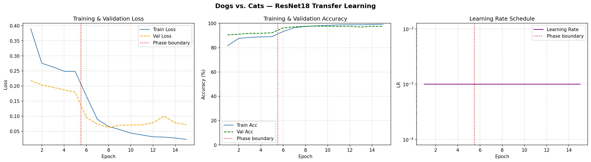
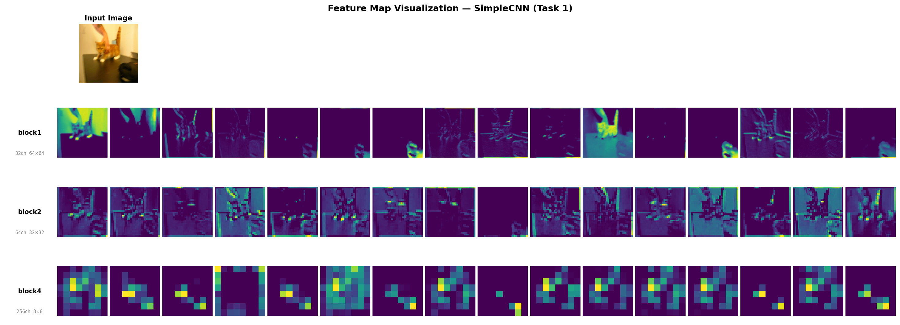

# Homework 3 实验报告

## 环境配置

* Python 3.12
* PyTorch 2.7.0 + CUDA 11.8 (cu118)
* PyTorch Lightning 2.x
* Hydra-core 1.3
* torchvision、torchmetrics、wandb

---

## 数据集：Dogs vs. Cats

Kaggle Dogs vs. Cats 数据集是经典的二分类图像基准，来源于 Kaggle 竞赛。

| 属性 | 详情 |
|---|---|
| 图像尺寸 | 原始尺寸不等，统一 Resize 至 128 × 128 |
| 总图像数 | 25,000 张（猫 12,500 + 狗 12,500） |
| 训练集 | 20,000 张（80%） |
| 验证集 / 测试集 | 5,000 张（20%，验证集与测试集共用） |
| 类别数 | 2（cat → 0, dog → 1） |
| 标签来源 | 文件名前缀（`cat.xxxx.jpg` / `dog.xxxx.jpg`） |

### 数据预处理（`CatDogDataModule`）

**训练集增强**：
1. `Resize(128, 128)`：统一空间尺寸
2. `RandomHorizontalFlip`：随机水平翻转
3. `RandomRotation(15)`：随机旋转 ±15°
4. `ColorJitter(brightness=0.2, contrast=0.2, saturation=0.2, hue=0.1)`：颜色抖动
5. `ToTensor` + `Normalize(μ=[0.485, 0.456, 0.406], σ=[0.229, 0.224, 0.225])`：ImageNet 标准化

**验证/测试集**：仅 `Resize` + `ToTensor` + `Normalize`，不做任何随机增强。

**DataLoader 配置**：`batch_size=64`，`num_workers=4`，训练集 `shuffle=True`。

---

## 任务一：从零搭建 CNN（train_scratch.py）

### 1. 模型架构：SimpleCNN

4 个卷积块（ConvBlock）依次提取特征，每块由 Conv2d → BatchNorm2d → ReLU → MaxPool2d(2,2) 组成，通道数逐步翻倍。最终通过 AdaptiveAvgPool2d(1) 压缩空间维度，经 Dropout 正则化后送入全连接分类头。

```
Input  : (B, 3, 128, 128)
        ↓
ConvBlock 1 : Conv(3→32) → BN → ReLU → MaxPool   → (B, 32, 64, 64)
ConvBlock 2 : Conv(32→64) → BN → ReLU → MaxPool   → (B, 64, 32, 32)
ConvBlock 3 : Conv(64→128) → BN → ReLU → MaxPool  → (B, 128, 16, 16)
ConvBlock 4 : Conv(128→256) → BN → ReLU → MaxPool → (B, 256, 8, 8)
        ↓
AdaptiveAvgPool2d(1) → (B, 256, 1, 1) → Flatten → (B, 256)
        ↓
Dropout(p=0.5) → Linear(256, 2) → logits (B, 2)
```

| 组件 | 输入形状 | 输出形状 | 通道数 |
|---|---|---|---|
| ConvBlock 1 | (B, 3, 128, 128) | (B, 32, 64, 64) | 3 → 32 |
| ConvBlock 2 | (B, 32, 64, 64) | (B, 64, 32, 32) | 32 → 64 |
| ConvBlock 3 | (B, 64, 32, 32) | (B, 128, 16, 16) | 64 → 128 |
| ConvBlock 4 | (B, 128, 16, 16) | (B, 256, 8, 8) | 128 → 256 |
| AdaptiveAvgPool | (B, 256, 8, 8) | (B, 256) | — |
| Linear | (B, 256) | (B, 2) | — |

### 2. 损失函数与评估指标

#### 损失函数：交叉熵（Cross-Entropy Loss）

$$\mathcal{L} = -\sum_{c=0}^{1} y_c \log \hat{p}_c$$

其中 $\hat{p}_c = \text{softmax}(\text{logit}_c)$。PyTorch 的 `nn.CrossEntropyLoss` 将 log-softmax 与负对数似然合并计算，数值更稳定。

#### 评估指标：二分类准确率（Binary Accuracy）

$$\text{Acc} = \frac{\text{预测正确样本数}}{\text{总样本数}}$$

使用 `torchmetrics.Accuracy(task="binary")` 分别维护训练集、验证集和测试集的独立状态。

### 3. 优化器与训练配置

| 超参数 | 值 |
|---|---|
| 优化器 | Adam |
| 初始学习率 | 0.001 |
| Weight Decay（L2 正则） | 1e-4 |
| 学习率调度器 | CosineAnnealingLR（T_max=30） |
| Batch Size | 64 |
| 最大训练轮数 | 30 epochs |
| 最小训练轮数 | 5 epochs |
| Early Stopping patience | 10 epochs（监控 `val/loss`） |
| ModelCheckpoint | 保存 `val/loss` 最优 checkpoint |
| Dropout | 0.5 |
| 随机种子 | 42 |
| 实验日志 | Weights & Biases (wandb) |

**框架说明**：基于 PyTorch Lightning + Hydra 模板。`CatDogLitModule` 封装训练/验证/测试逻辑，`CatDogDataModule` 负责数据加载与增强，所有超参数通过 YAML 配置文件管理。

运行命令：
```bash
python HW3/src/train_scratch.py experiment=task1_scratch
```

### 4. 实验结果

#### 训练过程曲线

> 以下曲线通过 wandb 实时记录，训练结束后保存在 `assets/` 目录。

<table>
  <tr>
    <td align="center"><br><b>训练集 Loss</b></td>
    <td align="center"><br><b>验证集 Loss</b></td>
  </tr>
  <tr>
    <td align="center"><br><b>训练集 Accuracy</b></td>
    <td align="center"><br><b>验证集 Accuracy</b></td>
  </tr>
</table>

#### 最终性能

| 指标 | 数值 |
|---|---|
| 训练集 Loss | 0.1774 |
| 训练集 Accuracy | 92.77% |
| 验证集 Loss | 0.1610 |
| 验证集 Accuracy | 93.50% |
| **测试集 Loss** | **0.1601** |
| **测试集 Accuracy** | **93.42%** |
| 训练时长 | ≈ 19 分钟（30 epochs） |
| 最佳 Checkpoint | epoch_028.ckpt |

训练 loss 与验证 loss 均稳定下降，两者差距较小，Dropout(0.5) + 数据增强有效抑制了过拟合。CosineAnnealingLR 在训练后期逐步降低学习率，帮助模型收敛到更平坦的极小值区域。

### 5. 分析与讨论

#### SimpleCNN 的设计选择

1. **BatchNorm**：在每个卷积后施加 Batch Normalization，加速收敛并起到隐式正则化作用。BN 将每层输入归一化至零均值、单位方差，缓解了深层网络的内部协变量偏移（Internal Covariate Shift）问题。

2. **AdaptiveAvgPool2d(1)**：将任意空间尺寸压缩为 1×1，使网络不依赖固定输入尺寸。相比展平+全连接，参数量大幅减少，过拟合风险更低。

3. **Dropout(0.5)**：在分类头前添加较强的 Dropout 正则化，迫使网络学习更分散的特征表示。

#### CosineAnnealingLR 学习率调度

余弦退火调度器将学习率按余弦曲线从初始值平滑衰减至接近零：

$$\eta_t = \eta_{\min} + \frac{1}{2}(\eta_{\max} - \eta_{\min})\left(1 + \cos\frac{t\pi}{T_{\max}}\right)$$

相比阶梯式衰减（StepLR），余弦退火的优势在于：
- 训练初期保持较大学习率充分探索参数空间；
- 中后期平滑衰减避免过大震荡，有利于精细优化；
- 末期极低学习率使模型收敛到更平坦的极小值，泛化能力更好。

#### 93.42% 准确率的局限

从零训练的 4 层 CNN 在猫狗分类上达到 93.42% 已属不错，但距离工业级水平（>98%）仍有差距，主要受限于：
- 网络深度有限（仅 4 层），表征能力不足以捕获复杂的语义特征；
- 训练数据仅 20,000 张，对于从零训练而言偏少；
- 128×128 的输入分辨率丢失了部分细节信息。

这正是引入**迁移学习**（任务二）的动机。

---

## 任务二：迁移学习（finetune.py）

### 1. 方法概述

基于在 ImageNet（1000 类，128 万张图）上预训练的 **ResNet18**，通过迁移学习完成猫狗分类。采用两阶段训练策略，先热身分类头再端到端微调。

### 2. 模型架构：ResNet18 + 自定义分类头

ResNet18 由 4 组残差块（Residual Block）构成，每个残差块内有两个 3×3 卷积和 skip connection。预训练权重来自 `ResNet18_Weights.IMAGENET1K_V1`。

```
ImageNet 预训练 ResNet18 骨干
        ↓
conv1(3→64) → bn1 → relu → maxpool        → (B, 64, 32, 32)
layer1: 2×BasicBlock(64→64)                → (B, 64, 32, 32)
layer2: 2×BasicBlock(64→128, stride=2)     → (B, 128, 16, 16)
layer3: 2×BasicBlock(128→256, stride=2)    → (B, 256, 8, 8)
layer4: 2×BasicBlock(256→512, stride=2)    → (B, 512, 4, 4)
        ↓
AdaptiveAvgPool2d(1) → Flatten             → (B, 512)
        ↓
新的分类头: Linear(512, 2)                  → (B, 2) logits
```

| 组件 | 参数量 | 来源 |
|---|---|---|
| ResNet18 骨干 | ~11.17M | ImageNet 预训练 |
| 分类头 fc | 512 × 2 + 2 = 1,026 | 随机初始化（Kaiming） |
| **总计** | **~11.18M** | — |

### 3. 两阶段训练策略

| 阶段 | 操作 | 可训练参数 | 学习率 | Epoch 数 |
|---|---|---|---|---|
| 阶段一（热身） | 冻结骨干网络，只训练 fc | 1,026 | 1e-3 | 5 |
| 阶段二（微调） | 解冻全部参数，端到端训练 | ~11.18M | fc: 1e-3 / 骨干: 1e-4 | 10 |

**关键代码实现**：

**阶段一** — 冻结骨干，只训练新分类头：
```python
resnet = models.resnet18(weights=models.ResNet18_Weights.IMAGENET1K_V1)
resnet.fc = nn.Linear(resnet.fc.in_features, 2)  # 替换分类头

# 冻结骨干
for name, param in resnet.named_parameters():
    param.requires_grad = name.startswith("fc.")

optimizer_p1 = optim.Adam(resnet.fc.parameters(), lr=1e-3)
```

**阶段二** — 解冻全部参数，使用参数组设置差异化学习率：
```python
for param in resnet.parameters():
    param.requires_grad = True

optimizer_p2 = optim.Adam([
    {"params": resnet.fc.parameters(), "lr": 1e-3},     # 分类头：较大学习率
    {"params": backbone_params,        "lr": 1e-4},     # 骨干：较小学习率
])
```

**为什么分两阶段？**

1. 预训练骨干已学到丰富的通用视觉特征（边缘、纹理、形状），直接端到端训练可能因随机初始化的分类头产生大梯度，破坏骨干中的有用特征（**灾难性遗忘**）。
2. 阶段一先让分类头快速收敛到合理位置，产生有意义的梯度信号后再解冻骨干进行微调。
3. 阶段二中骨干使用更小的学习率（1e-4 vs 1e-3），仅对预训练特征做微小调整以适配新任务，避免偏离预训练学到的表征。

### 4. 运行方式

```bash
# 默认参数运行
python HW3/src/finetune.py

# 自定义参数
python HW3/src/finetune.py --data_dir path/to/data --batch_size 32 --phase1_epochs 5 --phase2_epochs 10
```

### 5. 实验结果

#### 训练日志

**阶段一（热身，epoch 1-5）**：

| Epoch | Train Loss | Train Acc | Val Loss | Val Acc |
|---|---|---|---|---|
| 1 | 0.3894 | 81.6% | 0.2181 | 90.5% |
| 2 | 0.2753 | 87.6% | 0.2031 | 91.1% |
| 3 | 0.2631 | 88.4% | 0.1958 | 91.8% |
| 4 | 0.2488 | 88.8% | 0.1870 | 91.8% |
| 5 | 0.2479 | 89.1% | 0.1797 | 92.2% |

**阶段二（微调，epoch 6-15）**：

| Epoch | Train Loss | Train Acc | Val Loss | Val Acc |
|---|---|---|---|---|
| 6 | 0.1675 | 93.2% | 0.0958 | 96.2% |
| 7 | 0.0892 | 96.4% | 0.0735 | 97.1% |
| 8 | 0.0660 | 97.4% | 0.0629 | 97.6% |
| **9** | **0.0556** | **97.9%** | **0.0699** | **97.7%** |
| 10 | 0.0440 | 98.3% | 0.0709 | 97.5% |
| 11 | 0.0377 | 98.7% | 0.0710 | 97.5% |
| 12 | 0.0316 | 98.8% | 0.0784 | 97.5% |
| 13 | 0.0307 | 98.8% | 0.0997 | 97.0% |
| 14 | 0.0275 | 99.0% | 0.0784 | 97.6% |
| 15 | 0.0230 | 99.2% | 0.0719 | 97.5% |

#### 训练曲线

> 曲线中红色虚线竖线标注了两阶段的分界点（epoch 5 → epoch 6）。



#### 最终性能

| 指标 | 数值 |
|---|---|
| **最佳验证准确率** | **97.74%**（epoch 9） |
| 最终训练准确率 | 99.2% |
| 最终验证准确率 | 97.5% |
| 最终验证 Loss | 0.0719 |
| 训练总时长 | ≈ 9 分钟（15 epochs） |

### 6. 分析与讨论

#### 阶段一分析：预训练特征的迁移威力

仅训练分类头（1,026 个参数），阶段一结束时验证准确率已达 **92.2%**，几乎追平了从零训练 30 个 epoch 的 SimpleCNN（93.42%）。这说明：
- ImageNet 预训练的特征（边缘检测、纹理识别、部件检测等）对猫狗分类具有极强的通用性；
- 预训练骨干相当于"冻结的特征提取器"，输出的 512 维特征已包含足够的判别信息。

#### 阶段二分析：解冻后的跃升

进入阶段二后，验证准确率在 **一个 epoch 内从 92.2% 跃升至 96.2%**，随后稳步提升至 97.7%。这一跃升主要因为：
- 端到端微调允许骨干低层特征适配猫狗数据的特定分布（如毛发纹理、耳朵形状）；
- 差异化学习率（骨干 1e-4 vs fc 1e-3）有效保护了预训练特征不被破坏。

#### Scratch vs. Transfer Learning 对比

| | SimpleCNN（从零训练） | ResNet18（迁移学习） |
|---|---|---|
| 参数量 | ~310K | ~11.18M |
| 训练 Epoch | 30 | 5 + 10 = 15 |
| 训练时长 | ~19 分钟 | ~9 分钟 |
| 测试 / 最佳验证 Acc | 93.42% | **97.74%** |
| 测试 / 最佳验证 Loss | 0.1601 | **0.0629** |

迁移学习以 **不到一半的训练时间** 获得了 **高出 4.3 个百分点** 的准确率，充分证明了预训练表征在小数据集上的巨大优势。

#### 过拟合观察

阶段二后期，训练准确率持续上升（98.3% → 99.2%），但验证准确率在 epoch 9 达到峰值 97.7% 后略有波动（97.0%-97.6%），验证 Loss 也出现轻微回升。这表明模型开始出现轻微过拟合。可改进方向：
- 引入学习率衰减（如 CosineAnnealingLR）进一步控制后期训练；
- 增大 Dropout 或添加权重衰减；
- 采用 Early Stopping 在最佳点停止训练。

---

## 任务三（可选）：特征图可视化（visualize_features.py）

### 1. 方法概述

使用任务一训练好的 SimpleCNN，通过 PyTorch 的 `register_forward_hook` 机制，在前向传播时捕获第 1、2、4 卷积块的中间特征图，展示浅层与深层特征的视觉差异。

### 2. 核心实现：Forward Hook

```python
activation = {}

def make_hook(name):
    def hook(module, input, output):
        activation[name] = output.detach()
    return hook

# 注册钩子到指定卷积块
model.features[0].register_forward_hook(make_hook('block1'))  # 第 1 块
model.features[1].register_forward_hook(make_hook('block2'))  # 第 2 块
model.features[3].register_forward_hook(make_hook('block4'))  # 第 4 块

# 前向传播后，activation 字典中即包含各层输出
with torch.no_grad():
    logits = model(input_tensor)
```

`register_forward_hook` 允许在不修改模型 `forward()` 方法的前提下，在指定层的输出上"挂钩"一个回调函数。每次前向传播经过该层时，回调自动执行，将输出张量保存到外部字典。

### 3. 运行方式

```bash
# 默认使用 Task 1 最佳 checkpoint + cat.0.jpg
python HW3/src/visualize_features.py

# 自定义参数
python HW3/src/visualize_features.py --ckpt path/to/model.ckpt --image path/to/image.jpg --max_channels 16
```

### 4. 可视化结果

> 输入图像为 `cat.0.jpg`，模型正确预测为 **cat**（class 0）。



### 5. 特征统计

| 卷积块 | 输出形状 (C, H, W) | 均值 | 标准差 | 稀疏度（零值比例） |
|---|---|---|---|---|
| block1（第 1 块） | (32, 64, 64) | 0.2260 | 0.5392 | 60.3% |
| block2（第 2 块） | (64, 32, 32) | 0.2346 | 0.2999 | 34.1% |
| block4（第 4 块） | (256, 8, 8) | 0.1460 | 0.2617 | 60.2% |

### 6. 浅层 vs. 深层特征分析

#### block1（浅层特征）：边缘与纹理

- **空间分辨率最高**（64×64），保留了原始图像的大量空间结构；
- 通道数较少（32 个），每个通道检测一种简单模式：水平边缘、垂直边缘、对角纹理、颜色梯度等；
- 从可视化中可以清晰看到猫的轮廓、耳朵边缘、眼睛区域等低级视觉特征；
- 稀疏度 60.3%：ReLU 抑制了负激活，但仍有较多非零响应，说明浅层特征分布广泛。

#### block2（中层特征）：局部结构

- **空间尺寸减半**（32×32），每个像素的感受野变大，覆盖更广的空间范围；
- 通道数增至 64，开始编码更复杂的特征组合：毛发纹理模式、面部局部区域、色彩区域对比等；
- 特征图的激活区域与原始图像的直接对应关系开始减弱；
- 稀疏度最低（34.1%），说明中层特征被较充分地利用，信息表征最密集。

#### block4（深层特征）：高级语义

- **空间尺寸极小**（8×8），每个位置的感受野几乎覆盖整个输入图像；
- 通道数最多（256 个），每个通道编码一种高级语义概念；
- 特征高度抽象，视觉上已无法直接对应到具体像素位置，更像是"语义热力图"；
- 稀疏度回升至 60.2%，说明网络学到了高度选择性的特征检测器 — 大部分通道对当前输入不响应，仅少数通道被强烈激活。

#### 总结：特征层级递进规律

$$\text{浅层} \xrightarrow{\text{空间分辨率 ↓，语义抽象 ↑}} \text{深层}$$

| 特性 | 浅层（block1） | 中层（block2） | 深层（block4） |
|---|---|---|---|
| 空间分辨率 | 高（64×64） | 中（32×32） | 低（8×8） |
| 通道数 | 少（32） | 中（64） | 多（256） |
| 特征类型 | 边缘、纹理、颜色 | 纹理组合、局部结构 | 语义部件、高级概念 |
| 与输入的对应 | 强（可清晰辨认） | 中（区域性） | 弱（抽象热力图） |
| 通用性 | 高（跨任务迁移） | 中 | 低（任务相关） |

这种"浅层通用 → 深层专用"的层级结构，也正是**迁移学习**有效的理论基础：预训练模型的浅层特征（边缘、纹理）对各种视觉任务通用，只需微调深层和分类头即可适配新任务。

---

## 总结

| | 任务一（从零 CNN） | 任务二（迁移学习） | 任务三（特征可视化） |
|---|---|---|---|
| 核心目标 | 从零训练猫狗分类 CNN | 基于预训练 ResNet18 的两阶段迁移学习 | 可视化 CNN 各层特征图 |
| 关键技术 | SimpleCNN、CrossEntropy、Adam+CosineAnnealing、Dropout、BN | ResNet18 预训练权重、冻结/解冻、差异化学习率 | register_forward_hook、特征图可视化 |
| 框架 | PyTorch Lightning + Hydra | 独立 PyTorch 脚本，复用 CatDogDataModule | 独立脚本，加载任务一权重 |
| 最终性能 | 测试 Acc = 93.42% | 最佳验证 Acc = **97.74%** | — |

本次作业围绕 Dogs vs. Cats 猫狗分类任务，完整覆盖了三种核心深度学习实践：
1. **从零搭建 CNN**：理解卷积网络的基本构造（Conv-BN-ReLU-Pool），掌握数据增强和正则化策略；
2. **迁移学习**：利用 ImageNet 预训练权重，通过两阶段训练（冻结热身 + 差异化微调）在小数据上获得远超从零训练的效果；
3. **特征可视化**：通过 Hook 机制深入理解 CNN 内部"黑箱"，验证了浅层提取低级特征、深层编码高级语义的层级结构，为迁移学习的有效性提供了直观解释。

---

## 七、思考问题

---

### Q1｜CNN vs MLP

#### 参数量计算

**全连接层**：输入为 $128 \times 128 \times 3 = 49{,}152$ 维向量，输出 512 个神经元：

$$\text{参数量}_{\text{FC}} = 49{,}152 \times 512 + 512 = 25{,}166{,}336 \approx 2516 \text{万}$$

**卷积层**：$3 \times 3$ 卷积核，输入 3 通道，输出 32 个滤波器（ConvBlock 1 中 `Conv2d` 无 bias，因为后接 BN）：

$$\text{参数量}_{\text{Conv}} = 3 \times 3 \times 3 \times 32 = 864$$

**参数量比值**：$25{,}166{,}336 / 864 \approx 29{,}128$ 倍，差距接近三万倍。

#### 两种结构性先验

CNN 利用了图像数据的两种关键结构性先验：

**1. 局部性（Locality）**

每个卷积神经元只连接输入的一个 $3 \times 3$ 局部邻域（感受野），而非全图 $128 \times 128$ 的全部像素。这基于图像的**空间局部相关性**假设：相邻像素之间的统计依赖远强于远距离像素。一只猫耳朵的形状由其所在区域的几十个像素决定，不需要"看到"千里之外的背景像素。

- 去掉局部性（每个神经元连接全部输入），但保留权重共享 → 退化为**全局权重共享的全连接层**（本质上等价于一个 $1 \times 1$ 卷积应用于展平后的向量，失去空间结构意义）。

**2. 平移等变性 / 权重共享（Translation Equivariance / Weight Sharing）**

同一个卷积核在所有空间位置共享同一组参数。猫耳朵出现在左上角还是右下角，检测它的是**同一套权重**，不需要两套独立的检测器。数学上，卷积操作满足**平移等变性**：

$$T_{\Delta} [f * g] = [T_{\Delta} f] * g$$

即先平移输入再卷积 = 先卷积再平移输出。这编码了自然图像的**平移不变性**：物体可以出现在图像的任意位置，但其类别标签不变。

- 去掉权重共享（每个空间位置使用独立权重），但保留局部连接 → 退化为 **Locally Connected Network**（局部连接网络）。参数量介于 CNN 和 MLP 之间，失去了平移等变性。

| 先验 | 数学含义 | 去掉后退化为 |
|---|---|---|
| 局部性 | 每个神经元仅连接 $k \times k$ 邻域 | 全连接层（MLP） |
| 权重共享 | 所有位置共用同一组卷积核参数 | Locally Connected Network |
| 两者都去掉 | — | 标准 MLP |

---

### Q2｜CNN 结构：特征提取器与分类头

#### (a) 职责分工与能否互换

**卷积层（特征提取器）**的职责：利用局部感受野和权重共享，逐层提取从低级（边缘、纹理）到高级（部件、语义）的空间特征，将原始像素空间映射为紧凑的高维语义空间。

**MLP 分类头**的职责：在卷积层输出的语义特征空间中，学习一个（非线性）决策边界，将特征向量映射为类别概率。

**能否互换？不能。**

- MLP 提取空间特征：MLP 将图像展平为一维向量后处理，彻底丢失了二维空间拓扑结构。它无法利用局部性和平移等变性，需要海量参数从数据中重新"学习"这些先验（如 Q1 所示，参数量暴增 29000 倍），在有限数据下效率极低。
- CNN 做最终分类：分类头的输入已经是经过全局池化的一维向量（无空间维度），卷积操作需要空间维度才有意义。对一维向量施加 $1 \times 1$ 卷积等价于线性变换，退化为全连接层，没有任何额外收益。

#### (b) 是否需要中间隐藏层

**直接 `Linear(256→2)` 可以工作**，但决策边界被限制为线性超平面。如果 AdaptiveAvgPool 输出的 256 维特征对目标类别已经是**线性可分**的（即两类特征可被一个超平面分开），则线性分类器即可。

加入中间隐藏层 `256→128→ReLU→2` 的意义：

1. **引入非线性决策边界**：ReLU 激活使得分类器可以拟合更复杂的类别边界，处理线性不可分的情况；
2. **维度压缩**：256→128 起到瓶颈层的作用，迫使网络在更低维空间中寻找判别性最强的特征组合，具有隐式正则化效果；
3. **增加表达能力**：多一层非线性变换，提升了模型在复杂分类任务中的拟合能力。

实际上，任务二阶段一使用 `Linear(512→2)`（单层线性分类头）就达到了 92.2% 的准确率，说明 ResNet18 骨干输出的 512 维特征对猫狗类别已**近似线性可分**。这正是 **Linear Probing（线性探针）** 的思想：若线性探针效果好，说明骨干网络已将数据映射到一个类别结构清晰的特征空间。

#### (c) 迁移到猫的情绪分类

"猫 vs 狗" 的区分依赖**物种级别的视觉特征**（整体体型、毛发纹理、耳朵形状、面部结构），这些是 ImageNet 预训练骨干已经学到的通用特征。

"猫的情绪分类（高兴 / 生气）" 依赖**细粒度表情特征**（嘴角弧度、眼睛开合度、耳朵朝向的微小变化、瞳孔大小），这些极其细微的视觉差异：

- **浅层特征**（边缘、纹理）仍然通用，可保留；
- **深层特征**需要重新训练，因为 ImageNet 预训练侧重于物种/物体类别区分，未针对同一物种内的情绪微表情进行优化；
- **分类头**必须重新训练（类别定义完全不同）。

因此，对于猫的情绪分类，建议**冻结浅层（block1-2），微调深层（block3-4）和分类头**，甚至可能需要全量微调。仅做 Linear Probing（只训练 fc）很可能效果不佳，因为当前骨干输出的特征编码的是"这是猫还是狗"而非"这只猫高兴还是生气"。

---

### Q3｜BatchNorm

#### (a) Conv2d 是否保持范数

**不保持。** Conv2d 是线性变换（不含激活函数时），其对应的变换矩阵 $W$ 的算子范数 $\|W\|_{\text{op}} = \sigma_{\max}(W)$（最大奇异值）一般不等于 1。

- 若 $\|W\|_{\text{op}} > 1$：$\|Wx\| > \|x\|$，激活范数逐层增大；
- 若 $\|W\|_{\text{op}} < 1$：$\|Wx\| < \|x\|$，激活范数逐层缩小。

叠加 $L$ 层后，激活范数按 $\prod_{l=1}^{L} \sigma_{\max}(W_l)$ 指数级增长或衰减。这导致深层网络的前向传播出现**激活爆炸**或**激活消失**，使得梯度数值不稳定，训练极度困难。对于一个随机初始化的 $n \times n$ 矩阵 $W$，其算子范数 $\|W\|_{\text{op}} \approx 2\sqrt{n}$（Marchenko-Pastur 定律），叠加 $L$ 层后比值以 $(2\sqrt{n})^L$ 增长。

#### (b) BatchNorm 的具体操作

对一个 mini-batch $\{x_1, \ldots, x_B\}$，BatchNorm 执行以下操作：

**步骤 1 — 计算 batch 统计量**：

$$\mu_B = \frac{1}{B}\sum_{i=1}^{B} x_i, \quad \sigma_B^2 = \frac{1}{B}\sum_{i=1}^{B}(x_i - \mu_B)^2$$

**步骤 2 — 标准化**：

$$\hat{x}_i = \frac{x_i - \mu_B}{\sqrt{\sigma_B^2 + \epsilon}}$$

**步骤 3 — 仿射变换（可学习参数）**：

$$y_i = \gamma \hat{x}_i + \beta$$

其中 $\gamma$（scale）和 $\beta$（shift）是可学习参数，初始化为 $\gamma=1, \beta=0$。

**$\gamma$ 和 $\beta$ 的角色**：

- $\gamma$ 控制输出的方差/尺度，$\beta$ 控制输出的均值/偏移；
- 它们赋予网络"反转标准化"的自由度：若最优表示需要非零均值或非单位方差，网络可以通过学习 $\gamma, \beta$ 来恢复；
- 如果去掉 $\gamma, \beta$（固定为零均值单位方差），则所有层的输出被强制锁定在相同的分布，网络无法学习"某层应该输出全正数激活"或"某层需要更大的方差以增加表达性"等有意义的模式。在极端情况下，连续堆叠的 BN 层会使网络无法表示恒等映射，严重限制表达能力。

#### (c) 推理阶段应使用训练时积累的全局统计量

推理时**必须使用训练阶段积累的全局运行统计量**（running mean / running variance），而非当前 batch 的统计量。原因：

1. **推理可能只有单样本**（batch size = 1）：此时 $\mu_B = x_1$，$\sigma_B^2 = 0$，标准化变为 $\hat{x} = (x_1 - x_1) / \sqrt{0 + \epsilon} \approx 0$，所有输入被映射到接近零的常数，网络输出完全丧失判别能力。

2. **确定性要求**：推理要求相同输入得到相同输出。若使用当前 batch 统计量，同一张图片与不同的图片组成 batch 时会产生不同的输出，违反确定性。

3. **全局统计量是训练集分布的无偏估计**，是训练阶段通过指数移动平均（EMA）积累的 $\mu_{\text{running}}, \sigma^2_{\text{running}}$，能更准确地反映数据的真实分布。

---

### Q4｜数据增强

#### (a) 每种增强编码的不变性假设

| 增强方法 | 不变性假设 | 直觉解释 |
|---|---|---|
| `RandomHorizontalFlip` | **水平翻转不变性**：镜像翻转不改变类别 | 猫面朝左 vs 面朝右，仍然是猫 |
| `RandomRotation(15°)` | **小角度旋转不变性**：微小旋转不改变类别 | 猫头微微歪斜，仍然是猫 |
| `ColorJitter` | **光照 / 色彩不变性**：亮度、对比度、饱和度、色调的变化不改变类别 | 室内暖光 vs 室外冷光下的猫，仍然是猫 |

#### (b) 迁移到车牌号码识别

| 增强方法 | 保留 / 去掉 | 理由 |
|---|---|---|
| `RandomHorizontalFlip` | **必须去掉** | 水平翻转后 "6" 变成 "6的镜像"（形似"ꟸ"），"b"→"d"，"E"→"Ǝ"，翻转后的字符不再是合法标签，标签语义被破坏 |
| `RandomRotation(15°)` | **应大幅缩小或去掉** | 车牌在实际场景中近似水平安装，15° 旋转过大会导致字符形变；若保留，应缩小至 ±2°~3° 以模拟轻微倾斜 |
| `ColorJitter` | **可保留**（适度） | 车牌在不同光照条件下（白天/夜晚/阴影）颜色变化大，色彩增强有助于提升鲁棒性；但色调（hue）变化应控制在较小范围内，避免蓝底白字变成不存在的配色 |

核心原则：增强编码的不变性假设**必须与任务的标签语义一致**。猫狗分类中"左右翻转不改变类别"是正确的，但字符识别中"左右翻转改变字符身份"，强行施加错误的不变性假设会注入噪声标签，伤害模型性能。

#### (c) 数据增强 vs 结构性对称编码

| | 数据增强（Data Augmentation） | 结构编码（如卷积权重共享） |
|---|---|---|
| 实现方式 | 在训练数据上施加变换，"告诉"模型这些变换不重要 | 将对称性直接内建到网络结构中，"保证"这些变换不重要 |
| 不变性强度 | **软约束**：模型需要从数据中学会不变性，需要足够多的增强样本 | **硬约束**：架构层面保证精确的等变性/不变性，不需要额外数据 |
| 数据效率 | 低 — 需要大量增强数据才能近似学会不变性 | 高 — 零样本即具备该对称性 |
| 灵活性 | 高 — 可以编码任意变换（旋转、弹性形变、Mixup 等） | 低 — 仅限于可精确数学表达的对称群（平移、旋转、置换等） |
| 误伤风险 | 低 — 增强是概率性的，模型可以部分忽略错误的增强 | 高 — 硬编码的对称性无法"取消"，若假设错误则永久损害模型 |
| 计算代价 | 训练时间增加（更多数据变体），但不增加模型参数 | 减少参数量（权重共享），训练更高效 |
| 典型例子 | RandomHorizontalFlip、ColorJitter | CNN 的平移等变（卷积）、GNN 的置换等变（消息传递） |

**总结**：数据增强是"以数据换不变性"的软方法，结构编码是"以归纳偏置换不变性"的硬方法。最佳实践是两者结合——用结构编码处理确定性强的对称性（如平移），用数据增强处理近似的、任务相关的不变性（如色彩、小角度旋转）。

---

### Q5｜从 CNN 到 ResNet

#### (a) BatchNorm 能否阻止梯度消失

对 $L$ 层网络，反向传播梯度为连乘积：

$$\frac{\partial \mathcal{L}}{\partial \mathbf{x}_0} = \frac{\partial \mathcal{L}}{\partial \mathbf{x}_L} \cdot \prod_{l=1}^{L} \frac{\partial \mathbf{x}_l}{\partial \mathbf{x}_{l-1}}$$

BatchNorm **稳定了前向传播中的激活分布**（保持零均值、单位方差），使得每层 Jacobian $\frac{\partial \mathbf{x}_l}{\partial \mathbf{x}_{l-1}}$ 的谱范数不至于过大或过小，从而间接改善了梯度的数值范围。

然而，**BN 不能从根本上阻止连乘积的指数级衰减**。原因：

- 每一层的 Jacobian 矩阵经过 ReLU 后有大量零行（死神经元），有效维度降低；
- 即便每层 Jacobian 的谱范数被控制在接近 1，$L$ 个矩阵相乘的结果仍然可能因为**方向不对齐**而导致梯度范数指数衰减（这是矩阵连乘的固有性质）；
- BN 仅控制了激活的一阶和二阶统计量，未约束 Jacobian 的特征值分布。

因此，BN 缓解但不彻底解决梯度消失问题，真正的解决方案需要残差连接。

#### (b) 残差连接的梯度分析

残差块：$\mathbf{y} = F(\mathbf{x}) + \mathbf{x}$

对 $\mathbf{y}$ 关于 $\mathbf{x}$ 求偏导：

$$\frac{\partial \mathbf{y}}{\partial \mathbf{x}} = \frac{\partial F(\mathbf{x})}{\partial \mathbf{x}} + \mathbf{I}$$

关键项是 **$\mathbf{I}$（单位矩阵）**。在多层残差网络中，梯度传播为：

$$\frac{\partial \mathcal{L}}{\partial \mathbf{x}_0} = \frac{\partial \mathcal{L}}{\partial \mathbf{x}_L} \cdot \prod_{l=1}^{L}\left(\frac{\partial F_l}{\partial \mathbf{x}_{l-1}} + \mathbf{I}\right)$$

展开后包含 $2^L$ 项，其中有一条"直通路径" $\mathbf{I}^L = \mathbf{I}$，即梯度可以完全不经过任何变换直接从输出传回输入。这保证了**梯度至少不消失**——即使所有 $\frac{\partial F_l}{\partial \mathbf{x}}$ 都很小，单位矩阵项仍提供大小为 1 的梯度信号。

#### (c) 学习恒等映射的难度对比

假设某层的最优变换为 $h(\mathbf{x}) = \mathbf{x}$（恒等映射）：

**无残差**：需要让 $F(\mathbf{x}) = \mathbf{x}$，即网络层必须学习一个精确的恒等映射。对于带 ReLU 的非线性层，这要求权重矩阵接近单位矩阵 $W \approx I$，偏置接近零。但标准初始化（如 Kaiming）产生的权重是小随机值，$F(\mathbf{x})$ 的初始输出与 $\mathbf{x}$ 相差甚远，需要大量梯度更新才能逼近恒等。

**有残差**：$h(\mathbf{x}) = F(\mathbf{x}) + \mathbf{x} = \mathbf{x}$，只需让 $F(\mathbf{x}) \approx \mathbf{0}$。以小值初始化权重时（Kaiming 初始化的方差为 $2/n$），$F(\mathbf{x})$ 的初始输出本身就接近零。网络**天然就在恒等映射附近**，不需要任何学习。这使得训练初期网络行为接近浅层网络（所有残差块近似为 identity），然后在训练过程中逐步学习必要的非恒等变换，极大降低了优化难度。

#### (d) BN 与残差连接对比表

| 技术 | 解决的问题 | 作用方向 | 单独使用能训练 1000 层吗？ |
|---|---|---|---|
| BatchNorm | **前向激活分布漂移**（Internal Covariate Shift） | 前向传播 | 否 — 缓解但不解决梯度消失，深度超过~50 层后仍难以收敛 |
| 残差连接 | **反向梯度消失**（Vanishing Gradient） | 反向传播（+前向传播的恒等捷径） | 勉强可以 — 但无 BN 时前向激活不稳定，训练不够高效 |
| **两者结合** | **同时解决前向激活漂移和反向梯度消失** | 双向 | **是** — ResNet-1001 等超深网络均基于此组合成功训练 |

---

### Q6｜迁移学习

#### (a) 迁移到医学 CT / 卫星遥感

**迁移学习仍然有效，但效果因域差距（Domain Gap）而异。**

ResNet18 第一层卷积核可视化后，可以看到 Gabor 滤波器（边缘检测器）、颜色块检测器等低级视觉模式。这些模式在**几乎所有自然图像中都普遍存在**：

- **CT 切片**：虽然是灰度图、纹理风格不同，但组织边界、器官轮廓、纹理梯度等低级特征仍可由预训练浅层检测器捕获；
- **卫星遥感**：色彩分布不同（植被绿、水体蓝、建筑灰），但边缘、纹理、色块等低级特征依然通用。

**各层处理策略**：

| 层 | 域差距小（如猫→狗） | 域差距中（如自然图像→卫星遥感） | 域差距大（如自然图像→医学 CT） |
|---|---|---|---|
| 浅层（Block1-2） | 冻结 | 冻结或小学习率微调 | 小学习率微调 |
| 深层（Block3-4） | 微调 | 微调 | 较大学习率微调，甚至随机初始化重训 |
| 分类头 | 重新训练 | 重新训练 | 重新训练 |

**规律**：越浅的层学到的特征越"通用"（边缘、纹理对所有视觉任务有用），越深的层越"特殊"（语义部件与 ImageNet 的 1000 类强相关）。域差距越大，需要重训的层越多。

#### (b) 两阶段训练结果的解释

**阶段一（冻结骨干）≈ 92% 准确率**：

ImageNet 预训练的 ResNet18 骨干经过 1000 类、128 万张图像的训练，已经学到了极其丰富的通用视觉特征。其输出的 512 维特征向量中，已经隐含了"这是猫还是狗"的判别信息——只是原始分类头是为 1000 类设计的，不直接输出二分类概率。换上新的 `Linear(512→2)` 后，只需学习一个线性决策边界，就能从 512 维特征中分离出猫和狗。这说明**预训练特征对猫狗分类近似线性可分**。

**阶段二（解冻微调）→ 97.7% 准确率**：

剩余的 ~5.5% 提升来源于端到端微调使骨干特征"适配"猫狗特定领域：
- 浅层微调：让边缘检测器更敏感于猫狗特有的毛发纹理、耳廓边缘；
- 深层微调：让高级特征更专注于猫狗区分相关的语义部件（胡须、鼻型、眼距），而非 ImageNet 中 "金毛犬 vs 拉布拉多" 等细粒度区分；
- 差异化学习率保护了浅层的通用特征不被破坏，同时允许深层充分适配。

#### (c) 极少数据下的全量微调风险

用 500 张图、全量微调一个拥有 **1118 万参数** 的 ResNet18，会出现严重的**过拟合（Overfitting）**：

- 训练集 loss 可以降到接近零（模型完全"记住"了 500 张训练图），但验证集 loss 会急剧上升；
- 参数量 / 样本量的比值 = 11.18M / 500 = 22,360，模型容量相对于数据量极度过剩。

这个风险在迁移学习领域通常称为**灾难性遗忘（Catastrophic Forgetting）**——大学习率的梯度更新会快速覆盖预训练权重中的通用知识，使模型丧失泛化能力，退化为仅在 500 张训练图上有效的"过拟合模型"。这和作业 2 中 Dropout 要解决的**同一类问题**：模型容量过大而训练数据不足。

**缓解方法**：

1. **差异化学习率**：骨干使用极小学习率（如 1e-5），分类头使用较大学习率（如 1e-3），限制骨干权重的变化幅度；
2. **冻结更多层**：仅微调最后 1-2 个 block + 分类头；
3. **正则化**：增大 weight decay、使用 Dropout、添加 Label Smoothing；
4. **Early Stopping**：在验证 loss 开始上升时立即停止训练。

---

### Q7｜架构比较

#### （一）填表

| 机制 | 连接方式 | 权重共享 | 编码的对称性 | 适用数据结构 |
|---|---|---|---|---|
| **MLP** | 全连接（每个神经元连接上一层所有神经元） | 无共享（每条连接独立权重） | 无（平凡群 $\{e\}$） | 向量 / 表格数据（无结构） |
| **CNN** | 局部连接（每个神经元仅连接 $k \times k$ 邻域） | 同一卷积核在所有空间位置共享 | **平移群**（平移等变） | 规则网格数据（图像、音频、时间序列） |
| **GNN** | 邻居连接（每个节点仅与图中相邻节点交互） | 同一消息传递函数在所有节点/边共享 | **置换群**（节点排列等变） | 图结构数据（社交网络、分子、点云） |
| **Self-Attention** | 全连接（每个 token 与所有 token 交互） | QKV 投影矩阵在所有位置共享 | **置换群**（token 排列等变，需加位置编码破对称） | 序列 / 集合数据（文本、多模态） |

**GDL 视角的统一理解**：

- **CNN** = GNN 在**固定的二维规则网格图**上，边权重由**固定的卷积核**决定 → 稀疏、固定拓扑、固定边权；
- **Self-Attention** = GNN 在**完全图**上，边权重由 **Query-Key 内积动态计算** → 稠密、固定拓扑（全连接）、动态边权；
- **MLP** = 层间全连接，无权重共享，无结构假设 → 最一般但最低效。

#### （二）小计算题：CNN 需要多少层才能看到全局

**(a) 归纳法证明：$L$ 层 $3 \times 3$ Conv（stride=1, same padding）后感受野为 $2L+1$**

**归纳基**：$L=1$ 时，单层 $3 \times 3$ 卷积的输出像素连接 $3 \times 3$ 区域，感受野 $\text{RF}_1 = 3 = 2 \cdot 1 + 1$。成立。

**归纳假设**：设 $L=k$ 时 $\text{RF}_k = 2k + 1$。

**归纳步**：第 $k+1$ 层是 $3 \times 3$ 卷积，其每个输出像素连接第 $k$ 层输出的 $3 \times 3$ 邻域。第 $k$ 层的每个像素的感受野为 $2k+1$，新增一层 $3 \times 3$ Conv 在两侧各扩展 1 个像素：

$$\text{RF}_{k+1} = \text{RF}_k + (3-1) \times 1 = (2k+1) + 2 = 2(k+1) + 1$$

归纳完毕。$\blacksquare$

**(b) 覆盖 $128 \times 128$ 图像需要的最小层数**

令 $2L + 1 \geq 128$：

$$L \geq \frac{127}{2} = 63.5$$

因此至少需要 **$L = 64$ 层**纯 $3 \times 3$ 卷积（无池化）才能使感受野覆盖整张图。

**(c) 加入 MaxPool(2×2) 后的感受野增长**

感受野通用递推公式：

$$\text{RF}_l = \text{RF}_{l-1} + (k_l - 1) \cdot \prod_{i < l} s_i$$

其中 $s_i$ 为第 $i$ 层的步幅（stride），MaxPool(2×2) 等效于 stride=2。

本作业 SimpleCNN 中，每个 ConvBlock = Conv(3×3, stride=1) + MaxPool(2×2, stride=2)。逐层计算：

| 层 | 操作 | $k$ | $s$ | 累积步幅 $\prod s_i$ | RF |
|---|---|---|---|---|---|
| 0 | 输入 | — | — | 1 | 1 |
| 1 | Conv 3×3 | 3 | 1 | 1 | $1 + 2 \times 1 = 3$ |
| 2 | MaxPool 2×2 | 2 | 2 | 1 | $3 + 1 \times 1 = 4$ |
| 3 | Conv 3×3 | 3 | 1 | 2 | $4 + 2 \times 2 = 8$ |
| 4 | MaxPool 2×2 | 2 | 2 | 2 | $8 + 1 \times 2 = 10$ |
| 5 | Conv 3×3 | 3 | 1 | 4 | $10 + 2 \times 4 = 18$ |
| 6 | MaxPool 2×2 | 2 | 2 | 4 | $18 + 1 \times 4 = 22$ |
| 7 | Conv 3×3 | 3 | 1 | 8 | $22 + 2 \times 8 = 38$ |
| 8 | MaxPool 2×2 | 2 | 2 | 8 | $38 + 1 \times 8 = 46$ |

4 个 ConvBlock 结束后，感受野为 **46×46**，远小于输入的 128×128。这意味着最后一层卷积的每个神经元只"看到"了不到 $36\% \times 36\%$ 的图像面积。

**AdaptiveAvgPool2d(1) 的弥补作用**：

AdaptiveAvgPool2d(1) 将整个 $8 \times 8$ 特征图进行全局平均池化，输出 $1 \times 1$。这一步**隐式地将感受野扩展到了整张输入图像**——虽然每个特征图位置只看到 46×46 的局部，但全局平均池化聚合了所有 $8 \times 8 = 64$ 个位置的信息，它们的感受野联合覆盖了整张 128×128 图像。这是一种"廉价"的全局信息聚合方式。

**(d) Self-Attention 的信息传播路径**

Self-Attention 中，每个 token 与**所有其他 token** 直接计算注意力权重。因此，**仅需 1 层**，每个 token 就能"看到"全局所有 token 的信息。

| 架构 | 覆盖 128×128 需要的层数 | 信息传播路径长度 |
|---|---|---|
| 纯 3×3 Conv（无池化） | 64 层 | $O(n)$，$n$ 为图像宽度 |
| Conv + MaxPool（SimpleCNN） | ~6-8 层（视池化策略） | $O(\log n)$ |
| Self-Attention | **1 层** | $O(1)$ |

**本质差异**：CNN 的信息传播是**逐步局部扩散**的——每层仅扩展感受野 2 个像素，远距离信息必须经过多层中继才能到达。Self-Attention 是**全局即时连接**的——一层即可建立任意两点之间的直接通信。

**计算代价权衡**：

| | CNN | Self-Attention |
|---|---|---|
| 单层计算复杂度 | $O(k^2 \cdot C^2 \cdot H \cdot W)$，与输入面积线性 | $O((H \cdot W)^2 \cdot C)$，与输入面积的**平方** |
| 128×128 图像 | ~$10^7$ FLOPs/层 | ~$10^{10}$ FLOPs/层（$16384^2$ 对注意力） |
| 全局信息获取 | 需多层（但每层便宜） | 一层即可（但该层很贵） |
| 归纳偏置 | 强（局部性 + 平移等变） | 弱（需从数据学习空间关系） |

CNN 用**更多层但更便宜的计算**换取全局感知；Self-Attention 用**更少层但更昂贵的计算**实现全局感知。CNN 的强归纳偏置在数据有限时更高效，Self-Attention 的灵活性在数据充足时上限更高。这也是 Vision Transformer（ViT）需要海量数据预训练才能超过 CNN 的原因。

#### （三）进阶思考：对称群

从几何深度学习（GDL）的视角，每种架构对应于对输入数据所假设的对称群：

**MLP**：对称群为**平凡群** $G = \{e\}$（仅包含恒等变换）。MLP 不假设输入具有任何对称性，每个输入维度被独立看待，打乱输入维度顺序会得到完全不同的输出。这意味着 MLP 不编码任何结构先验，是最一般的函数逼近器，但也是最"浪费"的——它需要从数据中学习所有的结构规律。

**CNN**：对称群为**离散平移群** $G = (\mathbb{Z}^2, +)$（二维整数平移群）。CNN 的卷积操作保证了平移等变性：输入在二维网格上沿任意方向平移，输出特征图也发生相同的平移。这是通过权重共享（同一卷积核在所有空间位置重复使用）来实现的。严格来说，有限图像上的 CNN 对应的是**周期平移群** $\mathbb{Z}_H \times \mathbb{Z}_W$（或在边界填充下的近似平移群）。

进一步延伸（待课程覆盖后补全）：

- **GNN**：对称群为**置换群** $S_n$，即节点的任意重排不改变图的语义，GNN 的消息传递机制保证置换等变性。
- **Self-Attention**：同样对应**置换群** $S_n$（纯注意力对 token 顺序不变），但实际使用中通过位置编码（Positional Encoding）**打破**置换对称性，注入序列结构信息，使模型可以区分不同位置的 token。

**统一理解**：

$$\text{MLP} \xrightarrow{+\text{局部性}} \text{LCN} \xrightarrow{+\text{权重共享}} \text{CNN} \xrightarrow{-\text{规则网格}} \text{GNN} \xrightarrow{+\text{全局连接}+\text{动态边权}} \text{Transformer}$$

架构设计的本质是在**归纳偏置的强度**和**模型灵活性**之间做权衡：编码越强的对称性先验，模型在该对称性成立时越高效（更少数据、更快收敛），但在对称性不成立时可能受限。
