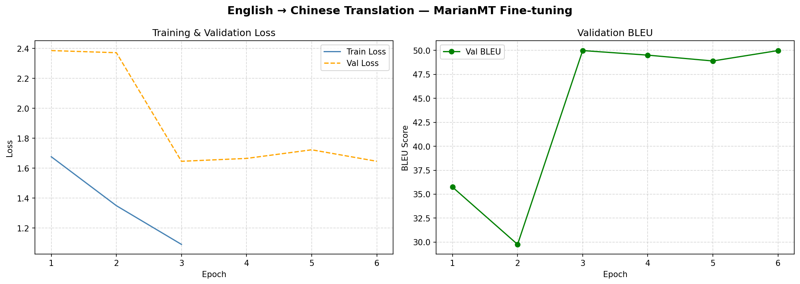
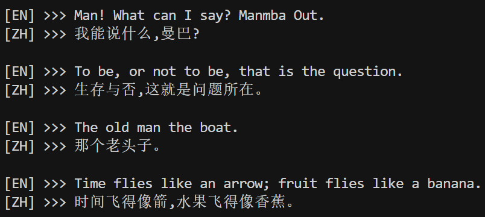
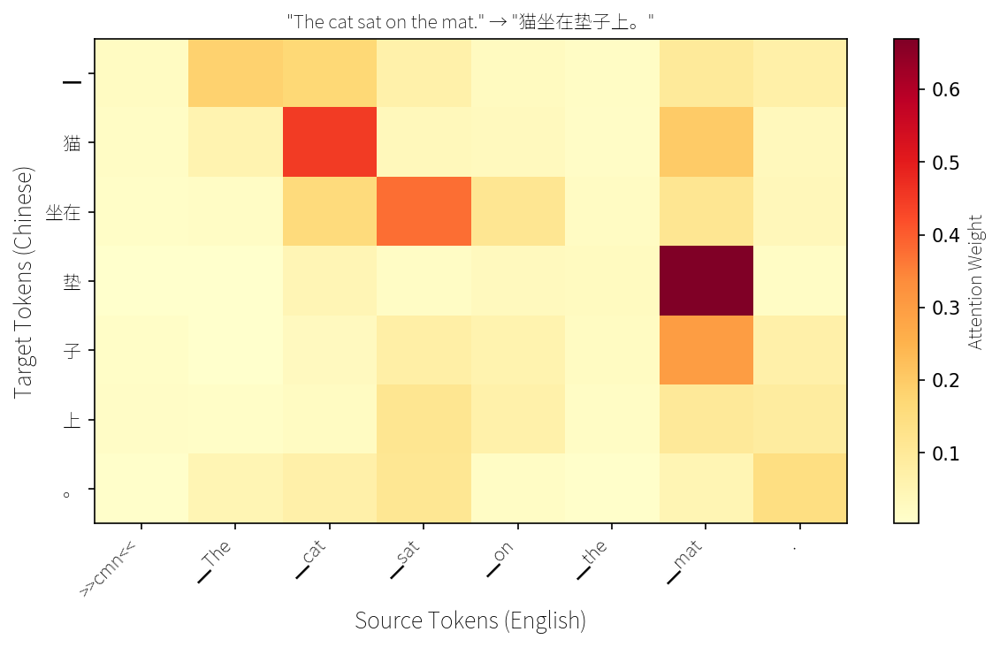
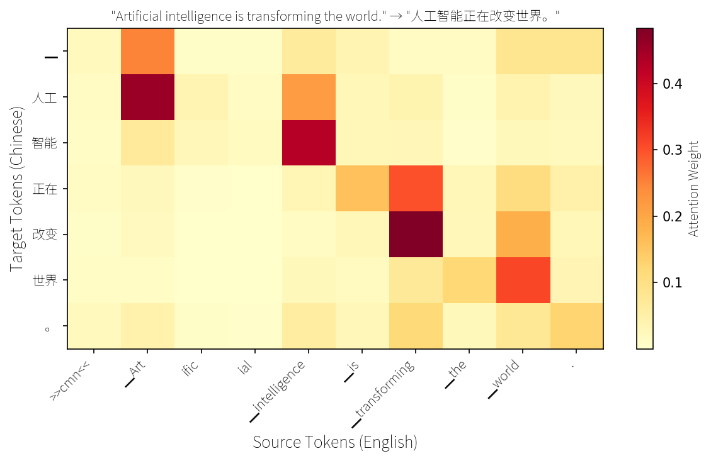
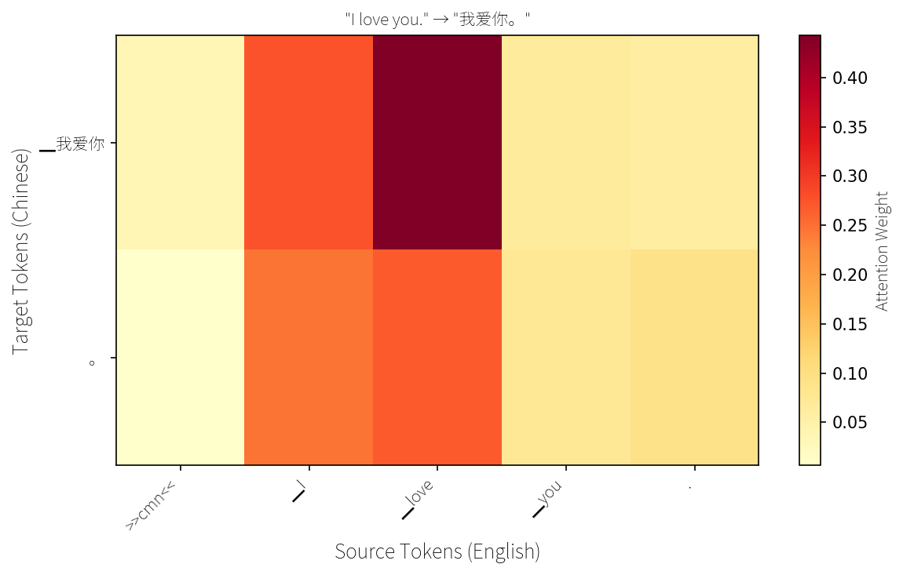
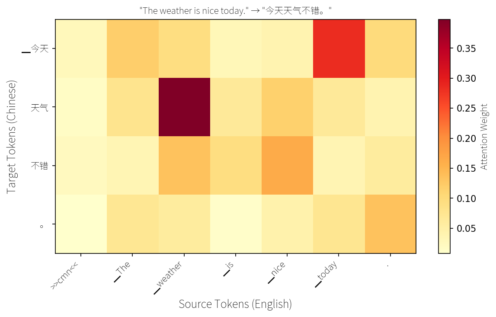
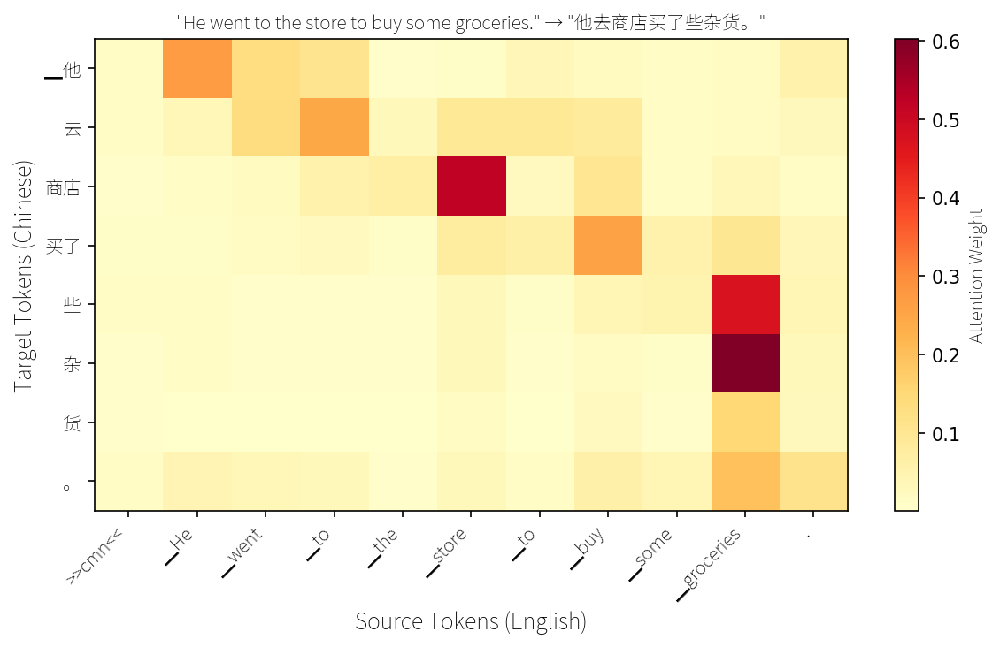

# Homework 4 实验报告：Transformer 与机器翻译

## 环境配置

* Python 3.12
* PyTorch 2.7.0 + CUDA
* PyTorch Lightning 2.x
* Hydra-core 1.3
* transformers, datasets, evaluate, sacrebleu, sentencepiece
* wandb（实验追踪）

---

## 数据集：WMT19 英中平行语料

| 属性 | 详情 |
|---|---|
| 数据集 | WMT19（config: zh-en） |
| 子采样 | 50,000 对 |
| 训练集 | 45,000 对（90%） |
| 验证集 | 5,000 对（10%） |
| 源语言 | 英文（English） |
| 目标语言 | 简体中文（Chinese） |
| 最大序列长度 | 128 tokens |

### 数据预处理

1. 英文源句添加语言前缀 `>>cmn<<`（指示模型生成简体中文）
2. 使用 MarianTokenizer 分别编码源文本和目标文本
3. 目标序列中的 padding token 替换为 -100（被损失函数忽略）
4. `max_length=128`，超长截断

---

## 模型：MarianMT (Helsinki-NLP/opus-mt-en-zh)

MarianMT 是基于 Marian NMT 框架的预训练翻译模型，采用标准 Encoder-Decoder Transformer 架构。

| 属性 | 详情 |
|---|---|
| 模型名称 | Helsinki-NLP/opus-mt-en-zh |
| 架构 | Encoder-Decoder Transformer |
| 参数量 | ~148M |
| Encoder 层数 | 6 |
| Decoder 层数 | 6 |
| 隐藏维度 | 512 |
| 注意力头数 | 8 |
| 词表大小 | 65001 |

### LightningModule 封装

```
Input (English tokens + >>cmn<< prefix)
        ↓
MarianMT Encoder (6 layers Self-Attention + FFN)
        ↓
Encoder Hidden States
        ↓
MarianMT Decoder (6 layers Masked Self-Attention + Cross-Attention + FFN)
        ↓
Output Projection (512 → 65001)
        ↓
Chinese Tokens
```

**训练**：Teacher Forcing，使用参考译文作为 Decoder 输入，交叉熵损失。

**验证**：自回归生成（Beam Search, num_beams=4），计算 BLEU 分数。

---

## 训练配置

| 参数 | 值 |
|---|---|
| `per_device_train_batch_size` | 16 |
| `per_device_eval_batch_size` | 16 |
| `learning_rate` | 2e-5 |
| `weight_decay` | 0.01 |
| `num_train_epochs` | 3 |
| `max_source_length` | 128 |
| `max_target_length` | 128 |
| `num_beams` | 4 |
| `eval_strategy` | 每个 epoch |
| `optimizer` | AdamW（bias 和 LayerNorm 不做 weight decay） |
| `seed` | 42 |

### 运行方式

```bash
# 训练
python HW4/src/train.py experiment=enzh_translation

# 测试 + 注意力可视化 + 交互翻译
python HW4/src/test.py --model_path <path_to_best_model>

# 仅交互翻译
python HW4/src/test.py --model_path <path_to_best_model> --interact
```

---

## 实验结果

### BLEU 分数

| 阶段 | BLEU |
|---|---|
| 微调前（基线） | 35.74 |
| 微调后（3 epochs） | 49.98 |



微调后 BLEU 分数显著提升，表明模型成功适应了 WMT19 英中翻译任务。

Best Model Download : https://pan.ustc.edu.cn/share/index/bd80a0a38b4045859b75

### 交互翻译体验



| 输入句子 | 翻译结果 | 评价 |
|---|---|---|
| Man! What can I say? Manmba Out. | 我能说什么,曼巴? | OK. |
| To be, or not to be, that is the question. | 生存与否,这就是问题所在。 | Maybe OK. |
| The old man the boat. | 那个老头子。 | 正确翻译应该是：老人们驾驶着这艘船。 |
| Time flies like an arrow; fruit flies like a banana. | 间飞得像箭,水果飞得像香蕉。 | 完全错误，正确翻译是：光阴似箭，果蝇爱吃香蕉。 |

**总体评价**：微调后模型在日常对话和常见句子上翻译质量较好，语句通顺、无明显遗漏。对于有歧义的句子或不常见的表达方式容易出现错误，只能翻译字面意思。

---

## 注意力可视化

选取 5 条翻译样例，提取模型最后一层 Decoder 的 Cross-Attention 权重（所有 head 取平均），绘制源语言与目标语言之间的注意力热力图。

<table>
<tr>
<td></td>
<td></td>
</tr>
<tr>
<td></td>
<td></td>
</tr>
<tr>
<td colspan="2"></td>
</tr>
</table>

**观察结果：**

- 热力图清晰地展示了翻译过程中的**词对齐关系**：例如 "猫" 主要关注 "cat"，"坐" 关注 "sat"，"垫子" 关注 "mat"
- 功能词的对齐也很明确："在...上" 关注 "on the"，体现了中英文语法结构的差异
- "I love you." 这类简单句的注意力几乎是精确的一对一对应
- 较长的句子中，注意力分布更分散，某些目标 token 会同时关注多个源 token，说明模型在综合多个词的语义信息

这验证了 Cross-Attention 作为"对齐"机制的作用：Decoder 在生成每个目标 token 时，通过 Cross-Attention 关注源句中语义相关的部分。

---

## 思考问题

### Q1 | Self-Attention 的计算

**(a)** 计算 $Q$, $K$, $V$：

$$
X = \begin{bmatrix} 1 & 0 & 1 & 0 \\ 0 & 1 & 0 & 1 \\ 1 & 1 & 0 & 0 \end{bmatrix}
$$

$$
Q = XW_Q = \begin{bmatrix} 1 & 0 & 1 & 0 \\ 0 & 1 & 0 & 1 \\ 1 & 1 & 0 & 0 \end{bmatrix} \begin{bmatrix} 1 & 0 \\ 0 & 1 \\ 1 & 0 \\ 0 & 1 \end{bmatrix} = \begin{bmatrix} 2 & 0 \\ 0 & 2 \\ 1 & 1 \end{bmatrix}
$$

$$
K = XW_K = \begin{bmatrix} 1 & 0 & 1 & 0 \\ 0 & 1 & 0 & 1 \\ 1 & 1 & 0 & 0 \end{bmatrix} \begin{bmatrix} 0 & 1 \\ 1 & 0 \\ 0 & 1 \\ 1 & 0 \end{bmatrix} = \begin{bmatrix} 0 & 2 \\ 2 & 0 \\ 1 & 1 \end{bmatrix}
$$

$$
V = XW_V = \begin{bmatrix} 1 & 0 & 1 & 0 \\ 0 & 1 & 0 & 1 \\ 1 & 1 & 0 & 0 \end{bmatrix} \begin{bmatrix} 1 & 0 \\ 0 & 1 \\ 0 & 1 \\ 1 & 0 \end{bmatrix} = \begin{bmatrix} 1 & 1 \\ 1 & 1 \\ 1 & 1 \end{bmatrix}
$$

**(b)** 注意力分数 $\frac{QK^T}{\sqrt{d_k}}$（$d_k = 2$，$\sqrt{d_k} = \sqrt{2} \approx 1.414$）：

$$
QK^T = \begin{bmatrix} 2 & 0 \\ 0 & 2 \\ 1 & 1 \end{bmatrix} \begin{bmatrix} 0 & 2 & 1 \\ 2 & 0 & 1 \end{bmatrix} = \begin{bmatrix} 0 & 4 & 2 \\ 4 & 0 & 2 \\ 2 & 2 & 2 \end{bmatrix}
$$

$$
\frac{QK^T}{\sqrt{2}} = \begin{bmatrix} 0 & 2.83 & 1.41 \\ 2.83 & 0 & 1.41 \\ 1.41 & 1.41 & 1.41 \end{bmatrix}
$$

对每行做 Softmax：

- 行 1：$[e^0, e^{2.83}, e^{1.41}] = [1, 16.95, 4.10]$，归一化 → $[0.045, 0.769, 0.186]$
- 行 2：$[e^{2.83}, e^0, e^{1.41}] = [16.95, 1, 4.10]$，归一化 → $[0.769, 0.045, 0.186]$
- 行 3：$[e^{1.41}, e^{1.41}, e^{1.41}] = [4.10, 4.10, 4.10]$，归一化 → $[0.333, 0.333, 0.333]$

$$
A \approx \begin{bmatrix} 0.045 & 0.769 & 0.186 \\ 0.769 & 0.045 & 0.186 \\ 0.333 & 0.333 & 0.333 \end{bmatrix}
$$

**(c)** 输出 $\text{Attention}(Q,K,V) = AV$：

$$
AV = \begin{bmatrix} 0.045 & 0.769 & 0.186 \\ 0.769 & 0.045 & 0.186 \\ 0.333 & 0.333 & 0.333 \end{bmatrix} \begin{bmatrix} 1 & 1 \\ 1 & 1 \\ 1 & 1 \end{bmatrix} = \begin{bmatrix} 1 & 1 \\ 1 & 1 \\ 1 & 1 \end{bmatrix}
$$

由于本例中 $V$ 的三行完全相同（均为 $[1, 1]$），无论注意力权重如何分配，输出都是 $[1, 1]$。

**(d)** 从注意力权重矩阵 $A$ 可以看出：
- Token 1 对 Token 2 的注意力最强（0.769），Token 2 对 Token 1 的注意力最强（0.769）——即 token 1 和 token 2 互相关注最多。
- Token 3 对所有 token 的注意力均匀（各 0.333）。
- 注意力权重与 Query-Key 内积直接相关：$Q_1 \cdot K_2 = 4$（最大）导致 token 1 最关注 token 2；$Q_3$ 与所有 $K$ 的内积相同（均为 2），导致均匀注意力。

**(e)** 数值稳定性问题与解决方案：

在实际模型中（$d_k = 512$），$QK^T$ 的元素量级可达数百。直接计算 $e^{z_i}$ 会导致**数值溢出**：FP32 最大约 $e^{88}$，FP16 最大约 $e^{11}$，$e^{500}$ 远超上限，变为 `inf`。

**解决方案（Safe Softmax）**：对每行先减去该行的最大值 $m_i = \max_j z_j$，再计算指数：

$$
\text{softmax}(z_i) = \frac{e^{z_i - m_i}}{\sum_j e^{z_j - m_i}}
$$

减去最大值后，最大的指数变成了 $e^0 = 1$，所有指数值都 $\leq 1$，不会溢出。

**数学等价性**：分子分母同时乘以 $e^{-m_i}$，结果不变：

$$
\frac{e^{z_i}}{\sum_j e^{z_j}} = \frac{e^{z_i} \cdot e^{-m_i}}{\sum_j e^{z_j} \cdot e^{-m_i}} = \frac{e^{z_i - m_i}}{\sum_j e^{z_j - m_i}}
$$

因此修改后的结果与原始公式**严格数学等价**。

---

### Q2 | 位置编码：为什么 Transformer 需要它？

**(a)** 证明 Self-Attention 对排列等变：

设 $\Pi$ 为排列矩阵，输入变为 $\Pi X$。则：
- $Q' = \Pi X W_Q = \Pi Q$
- $K' = \Pi X W_K = \Pi K$
- $V' = \Pi X W_V = \Pi V$

注意力分数矩阵：
$$
Q'K'^T = (\Pi Q)(\Pi K)^T = \Pi Q K^T \Pi^T
$$

由于 Softmax 逐行操作，而 $\Pi Q K^T \Pi^T$ 等价于对 $QK^T$ 做行列排列：
$$
\text{Softmax}(\Pi Q K^T \Pi^T) = \Pi \cdot \text{Softmax}(QK^T) \cdot \Pi^T
$$

输出：
$$
A'V' = \Pi A \Pi^T \cdot \Pi V = \Pi A V
$$

因此 $\text{Attention}(\Pi X) = \Pi \cdot \text{Attention}(X)$，等变性得证。

**(b)** 不加位置编码时，"I love you" 和 "you love I" 经过 Self-Attention 后，在对应位置上的输出**相同**（只是行排列不同）。这对翻译任务是**致命的**，因为：
- "I love you"（我爱你）和 "you love I"（你爱我）的语义完全不同
- 翻译依赖词序：主语、谓语、宾语的顺序决定了句子含义
- 没有位置信息，模型无法区分语法结构，无法正确翻译

**(c)** 不直接用整数位置 $[0, 1, 2, \ldots]$ 的原因，以及正弦编码的优势：

1. **数值范围有界**：正弦编码的值域为 $[-1, 1]$，而整数位置无上界（位置 1000 比位置 1 大 1000 倍），数值尺度不一致会干扰模型学习。
2. **编码相对位置**：正弦编码中，$\text{PE}_{pos+k}$ 可以表示为 $\text{PE}_{pos}$ 的线性变换（通过旋转矩阵），从而让模型能学习到相对位置关系，而非仅仅绝对位置。
3. **长度外推**：正弦函数对任意正整数位置都有定义，训练时 `max_seq_len=512`，推理时遇到位置 1000 也能产生有意义的编码。整数编码超出训练范围后无法泛化。

---

### Q3 | 从绝对到相对：旋转位置编码（RoPE）

**(a)** 证明旋转后内积只依赖相对位置 $n - m$：

$$
\tilde{Q}_m = R(m) Q_m, \quad \tilde{K}_n = R(n) K_n
$$

$$
\tilde{Q}_m^T \tilde{K}_n = (R(m) Q_m)^T (R(n) K_n) = Q_m^T R(m)^T R(n) K_n
$$

利用旋转矩阵性质 $R(m)^T = R(-m)$ 和 $R(-m)R(n) = R(n-m)$：

$$
\tilde{Q}_m^T \tilde{K}_n = Q_m^T R(n-m) K_n
$$

内积仅依赖 $n - m$，即相对位置。证毕。

**(b)** 不同维度对使用不同频率 $\theta_i$。对于近距离的 token 对（$|n-m|$ 小）：
- 所有维度对的旋转角差 $(n-m)\theta_i$ 都很小
- 两个向量在所有 2D 平面上都近似"对齐"（角度差小 → $\cos$ 值接近 1）
- 因此内积大，注意力分数高

对于远距离的 token 对（$|n-m|$ 大）：
- 高频维度对（$\theta_i$ 大）的旋转角差很大，已经"转过多圈"
- 对齐在高频维度上被破坏，$\cos$ 值在 $[-1, 1]$ 之间振荡
- 这些维度对内积的贡献趋向平均为 0
- 总体内积下降，注意力分数降低

这就像不同速度转动的时钟指针——近距离时所有指针都大致指向同一方向，远距离时快指针已经乱转了。

**(c)** RoPE 天然支持长度外推，因为：
- 旋转角 $m\theta_i$ 对任意正整数 $m$ 都有定义——它是纯数学计算（三角函数），不查表
- 不需要可学习的位置嵌入表（`nn.Embedding`），因此没有 `max_seq_len` 的硬限制
- 新位置的旋转矩阵可以在线计算，无需预先存储
- 虽然外推到远超训练长度的位置时注意力分布可能退化，但机制本身不会崩溃

---

### Q4 | 多头注意力

**(a)** 参数量计算（$d=512$）：

**单头注意力**：
- $W_Q$: $512 \times 512 = 262,144$
- $W_K$: $512 \times 512 = 262,144$
- $W_V$: $512 \times 512 = 262,144$
- $W_O$: 不需要（或恒等映射）
- **总计: $3 \times 262,144 = 786,432$**

**8 头注意力**（$d_k = d_v = 64$）：
- 每个头的 $W_Q^i$: $512 \times 64$，共 8 个 → $8 \times 512 \times 64 = 262,144$（等价于一个 $512 \times 512$ 矩阵）
- $W_K$, $W_V$ 同理，各 $262,144$
- $W_O$: $512 \times 512 = 262,144$
- **总计: $4 \times 262,144 = 1,048,576$**

多头比单头多一个 $W_O$ 矩阵的参数。

**(b)** 使用多头而非单头的原因：

类比 CNN 的多通道卷积核——每个卷积核检测不同的局部模式（边缘、纹理、颜色）。Attention 中的每个头可以关注**不同的语义模式**：
- 某个头关注**语法结构**（主语-谓语关系）
- 某个头关注**指代关系**（代词指向哪个名词）
- 某个头关注**相邻词**（局部 n-gram 模式）
- 某个头关注**长距离依赖**（从句与主句的关系）

单头只能学到一种注意力模式，多头允许模型同时在不同子空间中捕捉多样的依赖关系。

**(c)** 如果某个头的注意力权重几乎均匀分布（$a_{ij} \approx 1/n$），那么输出：

$$
\text{head}_i = \frac{1}{n} \sum_{j=1}^{n} V_j
$$

这等价于**全局平均池化**（Global Average Pooling）。这个头在做的操作是将序列中所有 token 的值求平均，得到一个"全局摘要"向量。

---

### Q5 | Encoder-Decoder 中的三种 Attention

**(a)** 填表：

| 注意力类型 | 所在位置 | Q 来自 | K, V 来自 | Mask |
|-----------|---------|--------|----------|------|
| Encoder Self-Attention | Encoder | Encoder 当前层输入 | Encoder 当前层输入 | 无 mask（双向） |
| Decoder Masked Self-Attention | Decoder | Decoder 当前层输入 | Decoder 当前层输入 | Causal mask（下三角） |
| Cross-Attention | Decoder | Decoder 当前层输入 | Encoder 最终输出 | 无 mask |

**(b)** Decoder 的 Masked Self-Attention 需要 causal mask 的原因：

自回归生成时，位置 $t$ 的 token 只能依赖 $1, \ldots, t$ 的已有输出，因为位置 $t+1$ 及之后的 token 尚未生成。如果训练时去掉 causal mask：
- 模型会"偷看"未来的 token（信息泄露）
- 训练时模型利用了未来信息，推理时却没有未来信息可用
- 产生 **train-test mismatch**：训练性能虚高，推理质量严重下降
- 极端情况下，模型可能学会直接复制未来 token 而非学习真正的语言生成能力

**(c)** 翻译 "The cat sat on the mat" → "猫坐在垫子上" 时，Decoder 生成 "猫" 时，Cross-Attention 应主要关注源句中的 **"cat"**——因为 "猫" 是 "cat" 的中文翻译，它们之间存在最直接的语义对应关系。

---

### Q6 | 三种 Transformer 架构

**(a)** 训练目标：

- **BERT**：$P(x_{\text{mask}} \mid x_1, \ldots, x_{\text{mask}-1}, x_{\text{mask}+1}, \ldots, x_n)$ ——基于**双向上下文**（左右两侧）预测被遮住的词
- **GPT / Decoder**：$P(x_t \mid x_1, x_2, \ldots, x_{t-1})$ ——仅基于**左侧上下文**预测下一个词

本质区别：BERT 看到的是完整的双向上下文，信息更丰富，适合理解任务；GPT 只能看左侧上下文，但天然适合生成任务。双向上下文虽然信息更多，但无法直接用于生成——生成时右侧还不存在。

**(b)** 三种架构对比：

| 架构 | 组成 | Attention 方向 | 训练方式 | 代表模型 | 擅长任务 |
|------|------|---------------|---------|---------|---------|
| Encoder-only | 仅 Encoder | 双向（全局可见） | 掩码语言模型（MLM） | BERT | 文本分类、NER、句子理解 |
| Decoder-only | 仅 Decoder | 单向（causal mask） | 自回归语言模型（CLM） | GPT, LLaMA | 文本生成、对话、代码生成 |
| Encoder-Decoder | Encoder + Decoder + Cross-Attention | Encoder 双向，Decoder 单向 | 序列到序列（Seq2Seq） | MarianMT, T5 | 翻译、摘要、问答 |

**(c)** Decoder-only 架构做翻译的方式——将翻译重新表述为**文本续写任务**：

```
Translate English to Chinese: The cat sat on the mat. →
```

模型将翻译指令和源句作为 prompt，然后续写出目标译文。

**灵活性**：
- 无需为每个语言对训练专门模型，一个通用模型支持所有任务
- 通过 prompt 即可切换任务（翻译、摘要、问答等）
- 支持零样本和少样本学习

**局限性**：
- 源句只能通过单向（左侧）上下文被"理解"，不如 Encoder 的双向注意力深入
- 需要更大的模型和更多数据才能学好翻译
- 翻译质量在相同参数量下可能不如专门的 Encoder-Decoder 模型

---

### Q7 | FFN 的多重身份

**(a)** 三种 FFN 的对比：

- **作业二 MLP**（784→512→256→10）：输出维度 = 类别数 10，它在做**分类决策**——将特征映射到类别空间
- **作业三 CNN 分类头**（256→128→2）：输出维度 = 类别数 2，同样在做**分类决策**
- **Transformer FFN**（512→2048→512）：输出维度 = 输入维度 512，它在做**特征变换**——对每个 token 的表示做非线性变换，增强表达能力

核心区别：前两者是"降维到类别空间"的分类器，输出的每个维度对应一个类别；Transformer FFN 是"保持维度不变"的特征变换器，不做决策，只做信息加工。

**(b)** "先升维再降维"（512→2048→512）而非直接 512→512 的原因：

- **2048 维中间层**：提供一个更大的"工作空间"——想象 512 维是一个"拥挤的房间"，2048 维是一个"宽敞的工作台"
- **ReLU 的作用**：在 2048 维空间中做**特征选择**——ReLU 将负值置零，等价于选择性地激活/关闭某些特征维度。2048 维中大约有一半被 ReLU 关闭，剩余的活跃维度构成一个**稀疏组合**
- 单层 512→512 线性变换只能做仿射变换，表达能力有限。两层 + ReLU 的结构能逼近任意非线性函数（万能近似定理）

**(c)** Token 之间的信息交互**完全由 Self-Attention 负责**。FFN 对每个 token 独立处理，不看其他 token。

一个 Encoder Layer 中的分工可以类比为**"小组讨论"**：
- **Self-Attention** = 组员之间交流观点（"你说了什么？我理解了什么？"）
- **FFN** = 每个人回到座位上独立消化吸收（"根据刚才听到的，我更新自己的理解"）

**(d)** Transformer 中真正起"分类"作用的是最后的**输出投影层**（`lm_head` / `output_projection`）：

- 输入维度：$512$（隐藏维度）
- 输出维度：$65001$（词表大小）

这个 $512 \to 65001$ 的映射在几何上意味着：输出权重矩阵的每一行是一个 512 维向量，对应词表中的一个词。512 维空间中分布着 65001 个"词向量方向"。模型通过将 token 表示与这些方向做内积（点积），找到最匹配的词。尽管 512 维空间中放 65001 个方向看似"拥挤"，但高维空间中的向量大多近似正交——512 维空间有足够的"角度"来区分 65001 个方向。

---

### Q8 | 从 BatchNorm 到 LayerNorm 再到 RMSNorm

**(a)** 归一化维度：

| | CNN 输出 `(B, C, H, W)` | Transformer 输出 `(B, T, D)` |
|---|---|---|
| **BatchNorm** | 对 $B, H, W$ 维度算 $\mu, \sigma$（每个 channel 独立） | — |
| **LayerNorm** | — | 对 $D$ 维度算 $\mu, \sigma$（每个 token 独立） |

BatchNorm 跨 batch 的所有样本和空间位置，为每个 channel 计算统计量；LayerNorm 在单个样本的单个时间步上，跨所有特征维度计算统计量。

**(b)** Transformer 不能用 BatchNorm 的三个原因：

1. **变长序列与 padding**：不同样本的序列长度不同，padding 位置的值是无意义的。BatchNorm 跨 batch 算统计量会被 padding 值污染，导致归一化不准确。
2. **自回归生成时的 batch size**：推理时 Decoder 逐 token 生成，此时 batch 中只有 1 个 token——BatchNorm 需要跨 batch 算统计量，1 个样本的均值就是它自己，方差为 0，归一化退化为无意义的操作。
3. **Decoder 的因果性**：causal mask 保证位置 $t$ 看不到 $t+1$ 之后的信息。但 BatchNorm 在时间维度上算统计量时，会跨时间步汇总，间接泄露了未来 token 的信息，违反因果性。

**(c)** CNN 能否改用 LayerNorm：

如果对 CNN 特征图 `(B, C, H, W)` 的 `(C, H, W)` 三维一起做 LayerNorm，隐含假设了**所有 channel 的激活值分布相同**。但这对 CNN 来说**不合理**：
- CNN 的不同 channel 各自检测不同的模式（channel 0 可能是"边缘检测器"，channel 1 可能是"颜色检测器"）
- 不同检测器的输出值域可能相差 10 倍
- 混在一起归一化会扭曲各 channel 的相对信号强度

BatchNorm 为每个 channel 独立归一化，尊重了 channel 之间的异质性。

**(d)** RMSNorm 与 LayerNorm 的区别：

LayerNorm = 减均值（centering）+ 除标准差（scaling）：
$$
\text{LayerNorm}(\mathbf{x}) = \gamma \odot \frac{\mathbf{x} - \mu}{\sigma + \epsilon} + \beta
$$

RMSNorm = 只除均方根（仅 scaling）：
$$
\text{RMSNorm}(\mathbf{x}) = \gamma \odot \frac{\mathbf{x}}{\sqrt{\frac{1}{d}\sum x_j^2 + \epsilon}}
$$

RMSNorm 省略了**减均值**（centering）操作和偏置 $\beta$。省略后效果几乎不变，因为：
- 归一化的主要作用来自**缩放**（控制向量长度 / 梯度尺度），减均值（平移）的贡献很小
- 实验表明，centering 对模型性能的贡献微乎其微
- 省略后减少了一次 reduce 操作，提高了计算效率（约 10-15%）

---

### Q9 | Pre-Norm vs Post-Norm

**(a)** 数据流图：

**Post-Norm**：
```
x_l → [Sublayer] → (+) → [LayerNorm] → x_{l+1}
 └─────────────────↗
      (残差连接)
```

**Pre-Norm**：
```
x_l → [LayerNorm] → [Sublayer] → (+) → x_{l+1}
 └──────────────────────────────↗
            (残差连接)
```

- **Post-Norm**：梯度从 $x_{l+1}$ 回传到 $x_l$ 时，**必须经过 LayerNorm 的 Jacobian** $J_{\text{LN}}$，因为 LayerNorm 包裹了残差加法的结果。
- **Pre-Norm**：残差路径 $x_{l+1} = x_l + (\cdots)$ 中，对 $x_l$ 求导时加法的梯度直接是 $I$（恒等矩阵），**不需要经过 LayerNorm 的 Jacobian**。

**(b)** Pre-Norm 展开：

$$
x_L = x_0 + \sum_{l=0}^{L-1} F_l(\text{LN}(x_l))
$$

对 $x_l$ 求梯度：

$$
\frac{\partial x_L}{\partial x_l} = I + \sum_{k=l}^{L-1} \frac{\partial F_k(\text{LN}(x_k))}{\partial x_l}
$$

其中包含一个**恒等矩阵 $I$**。这意味着：
- 梯度中始终有一条"高速公路"直接从 $x_L$ 通回 $x_l$，梯度不会被缩放、旋转或消失
- 即使 $\sum$ 中的其他项很小或为零，梯度至少等于 $I$
- 这对深层网络至关重要——保证了梯度能无衰减地流过任意多层，解决了梯度消失问题
- 这与 ResNet v2 的核心思想一致：保持 shortcut 路径的"身份映射"是深层残差网络能训练的关键

**(c)** Post-Norm 的梯度分析：

$$
x_{l+1} = \text{LN}(x_l + F_l(x_l))
$$

$$
\frac{\partial x_{l+1}}{\partial x_l} = J_{\text{LN}} \cdot (I + J_{F_l})
$$

从 $x_L$ 到 $x_l$ 的梯度是多个 $J_{\text{LN}}$ 的**连乘**。Post-Norm 中**不存在**一条"干净"的梯度直通路径——每一步都必须穿过 LayerNorm 的 Jacobian。

$J_{\text{LN}}$ 的特征值不一定为 1，连续多层相乘后：
- 梯度可能**指数级衰减**（vanishing）或**指数级放大**（exploding）
- 尤其在训练早期，模型参数不稳定，$J_{\text{LN}}$ 的特征值波动大
- 因此 Post-Norm 需要 **learning rate warmup** 来稳定训练初期的梯度

**(d)** Post-Norm 最终性能可能略优的直觉：

Post-Norm 的 LayerNorm 包裹了残差加法的结果 $\text{LN}(x_l + F_l(x_l))$，这意味着**每层的输出范数被严格约束**——不让任何一层的输出"偏离太远"。这相当于一种**更强的逐层正则化**：
- 防止某些层的输出主导后续层
- 迫使每层都做"有意义的贡献"
- 在充分训练后（绕过了训练不稳定期），这种额外约束可能带来更好的泛化

Pre-Norm 的残差路径是"干净"的，$x_L = x_0 + \sum v_i$，没有逐层归一化的约束，某些层可能产生过大的输出。

**(e)** 现代 LLM 的标准配置 **Pre-RMSNorm** 的逻辑：

Pre-Norm 保证训练稳定性（梯度直通路径），RMSNorm 以最小的计算开销实现有效的归一化（省略不必要的 centering）——兼顾训练稳定性和计算效率。

---

### Q10 | 回填架构比较表格

| 机制 | 连接方式 | 权重共享 | 编码的对称性 | 适用数据结构 |
|------|---------|---------|------------|------------|
| **MLP** | 全连接（所有输入-输出对） | 无共享 | 无对称性假设 | 向量/表格数据 |
| **CNN** | 局部连接（感受野内） | 卷积核跨空间位置共享 | 平移等变性 | 网格数据（图像） |
| **GNN** | 按图边连接（邻居节点） | 消息函数跨边共享 | 置换等变性（节点重编号不变） | 图结构数据 |
| **Self-Attention** | 全连接（所有位置对） | $W_Q, W_K, W_V$ 跨位置共享 | 排列等变性（加位置编码后打破） | 序列/集合数据 |

**Self-Attention 的对称群是全排列群 $S_n$**，它比 CNN 的平移群（循环群 $\mathbb{Z}_n$ 或平移群）"大"得多。

- CNN 的平移群是 $S_n$ 的一个**子群**
- Self-Attention 的先验（排列等变性）比 CNN（平移等变性）**更弱**
- 先验越弱 → 假设越少 → 需要更多数据才能学好 → **数据效率低**
- 先验越强 → 假设越多 → 少量数据就能学好 → 但假设错误的代价大

这是 Transformer 需要海量数据才能超越 CNN 的根本原因：CNN 内置了"局部性+平移不变性"的先验，Transformer 几乎不假设数据结构（仅通过位置编码注入少量位置信息）。

---

### Q11 | 从 CNN 到 Transformer：局部 vs 全局的权衡

**(a)** 对比表：

| 维度 | CNN（$3\times3$ 卷积） | Self-Attention |
|------|----------------------|----------------|
| 单层感受野 | 局部（$3\times3$ 邻域） | 全局（所有位置） |
| 权重来源 | 静态（训练后固定的卷积核） | 动态（由 QK 内积实时计算） |
| 单层计算复杂度 | $O(n \cdot k^2 \cdot d)$（$n$ 为像素数，$k$ 为核大小） | $O(n^2 \cdot d)$ |

**(b)** 计算量对比（$224\times224$ 图像，$d=512$）：

**Self-Attention**（$n = 196$ patches）：
$$
O(n^2 d) = 196^2 \times 512 = 38{,}416 \times 512 \approx 19.7\text{M}
$$

**$3\times3$ 卷积**（$n = 224^2 = 50{,}176$ 像素）：
$$
O(n \cdot k^2 \cdot d) = 50{,}176 \times 9 \times 512 \approx 231\text{M}
$$

虽然卷积的单层计算量更大（因为像素数远多于 patch 数），但注意 ViT 的 $n^2$ 随序列长度平方增长——如果使用更小的 patch（如 $8\times8$，$n=784$），Self-Attention 的计算量 $784^2 \times 512 \approx 315\text{M}$，反超卷积。关键在于 Self-Attention 是 $O(n^2)$，CNN 是 $O(n)$。

**(c)** ViT 在小数据集上不如 CNN，但在大数据集上反超的原因：

- **CNN** 内置了强归纳偏置（局部性 + 平移不变性），相当于告诉模型"看图像时先看局部"。这在小数据集上是巨大优势——模型不需要从数据中学习这些先验。
- **ViT** 几乎没有归纳偏置（全局注意力 + 位置编码），需要从数据中自己发现图像的空间结构。小数据集不足以让模型学好，但大数据集上，模型可以发现比"局部性"更丰富、更灵活的模式——包括全局依赖、远距离交互等 CNN 难以捕捉的特征。
- CNN 的静态卷积核 = 强先验，数据高效但灵活性差；Attention 的动态权重 = 弱先验，灵活但需要更多数据。

---

### Q12 | $O(n^2)$ 的代价

**(a)** $n = 100{,}000$ 时：

注意力矩阵元素数：$100{,}000^2 = 10^{10} = 100$ 亿。

FP16 下每个元素 2 字节：
$$
10^{10} \times 2 = 2 \times 10^{10} \text{ bytes} = 20 \text{ GB}
$$

仅**一层、一个头**就需要 20 GB 显存。实际模型有多层多头，例如 6 层 × 8 头 = 48 个注意力矩阵，总计 $48 \times 20 = 960$ GB——远超任何单卡显存。

**(b)** "只看当前句子、看不到上文"导致翻译错误的例子：

**代词消解**：
- 上文："Apple released a new iPhone. **It** received great reviews."
- 当前句："**It** will be available in China next month."

如果翻译模型只看当前句，不知道 "It" 指代 "iPhone" 还是 "Apple"，可能翻译为"他/她/它将于下月在中国上市"——代词翻译模糊。但上文明确了 "It" 指 "iPhone"，正确翻译应为"iPhone 将于下月在中国上市"。

另一个例子是**指代一致性**：前一句翻译了"这家公司"，后一句突然改称"该企业"，缺乏上下文连贯性。

**(c)** 长上下文方法：

| 方法 | 一句话本质 | 改了什么层面 |
|------|-----------|------------|
| **FlashAttention** | 通过分块（tiling）和重计算，将注意力计算从 HBM 搬到 SRAM 中完成，减少内存 IO 次数 | IO 调度（数学等价） |
| **Sparse Attention** | 每个 token 只关注部分位置（局部窗口 + 全局 token），将稠密 $n \times n$ 矩阵变为稀疏矩阵 | 注意力矩阵结构 |
| **Linear Attention** | 用核函数近似 softmax，改变矩阵乘法的结合顺序（先算 $K^TV$ 而非 $QK^T$），避免显式构建 $n \times n$ 矩阵 | 计算顺序 |
| **Ring Attention** | 将长序列分块分配到多卡，每卡只存部分 KV，通过环形通信传递 KV 块 | 分布式并行 |
| **PagedAttention** | 用操作系统虚拟内存分页思想管理 KV Cache，消除碎片化，提高 batch serving 的 GPU 利用率 | 显存管理 |
| **Mamba / RWKV** | 用线性递推（SSM / RNN 变体）替代 Attention，将 $O(n^2)$ 变为 $O(n)$，序列状态压缩为固定大小 | 整体架构 |

**(d)** 分类与数学等价性：

| 类别 | 包含的方法 | 是否数学等价 |
|------|-----------|------------|
| ① 纯 IO / 工程优化 | FlashAttention, PagedAttention | 是（严格等价） |
| ② 稀疏化 / 近似 | Sparse Attention, Linear Attention | 否（近似） |
| ③ 分布式并行 | Ring Attention | 是（严格等价） |
| ④ 架构替代 | Mamba / RWKV | 否（不同架构） |

**(e)** Linear Attention 的复杂度分析：

标准 Attention：$(QK^T)V$
1. 先算 $QK^T$：$(n \times d)(d \times n) = n \times n$ 矩阵，代价 $O(n^2 d)$
2. 再乘 $V$：$(n \times n)(n \times d)$，代价 $O(n^2 d)$
3. 总计 $O(n^2 d)$

Linear Attention：$\phi(Q)(\phi(K)^T V)$
1. 先算 $\phi(K)^T V$：$(d \times n)(n \times d) = d \times d$ 矩阵，代价 $O(nd^2)$
2. 再左乘 $\phi(Q)$：$(n \times d)(d \times d)$，代价 $O(nd^2)$
3. 总计 $O(nd^2)$

改变矩阵乘法的结合顺序，利用了矩阵乘法的结合律 $(AB)C = A(BC)$，将 $O(n^2 d)$ 降为 $O(nd^2)$。

当 $n \gg d$（长序列、低维度）时收益最大。例如 $n = 100{,}000$, $d = 512$：
- 标准：$n^2 d = 10^{10} \times 512 \approx 5 \times 10^{12}$
- 线性：$nd^2 = 10^5 \times 512^2 \approx 2.6 \times 10^{10}$
- 加速约 **200 倍**

**(f)** FlashAttention 的在线 Softmax（Online Softmax）：

FlashAttention 将注意力计算分块（tiling）进行——处理当前块时，尚不知道整行的全局最大值 $m$。解决方案是 **Online Softmax**（Milakov & Gimelshein, 2018）：

核心思路：
1. 处理第一个块时，用该块内的局部最大值 $m_1$ 做 safe softmax，累积 $\text{sum}_1 = \sum e^{z_j - m_1}$ 和加权 $V$ 的部分和
2. 处理第二个块时，发现新的最大值 $m_2$。如果 $m_2 > m_1$，用修正因子 $e^{m_1 - m_2}$ **rescale** 之前块的累积结果
3. 由于 $m_2 \geq m_1$（新最大值不小于旧最大值），修正因子 $e^{m_1 - m_2} \leq 1$，不会导致数值溢出
4. 以此类推，每处理一个新块，更新全局最大值并 rescale 所有之前的累积量

这样，处理完所有块后，累积结果等价于使用全局最大值做 safe softmax，与标准计算**数学严格等价**。

---

### Q13 | 从训练到推理：解码策略与 KV Cache

**(a)** 推理时生成第 $t$ 个 token 的 QKV 来源：

| Attention 类型 | Q 来自 | K, V 来自 |
|---|---|---|
| Decoder Self-Attention | 当前步的 token（位置 $t$） | 所有已生成的 token（位置 $1, \ldots, t$） |
| Cross-Attention | 当前步的 token（位置 $t$） | Encoder 输出（固定不变） |

**(b)** KV Cache 核心思想：

**不需要**重新计算所有已生成 token 的 Key 和 Value。因为：
- 在自回归生成中，已生成 token（位置 $1, \ldots, t-1$）的 Key 和 Value 在之前的步骤中已经计算过
- 这些值不会改变（因为 causal mask 保证它们不受未来 token 影响）

KV Cache 将每步计算的 Key 和 Value 缓存起来，后续步骤直接读取，避免重复计算。

**只缓存 K 和 V 而不缓存 Q**，因为：
- 位置 $t$ 的 Query 只在当前步使用——它的作用是"向前面的 token 提问"
- 但位置 $t$ 的 Key 和 Value 在**所有后续步骤**中都会被新 token 查询
- Cross-Attention 的 K、V 来自 Encoder，在整个生成过程中不变，只需计算一次

**(c)** KV Cache 存储量（生成到第 $t$ 步，$L$ 层 Decoder，维度 $d$）：

**Self-Attention KV Cache**：
- 每层缓存 $t$ 个 K 向量和 $t$ 个 V 向量，各 $d$ 维
- $L$ 层总计：$L \times 2 \times t \times d$ 个浮点数

**Cross-Attention KV Cache**：
- K、V 来自 Encoder，长度为源序列长度 $n_{\text{src}}$，只需计算一次
- $L$ 层总计：$L \times 2 \times n_{\text{src}} \times d$ 个浮点数

**总 KV Cache**：$2Ld(t + n_{\text{src}})$ 个浮点数。

**(d)** 解码策略特点：

| 策略 | 做法 | 特点 |
|------|------|------|
| Greedy | 每步选概率最高的 token | 简单快速，但易陷入次优解，缺乏多样性 |
| Beam Search（束宽 $k$） | 每步保留概率最高的 $k$ 条候选路径 | 平衡质量与效率，能找到全局较优解，但结果确定性强 |
| Top-$k$ Sampling | 从概率最高的 $k$ 个 token 中按概率采样 | 引入随机性和多样性，但 $k$ 固定可能不够灵活 |
| Top-$p$ (Nucleus) Sampling | 从累积概率达到 $p$ 的最小 token 集合中采样 | 自适应地调整候选集大小，分布集中时候选少、分布平坦时候选多 |

**机器翻译用 Beam Search**：翻译追求准确性和确定性——同一句话的"标准翻译"通常只有少数几种，需要找到概率最高的翻译。

**ChatGPT 用 Sampling**：对话追求多样性和创造性——如果每次回答都一样，对话变得无聊。`temperature` 参数控制分布的"尖锐程度"：$T \to 0$ 趋向 Greedy（确定），$T \to \infty$ 趋向均匀采样（随机）。

---

### Q14 | 残差连接的进化：从固定累加到深度注意力

**(a)** 标准残差 $M_{i \to l} = 1$ 的问题：

- **无选择性**：第 20 层不能"选择性地"多关注第 3 层、少关注第 5 层的输出——所有层的贡献被无差别等权累加。
- **范数膨胀**：随着层数 $L$ 增大，$h_L = \sum_{i=0}^{L-1} v_i$ 的范数大致以 $O(\sqrt{L})$ 增长（假设各 $v_i$ 独立）。深层的 $v_i$ 只占总和的 $\sim 1/L$，信号被前面层的累积"稀释"——第 50 层的输出只占总和的约 1/50。

**(b)** Hyper-Connections 多流机制：

当 $n > 1$ 时，$n$ 条流可以**分工保留不同层的信息**：
- 流 1 可能主要保留浅层（词法/句法）信息
- 流 2 可能主要保留深层（语义）信息
- 混合矩阵 $A_r^l$ 控制流之间的信息交换

类比"两个笔记本"：一个记录浅层特征，一个记录深层特征。每层可以选择从哪个笔记本读取、写入哪个笔记本。

相比标准残差的优势：
- 不同层的信息不会被无差别累加"稀释"
- 网络可以保持多个"信息通道"，各自维护不同粒度的特征
- $\alpha_l$（Pre-mapping）让每层可以选择性地聚合信息，$\beta_l$（Post-mapping）让每层选择性地分发输出

**(c)** HC 的深度混合矩阵 $M_{i \to l}^{\text{HC}} = \beta_i \cdot (\prod_{t=i+1}^{l-1} A_r^t) \cdot \alpha_l$ 的三个因素：

- **$\beta_i$**（Post-mapping）：决定第 $i$ 层"写了什么"——类比 Self-Attention 中的 **Key**，描述"我提供什么信息"
- **$\prod_{t=i+1}^{l-1} A_r^t$**（中间混合变换的连乘）：信息从第 $i$ 层传递到第 $l$ 层过程中经历的变换——类比**位置编码**，编码"路径距离"的衰减/变换
- **$\alpha_l$**（Pre-mapping）：决定第 $l$ 层"想读什么"——类比 Self-Attention 中的 **Query**，描述"我需要什么信息"

**(d)** AttnRes 与 Self-Attention 的对应：

| | Token Self-Attention（Q1） | AttnRes（深度注意力） |
|---|---|---|
| 注意力的方向 | 沿序列：token 看 token | 沿深度：层看层 |
| Query | $Q = XW_Q$（由输入投影） | $w_l$（可学习参数向量，不从输入投影） |
| Key | $K = XW_K$（由输入投影） | $\text{RMSNorm}(v_i)$（各层输出经归一化） |
| Value | $V = XW_V$（由输入投影） | $v_i$（各层输出本身） |
| 投影矩阵 | 需要 $W_Q, W_K, W_V$ | 不需要投影矩阵（Key 和 Value 直接来自层输出） |
| 每层新增参数 | $3 \times d \times d_k$ | $d$（仅一个 $d$ 维向量 $w_l$） |

**(e)** "线性注意力" vs "softmax 注意力"的类比：

**HC 是"线性"的**：$M_{i \to l}^{\text{HC}} = \beta_i \cdot (\prod A_r^t) \cdot \alpha_l$ 是矩阵乘积的线性组合，没有 softmax 归一化。各层的贡献权重不满足"归一化为 1"的约束——可以同时放大多层的贡献，也可以让某层贡献为 0。

**AttnRes 是"softmax"的**：$\alpha_{i \to l} = \text{softmax}(w_l^T \cdot \text{RMSNorm}(v_i))$ 经过了 softmax 归一化，各层的贡献权重之和为 1。这是一种**竞争机制**：增加对某层的关注必然减少对其他层的关注。

对应关系：
- 序列维度上：Linear Attention 用线性核 $\phi(Q)\phi(K)^T$（无 softmax 归一化） ↔ HC 的线性混合
- 序列维度上：Standard Attention 用 $\text{softmax}(QK^T)$（有归一化） ↔ AttnRes 的 softmax 混合
- Linear Attention 缺乏竞争机制，但计算效率高；Standard Attention 有竞争性（零和博弈），表达力更强

AttnRes 在深度维度上引入了 softmax 竞争机制，让网络能学到更精确的"该关注哪些层"的策略，代价仅为每层多一个 $d$ 维向量。
