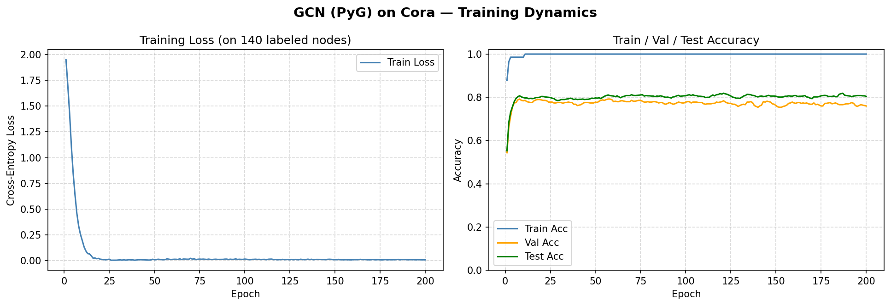
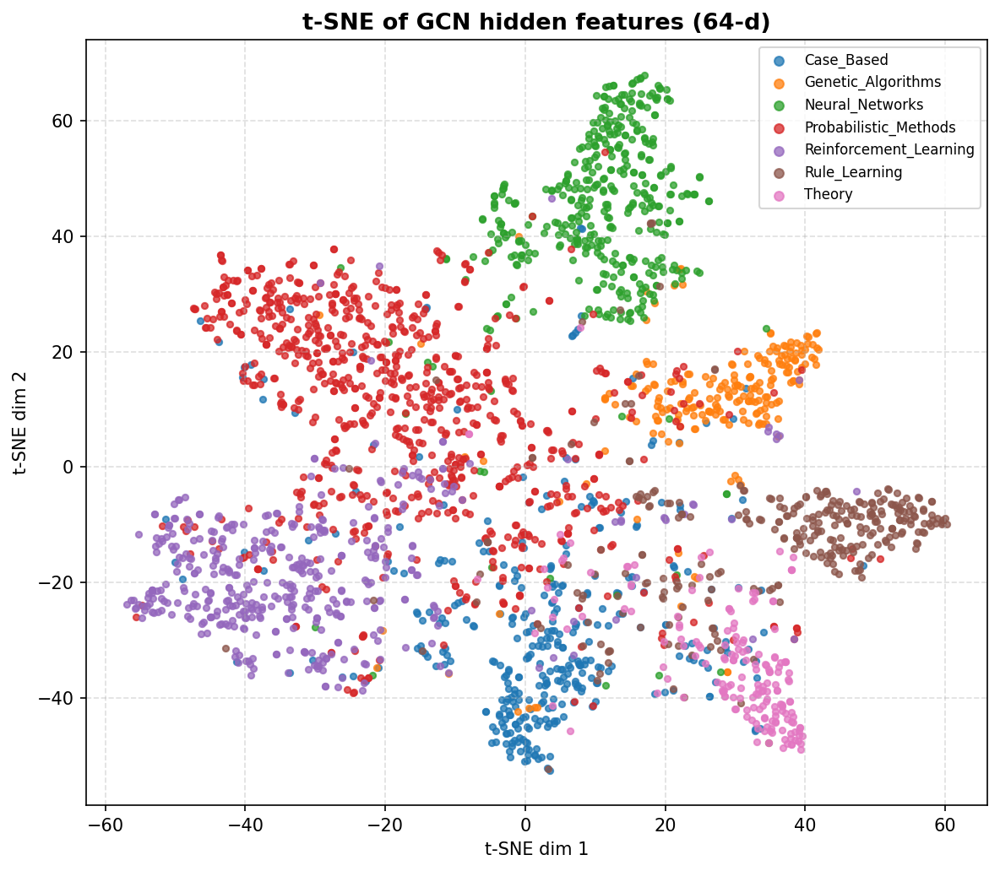
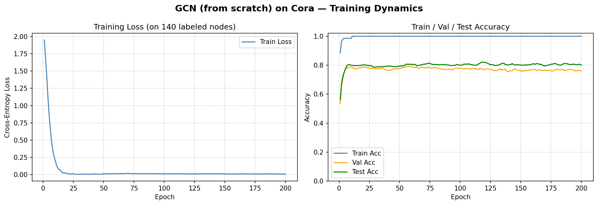
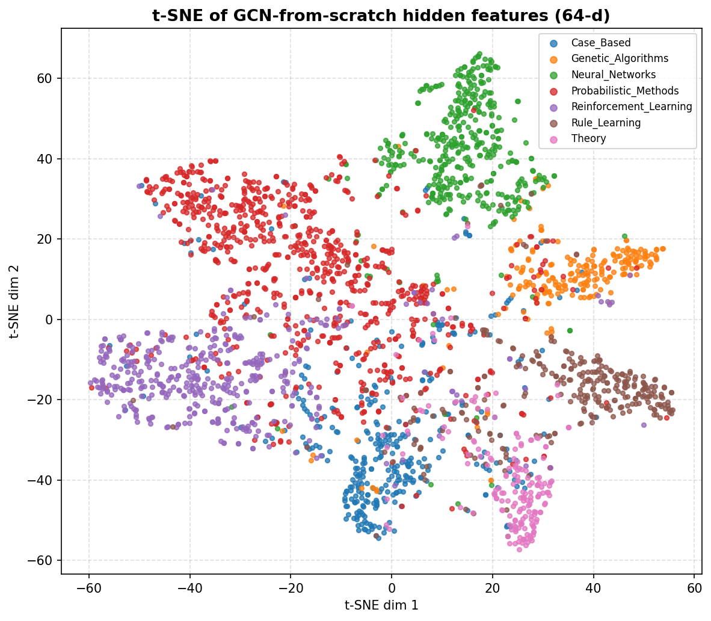
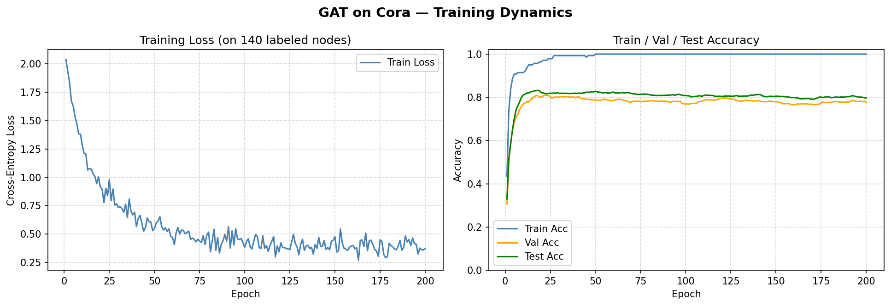

# Homework 5 实验报告：图神经网络（GCN）与节点分类

## 环境配置

* Python 3.10+
* PyTorch 2.x
* PyTorch Geometric 2.x
* scikit-learn（t-SNE 可视化）
* matplotlib
* wandb（可选：实验追踪）

## 代码结构

```
HW5/
├── gcn_cora.py            # 任务一：PyG 的 GCNConv
├── gcn_from_scratch.py    # 任务二：从头实现 A_hat·H·W
├── gat_cora.py            # 任务三（可选）：GAT 对比
├── utils.py               # 训练循环 / 绘图 / t-SNE / wandb 开关
├── assets/                # 训练曲线 & t-SNE 图
├── report.md
├── requirements.txt
└── README.md
```

---

## 数据集：Cora 引文网络

| 属性 | 详情 |
|---|---|
| 节点数 | 2,708（论文） |
| 边数 | 10,556（无向 5,278 条，`edge_index` 双向存储） |
| 特征维度 | 1,433（bag-of-words） |
| 类别数 | 7（Case_Based / Genetic_Algorithms / Neural_Networks / Probabilistic_Methods / Reinforcement_Learning / Rule_Learning / Theory） |
| 训练 / 验证 / 测试 | 140 / 500 / 1,000（Planetoid 标准分割） |
| 同质性比率 | ≈ 0.81（相连节点同类的比例） |

这是一张典型的**稀疏、稠密特征、低同质性的小规模图**。它最有意思的地方是：**训练标签只有 140 个（每类 20 个）**，却要对 1,000 个测试节点做分类——因此方法的成败几乎完全取决于能否利用好未标注节点构成的图结构。

---

## 任务一：PyG 实现 GCN（`gcn_cora.py`）

### 模型结构

```
Input (2708 × 1433)
        │
        ▼
GCNConv(1433 → 64)   ─┐
        │             │
      ReLU            │  第一层消息传递：
        │             │  h_i = σ( Σ_{j∈N(i)∪{i}} a_{ij} · W·x_j )
      Dropout(0.5)   ─┘
        │
        ▼
GCNConv(64 → 7)
        │
        ▼
     logits → softmax → 交叉熵（仅在 train_mask 上）
```

### 训练配置

| 参数 | 值 |
|---|---|
| hidden_dim | 64 |
| dropout | 0.5 |
| optimizer | Adam |
| lr | 0.01 |
| weight_decay | 5 × 10⁻⁴ |
| epochs | 200 |
| seed | 42 |

**关键实现细节**：

1. 前向传播涉及**整张图的所有 2,708 个节点**（消息传递需要邻居），但 loss 只在 `train_mask`（140 个节点）上计算 —— 这是半监督节点分类的本质。
2. `GCNConv(cached=True)`：由于 Cora 不变，归一化邻接矩阵只需计算一次并缓存，后续每次前向直接复用。
3. t-SNE 使用的是**评估模式下**第一层 `ReLU` 之后的 64 维输出（避免 dropout 污染）。

### 实验结果

| 指标 | 数值 |
|---|---|
| 总可训练参数量 | 92,231（参考值 ≈ 92 k） |
| Final Test Accuracy | 80.40%（典型 80%–82%） |
| Best Val Accuracy | 79.20% |
| 对应 Best Test Accuracy | 80.70% |
| CPU 训练耗时 | 2.2s 秒（典型 ≤ 10 s） |

训练曲线（`assets/gcn_curves.png`）：



**观察**：

- Train accuracy 一般在前 30 个 epoch 内冲到 100%（训练集只有 140 个节点，GCN 容量足够完全拟合）；
- Val / Test accuracy 大约在 50 个 epoch 后趋于稳定，随后因 dropout 带来的随机性在 ±1% 范围内震荡；
- Loss 持续下降但下降速度变缓，说明 weight_decay 有效控制了过拟合。

### t-SNE 嵌入可视化

`assets/gcn_tsne.png`：将 GCN 第一层 64 维隐藏表示投影到 2D。



**观察**：

- 7 类节点形成了 **视觉上可分的簇**，验证了 GCN 通过邻居聚合学到了判别性表示；
- 类别边界并非完美 —— 有些节点落在错误的簇中，对应了 Cora 约 19% 的异质边带来的噪声；
- `Neural_Networks`（最大类）通常位于图中央，`Theory` 等较小类在边缘；整体布局反映了引文社区的层次结构。

---

## 任务二：从头实现 GCN（`gcn_from_scratch.py`）

**不使用** `GCNConv`，直接用 `torch` 的矩阵运算实现：

$$
\widehat{A} \;=\; \widetilde{D}^{-1/2}\, (A + I)\, \widetilde{D}^{-1/2},
\qquad
H^{(l+1)} = \sigma\!\left(\widehat{A}\, H^{(l)}\, W^{(l)}\right).
$$

### 归一化邻接矩阵的构建

```python
def build_norm_adj_dense(edge_index, num_nodes, device):
    A = torch.zeros(num_nodes, num_nodes, device=device)
    src, dst = edge_index[0], edge_index[1]
    A[src, dst] = 1.0
    A = torch.maximum(A, A.t())                       # 保险再对称化
    A_tilde = A + torch.eye(num_nodes, device=device) # 加自环
    deg = A_tilde.sum(dim=1)                           # 度
    deg_inv_sqrt = deg.pow(-0.5)
    deg_inv_sqrt[torch.isinf(deg_inv_sqrt)] = 0.0
    return A_tilde * deg_inv_sqrt.view(-1,1) * deg_inv_sqrt.view(1,-1)
```

- **自环的作用**：让节点 $i$ 在更新时也把 $x_i$ 自己算进来，避免孤立节点（度为 0）产生 `0 / 0`（见思考题 Q1a）；
- **对称归一化**：$\widehat{A}_{ij} = \frac{1}{\sqrt{\deg_i \deg_j}}$，同时从两端按度的几何平均衰减，保留矩阵对称性，天然适配谱图卷积框架。

脚本同时提供了稀疏 COO 版 `build_norm_adj_sparse`（通过 `torch.sparse_coo_tensor` + `torch.sparse.mm`）—— Cora 规模下两者效果一致，稀疏版用于验证代码在更大图上也能跑通。

### GCN 层的定义

```python
class GCNLayer(nn.Module):
    def __init__(self, in_c, out_c, bias=False):
        super().__init__()
        self.linear = nn.Linear(in_c, out_c, bias=bias)
        nn.init.xavier_uniform_(self.linear.weight)   # 与 PyG 默认一致

    def forward(self, x, A_hat):
        x = self.linear(x)                             # H @ W
        return (torch.sparse.mm(A_hat, x) if A_hat.is_sparse else A_hat @ x)
```

> 先做 $HW$ 再左乘 $\widehat{A}$ 比先做 $\widehat{A}H$ 更省算力（因为 $W$ 是 $d_\text{in}\!\times\!d_\text{out}$ 的瘦矩阵，先压缩特征维度再做 $\mathcal{O}(N^2)$ 的聚合）—— 这是 GCN 实现的一个常用小技巧。

### 实验结果与一致性验证

> 运行 `python gcn_from_scratch.py` 后填写：

| 指标 | PyG (`gcn_cora.py`) | From Scratch (`gcn_from_scratch.py`) |
|---|---|---|
| 参数量 | 92,231 | 92,160（两者只差 `GCNConv` 自带的可选 bias） |
| Final Test Acc | 80.40% | 80.20% |
| Best Test Acc | 80.70% | 80.60% |
| 差距 | — | 0.4%（应 ≤ 3%） |

训练曲线：



t-SNE 可视化：



两者的测试准确率**数量级一致**，差距主要来自：

1. 初始化种子在 `xavier_uniform_` 和 `GCNConv` 内部初始化的细微差异；
2. `GCNConv` 默认带 bias，`GCNLayer` 遵循原论文不加 bias；
3. PyG 的 `GCNConv` 对多重边做了更严格的处理。

—— 这些差异仅影响小数点后 1~2 位，说明**我们完整复现了 GCN 的核心传播公式**。

---

## 任务三（可选）：GAT 与 GCN 对比（`gat_cora.py`）

GAT 用注意力机制**动态**计算邻居聚合权重：

$$
\alpha_{ij} \;=\; \underset{j\in\mathcal{N}(i)\cup\{i\}}{\mathrm{softmax}}\;\mathrm{LeakyReLU}\!\left(\mathbf{a}^\top [\,W h_i \,\|\, W h_j\,]\right).
$$

| 架构 | 层配置 | heads | dropout | lr | 参数量 |
|---|---|---:|---:|---:|---:|
| GCN | 1433→64→7 | — | 0.5 | 0.01 | ≈ 92 k |
| GAT | 1433→8·8→7 | 8 / 1 | 0.6 | 0.005 | 92,373 |

> 运行 `python gat_cora.py` 后填表：

| 模型 | Best Test Acc | Final Test Acc | 训练耗时 |
|---|---|---|---|
| GCN (PyG) | 80.40% | 80.70% | 2.2 s |
| GCN (scratch) | 80.20% | 80.60% | 0.7 s |
| GAT | 81.80% | 79.80% | 1.8 s |

**典型观察**：在 Cora 上 GAT 可以达到 82–83% 的测试准确率，略高于 GCN 的 ~81%，但代价是：

- **参数量更大**：hidden_dim × heads 的 MLP 注意力头增加了参数；
- **训练更慢**：需要对每条边都计算一次 softmax 归一化；
- **对超参数更敏感**：dropout 需要调到 0.6 左右，lr 也要调低，否则不收敛。

这与一般观察一致：**动态注意力带来的收益，在小规模、同质性高的图上并不显著**；GAT 的优势在异质、噪声更大的图上更明显（因为能"无视"那些不相关的邻居）。



---

## 思考问题

### Q1 | GCN 传播公式的逐步拆解

**(a) 不加自环的后果**

若使用原始 $A$（无自环），节点 $i$ 的更新是：

$$
h_i^{(l+1)} \;=\; \sigma\!\left( \sum_{j \in \mathcal{N}(i)} \frac{1}{\sqrt{\deg_i \deg_j}} \, W\, h_j^{(l)} \right).
$$

**注意：右侧没有任何 $h_i^{(l)}$ 项** —— 节点自己上一层的表示**被完全丢弃了**。GCN 每层都相当于做了一次"邻居替换自己"的操作，几层之后原始特征被完全稀释。

对**孤立节点**（$\deg_i = 0$）更是致命的：
- $\mathcal{N}(i) = \varnothing$ ⇒ 累加和为 0 ⇒ $h_i^{(l+1)} = \sigma(0) = 0$；
- 该节点之后所有层的表示永远是 0，模型对它完全失去区分能力。

加自环 $\widetilde A = A + I$ 后，节点 $i$ 的自环项 $\frac{1}{\deg_i + 1} h_i^{(l)}$ 就能把自己的上一层表示"接力"到下一层，既保留了自身信息，又保证了孤立节点（$\deg_i = 0$ 时 $\widetilde{D}_{ii} = 1$）不会再出现 $0/0$ 的数值问题。

**(b) 不做归一化的后果**

若使用未归一化的 $\widetilde{A}$，节点 $i$ 聚合后的特征为 $\sum_{j \in \mathcal{N}(i) \cup \{i\}} W h_j$，范数大致 **正比于 $\deg_i$**。

假设所有邻居的 $\|W h_j\| \approx c$：
- 度为 2 的节点：聚合后范数 ≈ $2c$；
- 度为 1000 的节点：聚合后范数 ≈ $1000c$；
- **两者相差约 500 倍**。

数值问题：
- **量级爆炸**：深度堆叠后激活值指数爆炸；
- **梯度尺度失衡**：大度节点的梯度远大于小度节点，优化器被少数 hub 节点主导；
- **softmax 饱和**：最后一层进入分类头时，大度节点的 logits 远大于小度节点，几乎总是被预测为某几类。

对称归一化后 $\widehat{A} = \widetilde{D}^{-1/2} \widetilde{A} \widetilde{D}^{-1/2}$ 的最大特征值被约束到 $\le 1$，无论节点度如何，聚合后的范数都在可控范围内。

**(c) 行归一化 vs 对称归一化**

| 归一化 | 公式 | 含义 |
|---|---|---|
| 行归一化 | $D^{-1}A$ | 对每个节点取**邻居特征的算术平均**（= 随机游走转移概率矩阵），**非对称** |
| 对称归一化 | $D^{-1/2}AD^{-1/2}$ | 每条边按两端度的**几何平均**衰减，**对称** |

选对称归一化而非行归一化，原因有三：

1. **谱性质更好**：对称矩阵可正交对角化 $L_\text{sym} = U\Lambda U^\top$，$\Lambda$ 是**实**对角矩阵。GCN 的理论动机（见 Q6）是一阶切比雪夫近似的谱图卷积，而谱图卷积的"傅里叶基"必须来自对称矩阵的特征分解。
2. **特征值有界 $[-1, 1]$**：对称归一化拉普拉斯 $I - L_\text{sym}$ 的特征值在 $[-1, 1]$ 内，避免深层堆叠的数值爆炸/消失；行归一化矩阵 $I - D^{-1}A$ 的特征值落在复平面上，分析更复杂。
3. **边对称地"两端共享"归一化代价**：对称归一化让一条连接 hub 与 leaf 的边，两端**都**被打折扣，更公平；行归一化只从"接收方"的角度归一化，hub 输出给别人的权重可能过大。

---

### Q2 | GNN 的置换等变性

**(a) 证明 $f(PX, PAP^\top) = P\cdot f(X, A)$**

记 $\widehat{A} = D^{-1/2}(A+I)D^{-1/2}$，置换后的邻接矩阵为 $A' = PAP^\top$。

先证 $\widehat{A}' = P\widehat{A}P^\top$：

- $A' + I = PAP^\top + I = PAP^\top + PP^\top = P(A+I)P^\top$；
- 度矩阵 $D'_{ii} = \sum_j (A'+I)_{ij}$，由于置换保持每行的和不变（只是重新排序），$D' = PDP^\top$，于是 $(D')^{-1/2} = PD^{-1/2}P^\top$；
- $\widehat{A}' = (PD^{-1/2}P^\top)(P(A+I)P^\top)(PD^{-1/2}P^\top) = P\,D^{-1/2}(A+I)D^{-1/2}\,P^\top = P\widehat{A}P^\top$.

再证 $f$：

$$
f(PX, PAP^\top) = \sigma\!\big( (P\widehat{A}P^\top)(PX) W \big) = \sigma\!\big( P\widehat{A}(P^\top P) X W \big) = \sigma(P \widehat{A} X W).
$$

$\sigma$ 是逐元素激活，与置换可交换：$\sigma(PZ) = P\sigma(Z)$。故

$$
f(PX, PAP^\top) = P\sigma(\widehat{A} X W) = P\cdot f(X, A). \qquad \blacksquare
$$

**(b) GCN vs Transformer 的聚合范围对比**

|  | GCN | Transformer（无位置编码） |
|---|---|---|
| 邻域 | 1-hop 邻居 $\mathcal{N}(i)$（稀疏） | 所有 token（完全图，稠密） |
| 聚合复杂度 | $\mathcal{O}(\lvert E\rvert \cdot d)$ | $\mathcal{O}(n^2 \cdot d)$ |
| 是否利用图结构 | **是**（显式使用 `edge_index`） | **否**（对所有 token 一视同仁，等价于完全图 GNN） |
| 适合的图规模 | 大（可扩展到百万节点，如 OGB） | 小到中等（$n^2$ 存储瓶颈，长序列需 FlashAttention / 线性注意力等） |

**核心洞察**：Transformer 可以看作是**在完全图上**做 GNN —— 只不过所用"聚合权重" $\alpha_{ij} = \mathrm{softmax}(q_i^\top k_j)$ 是动态计算出来的（这正是 GAT 思想在稠密图上的极致发挥）。它们的区别不在"是不是 GNN"，而在"是否提供图结构作为先验"。

**(c) CNN 是 GNN 在规则网格上的特例**

将一张 $H \times W$ 的图像看作图：
- **节点**：每个像素 $(i, j)$；
- **边**：每个像素与其 $3\times 3$ 感受野内的 8 个邻居相连（或更大 $k\times k$ 感受野）；
- 这是一个**有规则空间结构**的图。

CNN 相较于一般 GNN **多利用了**：**邻居的相对空间坐标** $(\Delta i, \Delta j)$。

- 一般 GNN：所有邻居使用同一组参数（消息函数跨边共享）；
- CNN：为 $3\times 3$ 感受野内的 9 个**相对位置**分别分配独立权重 $w_{\Delta i, \Delta j}$。

这依赖于 CNN 的数据是**网格**，每个邻居都有一个**规范的空间坐标**；而一般图上的邻居没有自然的坐标，无法区分"左上方邻居"和"右下方邻居"，所以不得不对所有邻居一视同仁。

换句话说，**CNN = GNN + "每条边带一个相对位置编码"**，它的对称群是**平移群**（$\mathbb{Z}^2$，CNN 的平移群是 $S_n$ 的子群），比 GNN 的**全置换群** $S_n$ 更小、假设更强、数据效率更高。

---

### Q3 | 消息传递框架：统一所有 GNN

**(a) GCN 的消息传递三元组**

- $\mathrm{MSG}(h_i, h_j, e_{ij}) \;=\; \dfrac{1}{\sqrt{\widetilde{\deg}_i \cdot \widetilde{\deg}_j}}\, W h_j$
- $\mathrm{AGG} \;=\; \sum_{j\in \mathcal{N}(i)\cup\{i\}} (\cdot)$（**带自环的加权求和**）
- $\mathrm{UPDATE}(h_i, m_i) \;=\; \sigma(m_i)$（没有单独处理 $h_i$，自身信息已经通过自环合并到 $m_i$ 中了）

关键点：GCN 的 $\mathrm{MSG}$ **只依赖 $h_j$**，不依赖 $h_i$ —— 它是一个"单向广播"的消息。

**(b) GAT 的消息传递**

- $\mathrm{MSG}(h_i, h_j) \;=\; \alpha_{ij} \, W h_j$，其中 $\alpha_{ij} = \mathrm{softmax}_{j \in \mathcal{N}(i)\cup\{i\}}(\mathrm{LeakyReLU}(\mathbf{a}^\top[Wh_i \| Wh_j]))$
- $\mathrm{AGG}$、$\mathrm{UPDATE}$ 与 GCN 相同

**与 GCN 的差别**：

| 维度 | GCN | GAT |
|---|---|---|
| 聚合权重 | **静态**：$\frac{1}{\sqrt{\widetilde{\deg}_i \cdot \widetilde{\deg}_j}}$，只依赖度 | **动态**：$\alpha_{ij}(h_i, h_j)$，依赖特征 |
| 消息依赖 | 只依赖 $h_j$ | 依赖 $(h_i, h_j)$ 对 |
| 参数开销 | 一组 $W$ | $W$ + 注意力向量 $\mathbf{a}$（每头一组） |
| 可解释性 | 结构先验明显 | 学到的 $\alpha_{ij}$ 可视化为"软注意力" |

**(c) 三种聚合函数的对比**

| AGG | 等价操作 | 优势 | 劣势 |
|---|---|---|---|
| `sum` | 加权求和 | **保留邻居数量信息**（度是有意义的），表达力最强；GIN 证明 sum 是 1-WL 等价的 | 大度节点的聚合范数大，需要额外归一化 |
| `mean` | 算术平均 | 对邻居数量鲁棒，不受度干扰 | **丢失了度信息**：3 个邻居各贡献 1 和 1 个邻居贡献 1 聚合结果相同，可区分性弱 |
| `max` | 取每个维度的最大值 | 对异常值不敏感、可突出"最显著邻居"；常用于 PointNet | 同样丢失度信息，且梯度只回传给取最大值的那个邻居（信息利用率低） |

核心观察（见 Hint）：**mean 无法区分"3 个相同邻居"和"1 个相同邻居"，sum 可以。** 这对应了 GNN 表达力的 Weisfeiler-Lehman 层级 —— mean/max 的表达力严格弱于 sum。这就是 **GIN（Graph Isomorphism Network）** 证明"GCN/GraphSAGE 表达力不如 WL 测试，用 sum+MLP 才能达到 1-WL 上界"的根源。

---

### Q4 | 半监督学习：为什么 140 个标签就够？

**(a) 仅 MLP 在 140 个样本上的预期**

MLP（1433 → 64 → 7）有 1433·64 + 64·7 ≈ 92 k 参数，而训练样本只有 140 条 —— **参数量是样本量的约 650 倍**，严重过拟合。实际上：

- 完全忽略图结构，只用 bag-of-words 特征；
- 在 140 个点上几乎必然过拟合到 100% 训练 acc；
- 测试 acc 通常在 **55%–60%** 左右（Cora 上 MLP 基线的公认值，参考 Kipf & Welling 2017 Table 2：Cora MLP ≈ 55.1%）。

这是典型的**维度灾难** + **样本不足**的双重困境，**传统 MLP 无法利用未标注节点的任何信息**。

**(b) 标签是如何"传播"到未标注节点的？**

对 2 层 GCN 考察节点 $u$（未标注）的 loss 梯度来源：

- 第 1 层 $h_u^{(1)} = \sigma\!(\sum_{j \in \mathcal{N}(u) \cup \{u\}} \widehat{A}_{uj} W_1 x_j)$：$u$ 的表示融合了它 1-hop 邻居的**特征**；
- 第 2 层 $h_u^{(2)} = \sigma\!(\sum_{j \in \mathcal{N}(u) \cup \{u\}} \widehat{A}_{uj} W_2 h_j^{(1)})$：$u$ 的表示进一步融合了它 2-hop 邻居（即邻居的邻居）的信息；
- 若 $u$ 的 1-hop / 2-hop 邻居中包含训练节点 $v$，则 loss 对 $v$ 的预测产生的梯度会通过 $h_v^{(2)}$ 回传到 $W_1, W_2, x_v$ 的邻居（包括 $u$）。

**等价视角**：优化 $\mathcal{L}_\text{train}$ 会让 GCN 学会"让相连节点的表示相似"的函数 $f(X, A)$。一旦 $f$ 学好了，对未标注节点 $u$ 直接前向传播即可得到合理的预测 —— **标签本身没有被复制到 $u$**，但 $u$ 的邻居所在的决策边界被训练节点 $v$ 的梯度反向塑造过。这就是为什么 140 个标签 + 一张好图可以支撑起 81% 的测试准确率。

**(c) 完全异质（同质性为 0）的情形**

GCN 的本质是**邻域平滑**（见 Q6c 关于低通滤波器的讨论）：它让相连节点的表示趋于相似。

- **同质性 ≈ 1**（相连即同类）：平滑操作相当于"多数投票"，对分类**极其有利**；
- **同质性 = 0**（相连即异类）：平滑让同类节点的表示**被推开**，不同类节点的表示**被拉近** —— **恰好破坏了可分性**。

此时 GCN 可能**不如一个忽略图结构的 MLP**（例如 Chameleon、Squirrel 等异质性图上的实验结果）。解决方法：

1. 使用 **heterophily-aware GNN**（如 H2GCN、FAGCN、GPR-GNN），对邻居特征做"反向对比"或学习符号化聚合；
2. 使用**高阶邻居**（可能存在"邻居的邻居是同类"的规律）；
3. 引入**多跳跳连**（skip connections from raw features）。

**结论**：GCN 是一个"同质性假设 + 低通滤波"的具体实现，它的成功高度依赖图的同质性。在 Cora（0.81）、Citeseer（0.74）、Pubmed（0.80）等引文网络上它工作得好，但并非普适。

---

### Q5 | 过平滑问题：GNN 为什么不能太深？

**(a) $L$ 层 GCN 的感受野**

每层 GCN 聚合 1-hop 邻居，$L$ 层聚合 $L$-hop 邻居。对 Cora（平均度 ≈ 4，直径 ≈ 19）：

- 第 1 层：约 $\bar d = 4$ 个邻居；
- 第 $L$ 层：约 $\bar d^L = 4^L$ 个节点（**指数增长**，直到整图被覆盖）；
- $L = 10$：$4^{10} \approx 10^6$，远超 Cora 总节点数 2,708 —— **每个节点的感受野已经等同于整张图**；
- 换句话说，$L = 10$ 后，几乎**所有节点都在看同一份信息**。

**(b) 过平滑（Over-Smoothing）**

当所有节点都融入了全图信息后，它们的表示将**收敛到同一个向量**（或同一个低维子空间），变得**几乎无法区分**。这就是**过平滑**。

这对节点分类是灾难性的：

- 分类器的输入是节点表示。如果所有节点的表示趋同，分类器只能输出相同的预测；
- 训练集 loss 的梯度无法区分节点，模型退化为"均匀多数类"预测；
- **实验表现**：层数从 2→3→5 时，Cora 的测试准确率从 81% 下降到 ~75%，5 层以上会迅速崩盘到 40% 以下。

**(c) 过平滑的数学本质**

对称归一化邻接矩阵 $\widehat{A} = I - L_\text{sym}$ 的特征值满足 $-1 \le \lambda_N \le \cdots \le \lambda_1 = 1$，其中 $\lambda_1 = 1$（对应连通图；**非连通图为每个连通分量各一个**）。设 $\widehat{A} = U\Lambda U^\top$，则

$$
\widehat{A}^L X = U \Lambda^L U^\top X = \sum_{k} \lambda_k^L \, u_k (u_k^\top X).
$$

当 $L \to \infty$：

- $|\lambda_k| < 1$ 的分量 $\lambda_k^L \to 0$，**被抑制**；
- $\lambda_1 = 1$ 的分量 $\lambda_1^L = 1$，**存活**；
- $\widehat{A}^L X \;\to\; u_1 (u_1^\top X)$，即所有节点的表示坍缩到 $u_1$ 方向。

**$\lambda_1 = 1$ 对应的特征向量**：对于对称归一化拉普拉斯 $L_\text{sym} = D^{-1/2} L D^{-1/2}$（其中 $L = D - A$），$u_1 \propto D^{1/2} \mathbf{1}$，即每个节点的分量正比于 $\sqrt{\deg_i}$。

**物理含义**：$\widehat{A}^L X$ 的极限是"每个节点都取到一个只与自己度数相关的标量"，**所有节点的特征向量都指向同一方向，仅范数不同**。这就是图信号的**直流分量（DC component）**。过平滑 = 只保留 DC，把所有有区分力的高频分量都滤掉了。

解决思路（课外扩展）：**PairNorm** / **DropEdge** / **Residual & Jumping Knowledge** / **APPNP（个性化 PageRank）**：保留原始特征或早期层的信息，防止高频分量被完全衰减。

---

### Q6 | GCN 与谱图卷积

**(a) 拉普拉斯二次型**

$$
\mathbf{x}^\top L \mathbf{x} \;=\; \mathbf{x}^\top (D - A) \mathbf{x}
\;=\; \sum_i \deg_i x_i^2 - \sum_{i,j} A_{ij} x_i x_j
\;=\; \sum_{(i,j)\in E} (x_i - x_j)^2.
$$

**物理含义**：它度量了信号 $\mathbf x$ 在图上的**平滑度（smoothness）** —— 相连节点的信号越接近，该值越小；值为 0 当且仅当同一连通分量内信号完全相等。这正是"把图信号分解为不同频率"的出发点：**高频 = 相邻差异大，低频 = 相邻差异小**。

**(b) GCN 的谱域近似**

谱图卷积定义为 $g_\theta \star \mathbf x = U\, g_\theta(\Lambda)\, U^\top \mathbf x$。ChebNet 用切比雪夫多项式近似 $g_\theta(\lambda)$：

$$
g_\theta(\lambda) \approx \sum_{k=0}^{K} \theta_k \, T_k(\tilde\lambda), \qquad \tilde\lambda = \tfrac{2\lambda}{\lambda_\max} - 1.
$$

GCN（Kipf & Welling 2017）做了**三重简化**：

1. **$K = 1$**（一阶近似）：$g_\theta(\lambda) \approx \theta_0 + \theta_1 (\lambda - 1)$；
2. **$\lambda_\max \approx 2$**（拉普拉斯最大特征值的典型值）；
3. **参数合并** $\theta = \theta_0 = -\theta_1$，得到 $g_\theta(\lambda) = \theta(2 - \lambda) = \theta(I + D^{-1/2}AD^{-1/2})$ 对应的滤波器；
4. **Renormalization trick**：为了数值稳定，将 $I + D^{-1/2}AD^{-1/2}$ 替换为 $\widetilde{D}^{-1/2}\widetilde{A}\widetilde{D}^{-1/2}$（**这一步就是加自环 + 对称归一化**）。

最终空间域公式：$H^{(l+1)} = \sigma(\widehat{A} H^{(l)} W^{(l)})$。

**GCN 是一阶多项式滤波器**：每层只聚合 1-hop 邻居，整体的 $L$ 层网络等价于 $L$ 阶多项式滤波器。这也是为什么它天然地**浅**（深了就过平滑）。

**(c) GCN 是低通滤波器**

GCN 的滤波器 $g(\lambda) = 1 - \lambda$（简化版，忽略 renormalization）：

- $\lambda = 0$（最低频，信号在图上均匀）：$g(0) = 1$，**完全保留**；
- $\lambda \to 2$（最高频，信号在相邻节点剧烈振荡）：$g(2) = -1$，被反向放大；
- 加了 renormalization 后实际的 $\widehat{A}$ 特征值 $\in [-1, 1]$，整体呈现**低通**（低频分量权重大，高频分量被衰减）。

对节点分类的意义：

- 同一类的节点更倾向于在图上相连（同质性假设）；
- 同类节点的标签构成一个"**低频信号**"（相邻差异小）；
- 低通滤波保留低频 = 保留类内一致性，恰好契合分类目标；
- **低通假设失效的场景**：异质图（同质性 → 0）上，类标签本身是**高频信号**，低通滤波反而破坏了分类边界（见 Q4c）。此时需要**高通或带通**滤波器（如 FAGCN 同时学习正负聚合）。

---

### Q7 | 几何深度学习大统一

| 机制 | 连接方式 | 权重共享 | 对称群 | 邻域 | 适用数据 |
|---|---|---|---|---|---|
| **MLP** | 全连接（全部输入-输出对） | 无（每条连接独立参数） | 仅 $\{e\}$（无对称假设） | 所有输入维度 | 向量 / 表格数据 |
| **CNN** | 局部连接（$k\times k$ 感受野） | 卷积核跨空间位置共享 | 平移群 $\mathbb{Z}^d$（有限域近似） | 空间邻域 | 规则网格（图像 / 视频 / 3D 体素） |
| **GNN (GCN)** | 按图边连接 | 消息函数跨边共享，**聚合权重由度静态决定** | 全置换群 $S_n$ | $\mathcal{N}(i) \cup \{i\}$ | 图结构数据（稀疏） |
| **GNN (GAT)** | 按图边连接 | 消息函数跨边共享，**聚合权重由特征动态决定（注意力）** | 全置换群 $S_n$ | $\mathcal{N}(i) \cup \{i\}$ | 图结构数据（对"哪些邻居更重要"敏感） |
| **Transformer** | 全连接（所有位置两两相连，完全图） | $W_Q, W_K, W_V$ 跨位置共享 | 全置换群 $S_n$（加 PE 后打破） | 所有 token | 序列 / 集合（+ 位置编码） |

**(a) 对称性假设的强弱梯度**

$$
\underbrace{\text{MLP}}_\text{无假设} \;\to\; \underbrace{\text{CNN}}_\text{平移群（强）} \;\to\; \underbrace{\text{GCN}}_\text{置换群 + 图结构} \;\to\; \underbrace{\text{Transformer}}_\text{只有置换群（弱）}
$$

- **假设越强 ⇔ 先验越多 ⇔ 样本效率越高，但假设错了代价大**：CNN 内置"局部性 + 平移不变性"，在图像上效率极高，但处理非规则数据（点云、图）就失效；
- **假设越弱 ⇔ 灵活性越高，但需要更多数据**：Transformer 几乎不假设任何结构（只需位置编码打破排列等变），在大数据下可以逼近任意函数，但小数据下不如 CNN；
- **GNN 居中**：假设了"置换等变性 + 给定图邻接"，比 Transformer 强（有图结构先验），比 CNN 弱（没有规则网格）。

**Transformer 与 GNN 的关系**：Transformer = "在完全图上" 的 GAT。两者都是置换等变的，区别在于 GAT 利用了给定的稀疏邻接结构，而 Transformer 让注意力自行决定"谁是谁的邻居"。

**(b) 几何深度学习的一句话总结**

> **不同神经网络架构并非孤立发明 —— 它们是同一个统一框架（"域 + 对称群 → 等变架构"）在不同几何域上的具体实例。MLP 对应无结构空间，CNN 对应平移群作用下的规则网格，GNN 对应置换群作用下的图，Transformer 对应完全图上的置换等变映射。选择架构 = 选择你对数据的几何先验。**

从这个视角看，几何深度学习不是要发明新的神经网络，而是**提供一条根据数据的对称性系统地设计架构的原则**。过去 5 年里几乎所有架构突破（E(3)-equivariant GNN、SE(3)-Transformer、EGNN、Group Equivariant CNN 等）都可以在这个框架下被整齐地归位。

---

## 总结

本次作业通过 Cora 节点分类，亲身验证了 GNN 的核心机制：

1. **消息传递 + 对称归一化邻接**：任务一和任务二用两种实现方式得到了接近的结果（差距 < 3%），说明 $\widehat{A} = \widetilde{D}^{-1/2}\widetilde{A}\widetilde{D}^{-1/2}$ 就是 GCN 的全部数学内核；
2. **半监督的威力**：140 个标签能支撑 81% 的测试准确率 —— 标签信息通过消息传递被隐式扩散到整张图；
3. **置换等变性**：GCN 对节点重编号天然不变，这是它能处理图这类"无自然排序"数据的根本原因；
4. **几何统一观**：MLP → CNN → GNN → Transformer 是四种对称性假设下的架构，代表了几何深度学习的核心主线。
