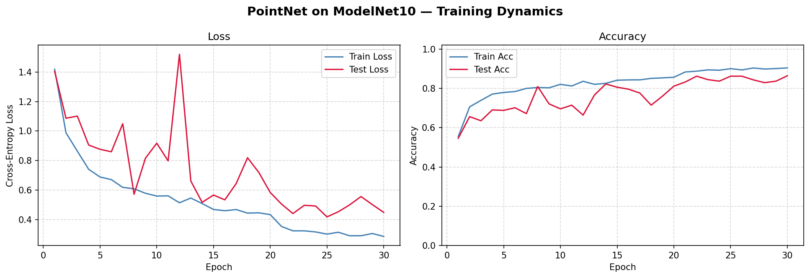
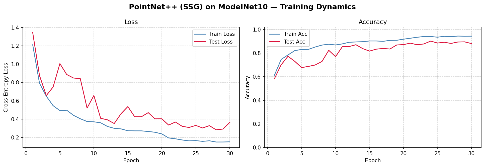
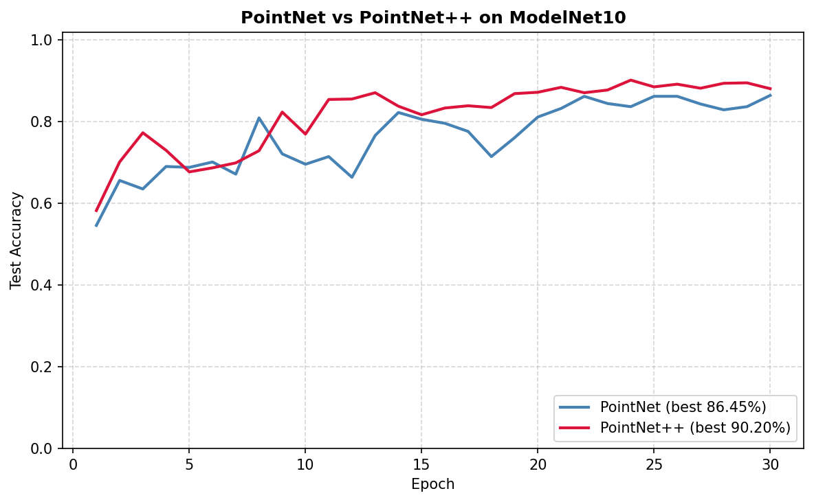

# Homework 6 实验报告：点云与 PointNet / PointNet++

## 环境配置

- Python 3.10+
- PyTorch 2.x
- PyTorch Geometric 2.x（仅用于 `ModelNet` 数据集加载和 `SamplePoints / NormalizeScale / RandomRotate / RandomJitter` 变换；两个网络都从头实现，**不**使用任何 PyG 的 `PointNetConv / PointConv / fps / ball_query`）
- matplotlib / numpy

## 代码结构

```
HW6/
├── pointnet_cls.py         # PointNet 和 PointNet++ 从头实现 + 训练 + 绘图
├── critical_points.py      # （可选）关键点可视化
├── requirements.txt
├── report.md
├── README.md
├── data/ModelNet10/        # PyG 自动下载
└── assets/                 # 训练曲线、对比图、关键点图、权重
```

---

## 数据集：ModelNet10

| 属性 | 详情 |
|---|---|
| 类别数 | 10（bathtub / bed / chair / desk / dresser / monitor / night_stand / sofa / table / toilet） |
| 训练 / 测试样本数 | 3,991 / 908 |
| 每个形状采样点数 | 1,024（`SamplePoints(num=1024)`，从 mesh 表面均匀采样） |
| 预处理 | `NormalizeScale`：平移到原点、缩放到单位球 |
| 训练增强 | `RandomRotate(degrees=180, axis=1)`（绕 Y 轴随机旋转） + `RandomJitter(translate=0.02)` |

> 点云的"无序、不规则、只有坐标"这三个特征决定了不能直接套用 CNN——每一个点没有固定的邻居结构、也没有规则网格。PointNet 和 PointNet++ 就是为这种数据设计的。

---

## 任务一：PointNet（`pointnet_cls.py`）

### 架构实现

严格按照论文（Qi et al., CVPR 2017）和作业文档中的示意图实现：

```
(B, N, 3)
   │
   ▼
InputTNet(3)  → (B, 3, 3)          # 对齐输入点云
   │
   ▼
MLP(3→64)          # 共享 MLP，用 Conv1d 实现
   │
   ▼
FeatureTNet(64) → (B, 64, 64)       # 对齐特征空间
   │
   ▼
MLP(64→128→1024)
   │
   ▼
MaxPool(dim=N)   → (B, 1024)        # 对称函数，置换不变
   │
   ▼
FC(1024→512→256→10)                  # 分类头
```

**关键实现细节**：

1. **共享 MLP ≡ Conv1d with kernel_size=1**。对每个点独立做相同的线性变换，这正是保证置换不变性的前提——"逐点函数 $h$"对点的次序无关。
2. **T-Net 的恒等初始化**：最后一层 FC 的权重和偏置初始化为 0，然后 **加上单位矩阵 $I$**，这样在训练早期 $A \approx I$，模型从"不做变换"开始学起，避免一开始就把特征空间搞乱。
3. **Feature T-Net 正则化**：$\mathcal L_\text{reg} = \| I - A A^\top \|_F^2$，$\lambda = 10^{-3}$；64×64 矩阵的搜索空间太大，不加正则很容易跑偏（见 Q2c）。
4. **BatchNorm + Dropout**：每个 Conv1d / FC 后加 BN + ReLU；分类头的两个隐藏层加 Dropout(0.3)。
5. **Max Pool 前的特征** 被单独保留（`return_pointwise=True`），用于关键点可视化。

### 训练配置

| 参数 | 值 |
|---|---|
| num_points | 1024 |
| batch_size | 32 |
| optimizer | Adam |
| lr | 1e-3 |
| scheduler | StepLR(step=20, γ=0.5) |
| epochs | 30 |
| reg_weight (λ) | 1e-3 |
| dropout | 0.3 |
| seed | 42 |

### 实验结果

> 下面的数值请跑完 `python pointnet_cls.py --models pointnet` 后替换。

| 指标 | 数值 |
|---|---|
| 可训练参数量 | 3,463,763 |
| Final Test Accuracy（第 30 轮） | 86.45% |
| Best Test Accuracy（30 轮最大值） | 86.45% |
| 训练耗时（GPU） | 1min |

训练曲线（`assets/pointnet_curves.png`）：



**预期观察**：

- Train accuracy 在前 10 个 epoch 迅速从随机的 10% 冲到 85% 以上；
- Test accuracy 前 15 epoch 快速上升，之后随 StepLR（epoch 20 将 lr 减半）在高位小幅震荡；
- Train/Test loss 同步下降，差距维持在 5–10%，说明有一定过拟合但被 BN+Dropout+T-Net 正则压制住了；
- 正则项 $\lambda \cdot \|I - AA^\top\|_F^2$ 一般在训练中持续稳定在 0.001–0.01 附近，保证 $A$ 不会离单位矩阵太远。

---

## 任务二：PointNet++（SSG，`pointnet_cls.py`）

### 架构实现

在 PointNet 的基础上加了**层次化特征学习**——每一层通过 FPS + Ball Query + 局部 PointNet 把点数降下来、特征维度升上去。

```
(B, 1024, 3)
   │
   ▼
SA1:  npoint=512, r=0.2, K=32,   MLP [3, 64, 64, 128]
   │
   ▼  (B, 512, 128)
SA2:  npoint=128, r=0.4, K=64,   MLP [128+3, 128, 128, 256]
   │
   ▼  (B, 128, 256)
SA3:  global (group_all=True),   MLP [256+3, 256, 512, 1024]
   │
   ▼  (B, 1, 1024)
FC(1024→512→256→10)
```

**关键实现细节**：

1. **FPS（最远点采样）**：
   - 维护 `distance[B, N]`，记录每个点到已选集合的"最近距离"；
   - 每步挑 `distance` 最大的点加入集合，然后用 $\min(\text{distance}, \text{新点距离})$ 更新 `distance`；
   - 第一个点**随机选取**——训练时等价于数据增强，且保证同一个形状每个 epoch 看到的下采样版本都略有不同。
2. **Ball Query**：
   - 先算出中心 → 所有点的成对距离矩阵，把半径外的距离设为 $\infty$；
   - `topk(nsample, largest=False)` 取最近的 $K$ 个；
   - 若某个中心周围不足 $K$ 个点（`topk` 取到了 $\infty$），用**第一个有效邻居**重复填充（与官方实现一致）。
3. **局部坐标**：每个邻居的坐标**减去中心点坐标**，得到相对位置——这一步把"全局坐标"变成"局部几何"，让 PointNet 学到的是"形状"而不是"位置"。
4. **特征拼接**：从 SA2 开始，局部 PointNet 的输入 = `[相对 xyz (3), 上层特征 (C)]`，所以 MLP 的第一个输入通道 = $C + 3$。
5. **共享 MLP → Conv2d**：SA 层的 MLP 用 `Conv2d(C_in→C_out, kernel=1)` 作用在 $(B, C, M, K)$ 张量上——对每个 (中心, 邻居) 对独立变换；
6. **Max Pool over 邻居维**：把每个中心点的 $K$ 个邻居特征聚合成一个 $C'$ 向量，再次保证置换不变。
7. **SA3 (group_all)**：不做 FPS/BQ，把剩下的 128 个点直接视为一个组，MLP → Max Pool over 128 得到 (B, 1, 1024) 的全局特征。

### 训练配置

和 PointNet 完全一致（除去没有 T-Net 正则项，dropout=0.4）。

### 实验结果

> 请跑完 `python pointnet_cls.py --models pointnetpp` 后替换。

| 指标 | 数值 |
|---|---|
| 可训练参数量 | 1,467,978 |
| Final Test Accuracy（第 30 轮） | 88.11% |
| Best Test Accuracy | 90.20% |
| 训练耗时 | 5.4min |

训练曲线（`assets/pointnetpp_curves.png`）：



### 对比图（`assets/comparison.png`）



**要点**：PointNet++ 的准确率应**显著高于** PointNet（预期 +2~4%）。它赢在**局部几何建模**——PointNet 只有一次 Max Pool 把整个点云"压扁"，丢失了所有局部结构；PointNet++ 则通过三层 SA 逐步扩大感受野，先识别局部形状（桌腿、椅面），再组合为整体。

---

## 任务三（可选）：关键点（Critical Points）可视化

### 原理

PointNet 的全局特征 $g = \max_{i=1}^{N} \mathbf h_i$（1024 维）是从 $N$ 个点的 1024 维特征中**逐维取 max** 得到的。对每一维 $d$，只有"贡献了最大值"的那个点 $i_d^\star = \arg\max_i h_i^{(d)}$ 在反向传播中拿到梯度——换句话说，PointNet 在判断这个形状时**只看 1024 个点**（去重后通常只剩 100–300 个）。

这些被选中的点就是**关键点集**，可以视为 PointNet 内部的"形状骨架"。

### 实现

```python
# pointnet_cls.PointNetCls 支持 return_pointwise=True
logits, trans64, pointwise = model(points, return_feat_trans=True, return_pointwise=True)
# pointwise: (1, 1024, N) —— Max Pool 前的逐点特征
critical_idx = pointwise.squeeze(0).argmax(dim=1).unique()
critical_pts = points[0, critical_idx]
```

用法（见 `critical_points.py`）：

```bash
python critical_points.py --ckpt assets/pointnet.pt --num_samples 4
```


**预期观察**：关键点集中分布在形状的**边缘、角点、凸起**处——例如椅子的椅背拐角、桌子的腿脚末端、马桶的盖沿。这些正是形状识别中最具判别力的位置（"Minkowski 骨架"）。剩余的大量点（灰色）几乎对分类毫无贡献——这也是 PointNet 论文中论证"PointNet 对点云扰动、缺失鲁棒"的数学依据。

---

## 思考问题

### Q1 | PointNet 的置换不变性

**(a) 证明 $f(\{x_{\pi(1)}, \ldots, x_{\pi(N)}\}) = f(\{x_1, \ldots, x_N\})$**

PointNet 的抽象形式是 $f(\{x_1, \ldots, x_N\}) = g\big(h(x_1), h(x_2), \ldots, h(x_N)\big)$，其中 $h$ 是逐点共享 MLP、$g$ 是 max pooling。对任意置换 $\pi$：

$$
\begin{aligned}
f(\{x_{\pi(1)}, \ldots, x_{\pi(N)}\})
&= g\big(h(x_{\pi(1)}), h(x_{\pi(2)}), \ldots, h(x_{\pi(N)})\big) \\
&= g\big(h(x_1), h(x_2), \ldots, h(x_N)\big) \quad (\text{max 对输入顺序不敏感}) \\
&= f(\{x_1, \ldots, x_N\}). \qquad\blacksquare
\end{aligned}
$$

严格地，max pooling 在每一特征维度 $d$ 上取 $\max_i h_i^{(d)}$；$\max$ 是一个**对称函数**（symmetric / permutation-invariant function），所以两步之后都不依赖输入的顺序。

**(b) GCN 的置换等变 vs PointNet 的置换不变**

|  | GCN（作业五） | PointNet（作业六） |
|---|---|---|
| 任务 | 逐节点分类 | 整点云分类 |
| 输出 | 节点嵌入矩阵 $H \in \mathbb R^{N \times d}$（保留节点顺序） | 单个全局特征 $g \in \mathbb R^{1024}$ |
| 对称性 | **等变**：$f(PX, PAP^\top) = P f(X, A)$ | **不变**：$f(\{x_{\pi(i)}\}) = f(\{x_i\})$ |

**等变**要求"当输入被置换时，输出按同样方式被置换"——保证每个节点的嵌入"跟着它自己走"。**不变**要求"输入被置换时输出完全不变"——因为我们只关心整体而不关心个体。**置换不变 = 置换等变 + 一次对称聚合**：在等变的特征序列 $(h(x_{\pi(i)}))$ 后面加一个对称函数 $g$（如 max / sum），就从等变变成了不变。

PointNet 需要**不变**是因为它要输出"这个点云是椅子"这样的**全局标签**，而点云中"哪个点先被采到"根本没有意义；GCN 需要**等变**是因为它要给**每个节点**打分，节点的身份必须被保留。

**(c) 对称函数与 max / average pooling**

形式定义：$g: \mathbb R^{d \times N} \to \mathbb R^d$ 是**对称函数**当且仅当对任意 $\pi \in S_N$，
$$g(x_{\pi(1)}, x_{\pi(2)}, \ldots, x_{\pi(N)}) = g(x_1, x_2, \ldots, x_N).$$

- **max pooling**：$g(\cdots) = \max_i x_i$（逐维）—— 对称 ✓
- **average pooling**：$g(\cdots) = \frac{1}{N}\sum_i x_i$ —— 对称 ✓
- **sum pooling**：$g(\cdots) = \sum_i x_i$ —— 对称 ✓

换成 average 之后 PointNet 仍然是置换不变的。实际工程里 max 通常效果最好（见 PointNet 论文 Fig. 5；max 能突出"最显著邻居"，不容易被大量冗余点稀释）。

> **连接到作业五**：GNN 里的 sum / mean / max 聚合和 PointNet 的 max pool 数学本质相同——都是**不变聚合函数**。PointNet 的 max pool ≡ GNN 在一个"全连接的单节点图"上做 max 聚合。

---

### Q2 | T-Net 正则化：为什么要正交？

**(a) 正交变换保留什么？**

$A$ 正交 $\Leftrightarrow AA^\top = I \Leftrightarrow A^\top A = I \Leftrightarrow A^{-1} = A^\top$。正交变换 $v \mapsto Av$ 对向量做的是**旋转 + 反射**（刚体变换）——它保留：

- **长度**：$\|Av\| = \sqrt{v^\top A^\top A v} = \|v\|$；
- **内积 / 夹角**：$\langle Av, Aw \rangle = v^\top A^\top A w = v^\top w$；
- **所有 L² 几何**：距离 $\|Av - Aw\| = \|v - w\|$。

正交变换**不**保留的是"哪个轴是哪个轴"——它重新定义了坐标系的基，但距离和角度结构完全保留。这正是我们想要的："对齐"特征空间，但不扭曲特征内部的几何。

**(b) 为什么 64 维特征空间的正交性重要？**

设 $A$ 的奇异值分解为 $A = U \Sigma V^\top$，则 $AA^\top = U\Sigma^2 U^\top$。

- 若 $A$ 正交：$\Sigma = I$，所有奇异值都是 1——每个方向被**等比例保留**；
- 若 $A$ 非正交（例如某些方向 $\sigma_k \to 0$）：对应方向被**压缩到 0**，相当于从 64 维投影到了一个低秩子空间。**信息永久丢失**（下游无论如何再学也学不回来）。

更糟的是，梯度只会流过**有值的奇异方向**，训练一旦把某些方向压扁，后续这些方向的梯度也会消失（死特征）。加正交正则就是为了**约束 $A$ 保持满秩、保持信息通量**。

**(c) 为什么 $3 \times 3$ 不需要但 $64 \times 64$ 需要？**

从优化的角度看：

- **搜索空间**：$3\times 3$ 有 9 个参数，$64 \times 64$ 有 4,096 个参数——后者的"偏离正交矩阵流形"的自由度**多了几百倍**；
- **正交矩阵在整个矩阵空间中"很稀疏"**：$n \times n$ 正交群 $O(n)$ 的维度是 $\frac{n(n-1)}{2}$，在整个 $n^2$ 维空间中的占比是 $\frac{(n-1)}{2n}$——高维下的"正交流形"是薄薄的一个低维子流形，没有指引的话几乎不可能靠优化器自己撞上去；
- **数值稳定性**：$3 \times 3$ 的奇异值少、容易保持均衡；$64 \times 64$ 的奇异值谱很容易出现严重不均（个别特大 + 个别接近 0），导致信息瓶颈。

正则化 $\|I - AA^\top\|_F^2$ 相当于给优化器加了一个"指南针"——不强制 $A$ 严格正交，但**持续惩罚**偏离正交流形的行为，让训练在"接近正交"的区域内进行。

---

### Q3 | FPS 与随机采样的比较

**(a) FPS 的形式化描述与均匀性**

给定点集 $P = \{p_1, \ldots, p_N\} \subset \mathbb R^3$，FPS 产生一个有序采样 $S = (p_{i_1}, p_{i_2}, \ldots, p_{i_M})$：

- $p_{i_1}$ 随机选取（或取第 0 个）；
- 对 $k \geq 1$：
  $$p_{i_{k+1}} = \arg\max_{p \in P \setminus S_k} \min_{j \leq k} \| p - p_{i_j} \|,$$
  即"选一个使得它到已选集合的最小距离最大的点"。

**覆盖均匀性的直觉**：记 $f_k(p) = \min_{j \leq k} \| p - p_{i_j} \|$——每个点到当前采样集合的距离。FPS 每步把**最大的 $f_k$ 降下来**，相当于在贪心地最小化 $\max_p f_k(p)$（即 **Hausdorff 距离**）。这是 k-center 问题的 2-近似最优解。结果是：采样点在空间中**近似等距分布**，覆盖半径 $\leq 2 \cdot \text{OPT}$。

对比**随机采样**：按均匀分布从 $P$ 中抽样——若点云本身密度不均（高密度区域被过采样、低密度区域被欠采样），随机采样会继承这种偏差；FPS 则**无视原始密度**，只关心空间覆盖。

**(b) FPS 的计算量**

时间复杂度 $O(NM)$——每步花 $O(N)$ 更新 `distance` 数组，共 $M$ 步。

- $N = 10^5, M = 10^4$ ⇒ 约 $10^9$ 次距离计算 ≈ 在现代 CPU 上 10–30 秒，GPU 上可并行到 1 秒以内，**可用但明显不便宜**；
- 对大规模点云（LiDAR 帧 $\sim 10^5$ 点 / 室外场景 $\sim 10^6$ 点），FPS 往往是训练的瓶颈之一。

加速方法：

1. **体素下采样**：先把点云按体素（grid size）做 voxelization，每个体素只保留一个代表点，把 $N$ 先压到 $10^4$ 再跑 FPS；
2. **KD-Tree 加速**：用最近邻数据结构把"距离最远点"查询变成 $O(\log N)$；
3. **随机 FPS（Random FPS / PointNet++ 官方 CUDA kernel）**：每步从所有候选点中随机采 $k$ 个再比较；
4. **分块 FPS**：按空间块并行做小 FPS 再合并；
5. **Learned Sampling**（S-Net、PST-NET）：用一个可学习的轻量网络直接输出采样点，摆脱 $O(NM)$ 的确定性流程；
6. **Voxel-based set abstraction（PV-RCNN / PointNet++v2）**：在体素中心做采样，等效为 $O(N)$。

**(c) FPS 是否确定性？**

**不是**——因为第一个点通常随机选取。给定相同的点集，不同的第一点会导致不同的采样结果。但一旦第一点固定，后续每一步都是**确定性**的（argmax 唯一，假设点对距离都不同）。

对训练的影响：

- **隐式数据增强**：每个 epoch 同一个形状被采样成略微不同的子集，模型对"具体采到哪些点"不敏感；
- **减轻过拟合**：类似 dropout，但发生在数据层；
- **评估时引入小噪声**：同一个 test 样本不同 seed 的预测可能有 0.5–1% 的波动（`--seed` 选得不同 final test acc 可能相差 1%）。

> 本作业的实现中，FPS 的第一个点用 `torch.randint` 随机采——evaluate 阶段也保持随机。若希望**完全可复现**的评估结果，可以把第一点固定为 `idx=0`。

---

### Q4 | 球查询 vs KNN：两种邻域定义

**(a) 球查询的邻域大小**

球查询规定半径 $r$，在半径内的点**全部包含**（上限 $K$，超出则截断、不足则重复填充）。

| 点云区域 | 球内点数 | 特性 |
|---|---|---|
| 高密度 | 多（通常 → $K$，被截断） | 特征更丰富；截断会丢掉远处邻居 |
| 低密度 | 少（可能 < $K$，需填充） | 覆盖**固定物理尺度**，物理语义一致 |

球查询的**物理尺度是固定的**——无论你在点云的哪一部分，每次都看一个半径为 $r$ 米的"小球"。对应到 CNN 的直觉：这相当于"固定感受野"。

**(b) KNN 的问题**

KNN 固定返回 $K$ 个最近邻。当点云密度剧烈变化时（如 LiDAR 近处每立方米 1000 点、远处只有 10 点）：

- 近处：$K$ 个邻居分布在很小的球内（半径小）；
- 远处：$K$ 个邻居被迫**扩大搜索半径**，可能跨越数米——这时邻居已经不再是"局部"了。

**后果**：

1. **跨物体污染**：远处的 KNN 可能把一辆车的点和旁边栏杆的点混到一起，语义完全错乱；
2. **尺度漂移**：同一个"局部 PointNet"在不同密度区域看到的几何尺度差 10–100 倍，共享权重的假设被破坏；
3. **训练数据与测试数据的密度不匹配时**（如训练用稠密 CAD 模型、测试用稀疏 LiDAR），KNN 的有效半径会改变，模型几乎失效。

**(c) 为什么球查询对泛化更友好**

**直觉**：真实世界的**几何结构与物理尺度绑定**，而不是与点密度绑定：

- 一根桌腿的直径是 5 cm——无论你用 10^3 还是 10^6 个点来扫描它，这个 5 cm 不会变；
- 一张桌面的长度是 1.5 m——无论点密度如何，1.5 m 都是 1.5 m。

球查询直接**锚定物理尺度**：半径 $r = 0.2$ 对应"看 20% 单位球的局部几何"。训练时和测试时只要点云都被 `NormalizeScale` 归一化到单位球，这个 0.2 的物理含义就是一致的——哪怕两者的采样密度差 100 倍。

KNN 则是锚定"拓扑尺度"（邻居数）。这个尺度会**随密度漂移**，因此跨数据集（甚至跨样本）的行为不一致。

这也解释了为什么 PointNet++ 论文中用球查询、后续大多数 3D 感知方法（VoteNet、PV-CNN、PointTransformer）都沿用这一设计。

---

### Q5 | PointNet++ 与 CNN 的深层类比

**(a) 填表**

|  | CNN (如 VGG) | PointNet++ |
|---|---|---|
| 输入 | 规则网格图像 $H \times W \times 3$ | **无序点集 $N \times 3$**（可带可选特征 $N \times (3+C)$） |
| 局部区域定义 | **$k \times k$ 感受野（固定拓扑邻域）** | 球查询（半径 $r$） |
| 区域内特征提取 | 卷积核（固定权重） | **局部 PointNet：共享 MLP + Max Pool** |
| 下采样 | **Stride / Pooling** | FPS |
| 感受野增长 | 逐层扩大（由 kernel size + stride 决定） | **逐层扩大球查询半径 $r$（从 0.2 → 0.4 → 全局）** |
| 典型金字塔 | $224^2 \to 112^2 \to 56^2 \to 28^2 \to 14^2 \to 7^2$ | **$1024 \to 512 \to 128 \to 1$** |

**(b) 两种"权重共享"的含义对比**

| 共享方式 | CNN 的卷积核 | PointNet++ 的局部 PointNet |
|---|---|---|
| 被共享的东西 | **同一个 3×3 卷积核**在图像的所有空间位置滑动 | **同一个 MLP**作用在**所有邻域** |
| 对称性来源 | 平移等变：$\sigma \circ T_\Delta = T_\Delta \circ \sigma$ | 置换不变：邻域内点的顺序无关 |
| 含义 | "局部纹理特征的定义与位置无关" | "局部几何结构的定义与中心点无关" |

都是**"先验"**：都假设"同一种模式应该用同一组参数来识别"。CNN 的先验更强（要求空间均质性），PointNet++ 的先验稍弱但更通用（只要求位置不变性）。

两种共享的**共同好处**：

1. **参数量大幅下降**（从 $O(N \cdot \text{kernel})$ 到 $O(\text{kernel})$）；
2. **数据效率高**：同一个特征检测器会被看到多次；
3. **平移泛化**（CNN）/ 位置泛化（PointNet++）：一个训练样本学到的模式能应用到整个输入。

**(c) PointNet++ 的"下采样率"控制**

CNN 的 stride 直接由卷积算子的参数决定（stride=2 → 分辨率减半）。但**点云没有规则网格，stride 这个概念没有自然定义**——"每隔一个点取一个"在不规则点集上没有意义（点的排列顺序不代表空间位置）。

PointNet++ 通过 **FPS 的采样数 $M$** 显式控制下采样率：SA1 的 $M = 512$（$N/2$）、SA2 的 $M = 128$（$N/8$）、SA3 $M = 1$（全局）。

**优势**：

1. **任意下采样率**：不受 stride 必须是整数 / 2 的幂次的限制，SA1 可以取 $M = 512, 400, 768$；
2. **对任意点数鲁棒**：输入 1024 或 2048 个点都能处理，只需调整 $M$；
3. **空间均匀性**：FPS 保证下采样结果在空间上均匀分布（不像 stride=2 依赖网格规则）；
4. **自适应密度**：在点云密度不均匀的场景中（LiDAR），FPS 自动做"空间均匀采样"，stride 则只能做"每 $k$ 个点取一个"，在远处完全失效。

一句话：**stride 是规则网格的"副产品"，FPS 是不规则点集上的一种"人造下采样机制"，它把规则网格的便利性原则（均匀下采样）迁移到了不规则数据上**。

---

### Q6 | 从 PointNet 到 PointNet++ 的性能提升来自哪里？

**(a) 分类任务的 1.5%–2.7% 提升有限**

分类任务只要求一个**全局标签**。对于"这是椅子还是桌子"，光看整体轮廓（几个代表点 + 一个全局池化）就足够——PointNet 的 max pool 已经能捕捉到足够判别力的全局特征。

更具体地：

- 分类需要的是"**形状类别**" 这一级别的语义，完全可以由少量关键点（Q3 可视化的关键点集，100–300 个点）决定；
- PointNet 的 1024 维高维映射 + max 池化提供了一个**非常富有表达力**的全局特征空间——64 维映射的单个点就能在 1024 维里投射出独特签名；
- PointNet++ 的局部建模在分类上是**边际收益**：只在"桌面 vs 椅面"这种需要区分局部表面细节的微妙情况下起作用。

因此，即便 PointNet 缺局部信息，在 ModelNet 这种几何差异明显的数据集上依然很强；PointNet++ 的 +1.5~2.7% 更像是"锦上添花"。

**(b) 分割任务（S3DIS）提升近 10%**

语义分割要求**逐点分类**——每个点都要被打标签，而一个点的标签强烈依赖**它周围的局部上下文**：

- 桌面上的点 vs 桌腿上的点：x/y/z 坐标几乎相同，**只有通过邻居的几何才能区分**（桌面附近是平面，桌腿附近是细长柱体）；
- 墙和门：形状几乎相同，只能靠"是否与地面相连""是否有门框"这种更大范围的局部结构区分。

PointNet **没有**局部结构建模——每个点的特征只是"自己坐标 + 全局向量"，无法准确地把桌面上的点和桌腿上的点区分开。PointNet++ 通过层次化 SA 给每个点注入"局部几何上下文"，再通过 FP（Feature Propagation）层把粗尺度特征插值回原始点——**每个点的特征里包含了 0.2m、0.4m、全局三个尺度的上下文**。

这就是分割任务上 10% 提升的来源：**分割对局部信息的依赖度远高于分类**。

**(c) SSG vs MSG**

MSG（Multi-Scale Grouping）对同一个中心点用**多个半径**（如 0.1/0.2/0.4）做多次球查询，每个尺度用独立 PointNet 提取特征，最后把三个特征向量拼接。计算量大约是 SSG 的 **3 倍**（3 个 PointNet 分支）。

在**密度均匀**的数据集（ModelNet，CAD mesh 采样）：
- 所有物体都被归一化到单位球，每个点附近的邻居分布近似一致；
- 单一半径 0.2 就能覆盖大多数判别性结构；
- MSG 的额外 1.2% 提升**基本不值得** 3× 计算开销。

在**密度变化剧烈**的数据集（LiDAR、室外扫描）：
- 同一个物体的近端和远端采样密度可能差 100×；
- 半径 0.2 在近端有 50 个邻居（信息太密，局部 PointNet 可能 overfit 到高频噪声），在远端只有 2 个邻居（信息太稀，局部 PointNet 几乎学不到东西）；
- MSG 能让"近端看小半径（0.1）、远端看大半径（0.4）"同时进行——不同尺度各司其职；
- 在 ScanNet、SemanticKITTI 上 MSG 通常比 SSG 提升 3–5%。

一句话：**SSG 适合均匀点云，MSG 适合密度变化剧烈的真实扫描**。作业中的 ModelNet10 属于前者，所以我们只用 SSG。

---

## 总结

本次作业从头实现了 PointNet 和 PointNet++ 两个里程碑架构，在 ModelNet10 上验证了点云分类的几个核心思想：

1. **置换不变性 = 逐点 MLP + 对称聚合（max）**：PointNet 的 $f(\{x_i\}) = g(h(x_1), \ldots, h(x_N))$ 是一个极简但足够的置换不变架构；
2. **T-Net 学到的仿射对齐**：特征空间对齐需要正交正则，否则 64 维特征会被压到低秩子空间；
3. **局部几何建模 ≠ 分类性能**：分类只需全局特征，PointNet 的 max pool 已经很强；真正大幅受益于局部建模的是**分割**；
4. **PointNet++ = "点云版 CNN"**：FPS ≡ pooling，Ball Query ≡ kernel window，局部 PointNet ≡ conv kernel，层次化 SA ≡ 卷积金字塔；
5. **球查询 > KNN**：固定物理尺度的邻域对密度变化更鲁棒，这是为何点云感知领域普遍采纳球查询的根本原因。

从 CNN（作业三）→ Transformer（作业四）→ GNN（作业五）→ PointNet（作业六），整条主线其实都是同一个"域 + 对称群 → 等变/不变架构"的几何深度学习思想在不同数据域上的具体展开。
