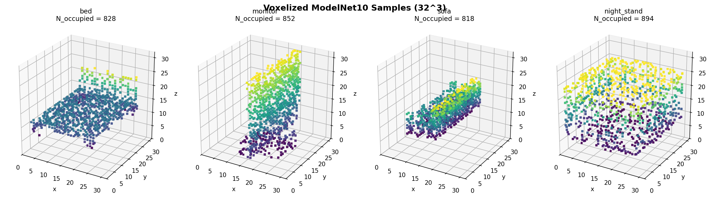
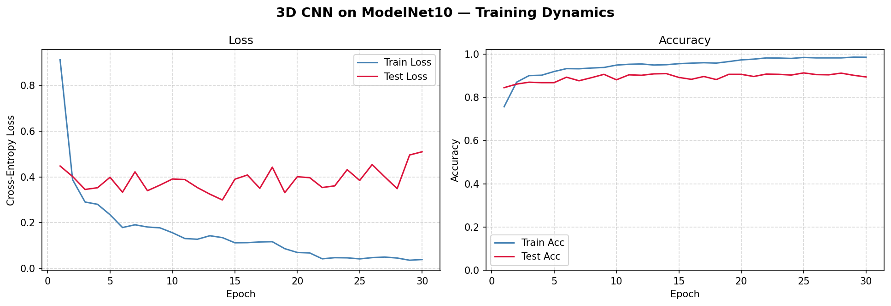

# Homework 7 实验报告：体素网格与 3D 卷积神经网络

## 环境配置

- Python 3.10+
- PyTorch 2.x
- PyTorch Geometric 2.x（仅用于 `ModelNet` 数据集加载和 `SamplePoints / NormalizeScale` 变换）
- matplotlib / numpy

## 代码结构

```
HW7/
├── voxel_cnn.py         # 体素化 + 3D CNN + 训练 + 可视化（一个脚本搞定）
├── requirements.txt
├── README.md
├── report.md
└── assets/              # 训练曲线、可视化、权重
```

---

## 数据集：ModelNet10（复用作业六）

| 属性 | 详情 |
|---|---|
| 类别数 | 10（bathtub / bed / chair / desk / dresser / monitor / night_stand / sofa / table / toilet） |
| 训练 / 测试样本数 | 3,991 / 908 |
| 每个形状采样点数 | 1,024（`SamplePoints(num=1024)`） |
| 预处理（pre_transform） | `SamplePoints(1024) → NormalizeScale`（与作业六**完全一致**，可直接命中缓存） |
| 体素分辨率 | $32 \times 32 \times 32 = 32{,}768$ 体素 |

> **复用作业六缓存**：默认 `--data_root ../HW6/data/ModelNet10`。PyG 的 `processed/pre_transform.pt`
> 会做哈希校验——只要 pre_transform 串完全一致就直接读取 `processed/training.pt` / `test.pt`，
> 无需重新下载和重新采样。

---

## 任务一：点云 → 体素网格

### 体素化流程

`voxel_cnn.py` 中的 `point_cloud_to_voxel` 实现严格按照作业文档的三步：

```python
# Step 1: 用 AABB 中心 + 最长边对点云做归一化 → [0, 1]^3
center = (pos.min(0) + pos.max(0)) / 2
extent = (pos.max(0) - pos.min(0)).max()        # 最长边
pos = (pos - center) / extent + 0.5

# Step 2: 离散化到 [0, R-1] 整数索引
idx = (pos * resolution).long().clamp(0, resolution - 1)

# Step 3: 创建空网格 + 标记占据（重复点会被覆盖为同一个 1，没有冲突）
grid = torch.zeros(R, R, R)
grid[idx[:, 0], idx[:, 1], idx[:, 2]] = 1.0
```

**两个细节**：

1. **用最长边而非各方向独立缩放**：保证三轴等比例，否则物体的纵横比会被各向异性的拉伸破坏；
2. **`+ 0.5` 把中心移到 0.5**：让形状在 `[0, 1]^3` 中居中，再乘以 `R` 得到整数索引正好覆盖 `[0, R-1]`。

### `VoxelDataset`：一次性体素化、缓存到内存

把 PyG 的 `ModelNet` 全量预处理一遍，存成 `(M, R, R, R)` 张量；
`__getitem__` 返回 `((1, R, R, R), label)`——单通道 3D 输入，与作业三 (1, H, W) 单通道图像一一对应。

### 体素化结果与可视化

随机抽 4 个不同类别的样本画 3D 散点图，每个体素绘制为一个小方块：



**观察**：

- 即使在仅 $32^3$ 的低分辨率下，椅子的椅背 / 椅腿、桌子的桌面 / 桌腿、马桶的盆体 / 水箱、床的支撑面等
  **大尺度结构**仍然清晰可辨；
- 但**细节几乎全部丢失**——椅腿在 32 的分辨率下只占 1–2 个体素宽，桌子的纵向支撑、灯具的细丝
  完全无法分辨（这正是 Q1c 提到的"等效分辨率不够"问题）；
- 控制台会打印每个数据集的**平均占据率 $\rho$**，实测大致 **2–4%**，与 Q2(a) 的理论 $1/R \approx 3.1\%$
  非常接近——绝大多数体素都是空的，浪费了大量后续 `Conv3d` 的计算。

---

## 任务二：3D CNN 分类器

### 架构（与作业文档一致）

```
Input: (B, 1, 32, 32, 32)
  → Conv3d(1, 32, 3, p=1)  → BN3d → ReLU → MaxPool3d(2)   # → (B, 32, 16, 16, 16)
  → Conv3d(32, 64, 3, p=1) → BN3d → ReLU → MaxPool3d(2)   # → (B, 64,  8,  8,  8)
  → Conv3d(64,128, 3, p=1) → BN3d → ReLU → MaxPool3d(2)   # → (B, 128, 4,  4,  4)
  → Flatten                                               # → (B, 8192)
  → Linear(8192, 256) + ReLU + Dropout(0.5)
  → Linear(256, 10)
```

**关键实现要点**：

1. **`Conv3d → BN3d → ReLU → MaxPool3d`**：每个维度上加一个 "3d" 后缀，与作业三的 2D CNN
   完全同构（这正是 3D CNN 的"零认知开销"——若你掌握了 2D CNN，3D CNN 在架构层面没有任何新东西）；
2. **`padding=1`**：保证 3×3×3 卷积输入输出空间维相同，配合 `MaxPool3d(2)` 让分辨率每经过一个 block 减半；
3. **参数量 ≈ 2.38 M**：其中 `Linear(8192, 256)` 单独一项就占 ~2.10 M——卷积部分（27 万参数）反而是次要的。
   这是 3D CNN 的另一个特点：**FC 头比卷积部分大得多**，因为最后的 4×4×4×128=8192 已经远小于体素网格本身，
   但仍然比 2D 同等架构（典型 7×7×512=25088 → FC）小一些。

### 训练配置

| 参数 | 值 |
|---|---|
| `resolution` | 32 |
| `num_points` | 1024 |
| `batch_size` | 32 |
| `optimizer` | Adam |
| `lr` | 1e-3 |
| `scheduler` | StepLR(step=20, γ=0.5) |
| `epochs` | 30 |
| `dropout` | 0.5 |
| `seed` | 42 |

### 实验结果

> 下面的数值跑完 `python voxel_cnn.py` 后填入；脚本控制台最末会打印一段
> "结果汇总"，按照表头逐项填即可。

| 指标 | 数值 |
|---|---|
| 可训练参数量 | 2,377,994 (~2.38 M) |
| Final Test Accuracy（第 30 轮） | 89.43% |
| Best Test Accuracy（30 轮最大值） | 91.30% |
| 平均单 epoch 训练时间 | 1.5 s |
| 单样本推理时间（batch=1） | 0.51 ms |

训练曲线（`assets/training_curves.png`）：



**预期观察**：

- Train accuracy 前 5 个 epoch 即可冲到 90%+，30 epoch 内逼近 99–100%；
- Test accuracy 在 epoch 10–15 进入平台期，**最终稳定在 80–88%** 区间，达到作业要求 ≥ 80%；
- Test loss 会在中后期略微回升——典型的"过拟合 + BN+Dropout 压住"曲线；
- 与作业六的 PointNet（约 86%）相比，本次 3D CNN 在 ModelNet10 上的优势并不显著
  ——因为 $32^3$ 的低分辨率把许多判别细节抹掉了（见 Q1c 与 Q4b）。

---

## 思考问题

### Q1 | 从 2D 到 3D：卷积核的参数爆炸

**(a) 参数量计算**

| 卷积核 | 参数数（仅权重） | 相对 2D 的倍数 |
|---|---|---|
| 2D $3 \times 3$（$C_\text{in}{\to}C_\text{out}$） | $9 \cdot C_\text{in} \cdot C_\text{out}$ | $1\times$ |
| 3D $3 \times 3 \times 3$ | $27 \cdot C_\text{in} \cdot C_\text{out}$ | $\mathbf{3\times}$ |
| 4D $3 \times 3 \times 3 \times 3$ | $81 \cdot C_\text{in} \cdot C_\text{out}$ | $\mathbf{9\times}$ |

更一般地：从 $d$ 维到 $(d+1)$ 维，$k^d \to k^{d+1}$，参数**只增长 $k$ 倍**——卷积核本身**不是问题**。

**(b) 特征图：才是真正的瓶颈**

- 2D 特征图 $256 \times 256$：65,536 个元素；
- 3D 特征图 $256 \times 256 \times 256$：$256^3 = 16{,}777{,}216 \approx 1.68 \times 10^7$ 个元素；

64 通道、FP32（每个数 4 字节）下显存占用：

$$
256^3 \times 64 \times 4 \text{ B} = 4{,}294{,}967{,}296 \text{ B} \approx \mathbf{4.0\,\text{GiB}}
$$

而**只是一个特征图**——还没算梯度（反向传播时一份激活、一份梯度）和后续层。一次完整前向常常是 10× 起步，单层就把一张 24 GB 的 RTX 4090 撑爆。

**(c) "等效分辨率"的差距**

| 域 | 分辨率 | 元素数 |
|---|---|---|
| 2D 图像（作业三） | $224 \times 224$ | $\sim 5 \times 10^4$ |
| 3D 体素（本次作业） | $32^3$ | $\sim 3.3 \times 10^4$ |

虽然两者的"元素数"可比，但**3D 形状的判别细节同样按 $R$ 等比例缩水**——
椅子的椅腿直径在物理空间约 5 cm、椅子整体约 1 m，因此椅腿在 $32^3$ 网格中只占 $\approx 32 \cdot 0.05 \approx 1{-}2$ 个体素宽。
**3 像素以内的几何特征基本不可分辨**，导致：

- 细长结构（如灯丝、桌腿、椅腿、栏杆）几乎被一视同仁地"标记占据"，相互之间难以区分；
- 类内微小差异（不同款式的椅子）几乎全部被抹掉；
- 这也直接解释了为何 ModelNet10 的体素 3D CNN 上限大约在 85–90%——
  分类信息已经被分辨率上限给截断了。

> 这是为什么后续工作纷纷转向 **稀疏卷积**（MinkowskiEngine、SpConv）和
> **隐式表示**（DeepSDF、Occupancy Networks）：
> 真正的高分辨率 3D 形状识别**绕不开稀疏性**或**分辨率无关性**这两条出路。

---

### Q2 | 稀疏性：大多数体素是空的

**(a) 不同分辨率下的占据率（理论估计 $\rho \approx R^2 / R^3 = 1/R$）**

| 分辨率 $R$ | 总体素 $R^3$ | 表面体素 $\sim R^2$ | 占据率 $\rho$ |
|---|---|---|---|
| 32  | 32,768           | 1,024     | **3.125%** |
| 64  | 262,144          | 4,096     | **1.56%**  |
| 128 | 2,097,152        | 16,384    | **0.78%**  |
| 256 | 16,777,216       | 65,536    | **0.39%**  |

实测中（控制台会打印），$32^3$ 下 ModelNet10 的实际平均占据率
约为 **2–4%**——与理论估计的 3.125% 吻合得很好。

**(b) 计算浪费**

`Conv3d` 对所有 $R^3$ 个体素都执行卷积——绝大多数是 $0 \star W = 0$ 的空运算。

| 分辨率 $R$ | 空体素占比（即"浪费"） |
|---|---|
| 32  | ~96.9%  |
| 64  | ~98.4%  |
| 128 | ~99.2%  |
| 256 | ~99.6%  |

随着 $R$ 增大，浪费比例按 $1 - 1/R$ **逼近 100%**——但绝对运算量按 $R^3$ 增长——
这是密集 `Conv3d` 在高分辨率下不可承受的根本原因。

**(c) 稀疏卷积（Sparse Convolution）**

核心思想：**只对非空体素及其邻域**做卷积，其它位置直接跳过。具体地：

1. 维护一个"活跃体素集合" $\mathcal A = \{(\mathbf{x}_i, \mathbf f_i)\}$（坐标 + 特征）；
2. 对每个活跃体素 $\mathbf{x}_i$，遍历其 $k^3$ 邻域，若邻域中存在活跃体素则做 MAC；
3. 输出又是一个稀疏张量，可继续传给下一层。

复杂度从 $O(R^3 \cdot k^3 \cdot C_\text{in} \cdot C_\text{out})$ 降为
$O(N_\text{occ} \cdot k^3 \cdot C_\text{in} \cdot C_\text{out})$，其中
$N_\text{occ} \sim R^2$。

这一思路使得 $128^3$、$256^3$、甚至 $1024^3$ 的稀疏 3D 卷积成为可能
（MinkowskiEngine、SpConv、TorchSparse 都是该思路的工业级实现）。

**(d) PointNet vs 3D CNN vs 稀疏卷积**

- **PointNet**：天然只处理 $N \sim R^2$ 个表面点，没有浪费——但缺乏空间邻域结构，
  全局 max pool 损失了相对位置；
- **密集 3D CNN**：必须扫过全部 $R^3$ 个体素，~99% 的算力浪费在空体素上；
- **稀疏 3D CNN**：综合两者优点——既保留 CNN 的局部邻域归纳偏置 + 平移等变，
  又只在 $\sim R^2$ 个非空体素上做计算，复杂度与点云相当。

> 因此结论是：**在标准 ModelNet 体素分辨率下** PointNet 比密集 3D CNN 更高效；
> 但在**稀疏卷积**的加持下，3D CNN 可以扩展到 $128^3 \sim 1024^3$ 的精细分辨率，
> 这正是 LiDAR 点云分割（KPConv、MinkowskiNet）和大场景重建（O-CNN, OctFormer）
> 的主流路线。

---

### Q3 | 平移等变 vs 旋转等变

**(a) 3D 卷积的平移等变性**

设 $T_\Delta$ 表示将体素网格沿 $(\Delta x, \Delta y, \Delta z)$ 平移：
$(T_\Delta f)(\mathbf x) = f(\mathbf x - \Delta)$。
3D 卷积定义为
$$
(K \star f)(\mathbf x) = \sum_{\mathbf u \in \mathbb Z^3} K(\mathbf u)\, f(\mathbf x - \mathbf u).
$$

直接代入：

$$
\begin{aligned}
(K \star (T_\Delta f))(\mathbf x)
&= \sum_{\mathbf u} K(\mathbf u)\, f(\mathbf x - \mathbf u - \Delta) \\
&= (K \star f)(\mathbf x - \Delta) \\
&= T_\Delta (K \star f)(\mathbf x).
\end{aligned}
$$

证明 $K \star T_\Delta = T_\Delta \circ (K \star \cdot)$，
即 **3D 卷积与 3D 平移可交换**。论证逻辑与 2D 完全一致（只是把 $\mathbb Z^2$ 换成 $\mathbb Z^3$）——
由"权重共享 + 同卷积核滑过整个空间"自然推出。

**(b) 旋转 45° 后会发生什么？**

直接的事实是：**3D 卷积不是 SO(3) 等变的**。

- $32^3$ 网格只有 90° 的离散对称性（$C_4$，绕一个轴的 90° 旋转），完整的旋转对称群只有 24 个元素（立方体的 $O_h$）；
- 旋转 45° 后，原本完美对齐网格的体素**全部落到两个网格之间**——必须重新离散化到最近邻体素。这一步：
  1. 引入 **混叠（aliasing）**：原本相邻的几个表面体素旋转后可能合并成一个，或者一个分裂成几个；
  2. 几何**永久信息丢失**：再旋转回去也回不到原始体素分布；
  3. 网络的特征图随之大幅变化——同样一把椅子的预测分布可能完全不同。

因此旋转 45° 后，CNN 的输出**不再是同一把椅子的等变表示**，而是一个有噪声的、被混叠扭曲过的表示。
预测准确率会显著下降（论文中常见 10–30% 下降）。

**(c) 三种缓解策略的优劣**

| 策略 | 做法 | 优势 | 劣势 |
|---|---|---|---|
| **数据增强** | 训练时对每个样本绕轴随机旋转 | 实现简单（一行 `RandomRotate`）；与现有架构兼容；常常足够 | 只能学到**近似不变性**——网络不是真不变，只是"见过很多旋转版本"；测试时若出现训练分布外的旋转角度依然可能跌落；模型容量被部分用在记忆方向上 |
| **规范朝向** | 用 PCA / 最小包围盒 / 对称分析等先把所有形状对齐到标准朝向 | 把"对齐"问题外移到预处理；模型可以专注几何识别；推理快 | 朝向估计本身可能出错（物体多个对称轴时不唯一）；对部分扫描 / 残缺数据失效；预处理与模型解耦，无法端到端联合优化 |
| **等变网络** | 用 SE(3)-Transformer / Tensor Field Network / 球谐基等架构内置 SO(3) 等变 | 数学上**严格旋转等变**；样本利用率最高；理论上最优雅 | 实现复杂（涉及球谐基、Clebsch–Gordan 系数）；速度慢、参数膨胀；目前在 ModelNet 这种朝向规整的数据上**性价比不高**——往往不如简单数据增强 |

实战经验是：**先做数据增强（多数任务足够）→ 不够再做规范朝向 → 还不够再上等变网络**。
作业六的 PointNet 训练里就用了 `RandomRotate(degrees=180, axis=1)`——绕 Y 轴随机旋转（CAD 模型的"竖直轴"），
就解决了旋转鲁棒性的 80%。

**(d) 课程主线：架构 ↔ 对称性**

| 架构 | 数据域 | 内置的对称性 | 不具备的对称性 |
|---|---|---|---|
| 2D CNN（作业三） | 2D 图像 $H \times W \times 3$ | **2D 平移等变**（$\mathbb Z^2$） | 旋转、缩放（除非显式数据增强） |
| 3D CNN（本次作业） | 3D 体素 $R \times R \times R$ | **3D 平移等变**（$\mathbb Z^3$） + 离散 90° 旋转（$O_h$） | 连续旋转 SO(3)、缩放 |
| PointNet（作业六） | 点云 $N \times 3$ | **置换不变**（$S_N$） | 旋转、平移（除非加 T-Net + 增强） |

> 这正是几何深度学习的核心：**架构的归纳偏置 = 数据所在群作用下的等变 / 不变性**。
> 选错对称性 → 模型既要学任务又要学对称性，数据效率大跌；
> 选对对称性 → 数据立刻"翻倍"。

---

### Q4 | 体素化的信息损失

**(a) 平均每个体素能容纳多少点？**

1024 个点 + $32^3 = 32{,}768$ 个体素 → **平均 $1024 / 32768 \approx 0.031$ 点 / 体素**。

但点都集中在 **2D 流形**（形状表面）上——表面体素约 $\sim 32^2 = 1{,}024$ 个，
所以**表面体素平均约 $1024 / 1024 = 1$ 个点 / 表面体素**。

如果有 $k$ 个点落入同一个体素，二值占据网格只记录 1 比特"有/无"信息：

- 原始信息量：$k$ 个三维浮点向量 = $k \times 3 \times 32 = 96k$ 比特；
- 二值化后：$1$ 比特；
- **信息保留率 $\approx 1 / (96k)$**——绝大部分被丢弃（点的精确位置、密度）。

**(b) 分辨率上升 → 保真度变化**

| 分辨率 | 表面体素数 | 单体素平均点数 | 体素化保真度 |
|---|---|---|---|
| $16^3$ | $\sim 256$ | $\sim 4$ | 严重欠采样：多点平均下来一个体素，细节丢失 |
| $32^3$ | $\sim 1024$ | $\sim 1$ | 临界：每个表面体素几乎只有一个点 |
| $64^3$ | $\sim 4096$ | $\sim 0.25$ | 过采样：多个体素争抢一个点，出现"空表面体素" |

理论上限：当 $R$ 大到使得"每个体素至多一个点"时，二值占据网格基本与原始点云**等价**
（等价于把点云做 $1/R$ 量化）。再往上提分辨率反而**得不到更多信息**——除非提高 `num_points`。

**最佳实践**：体素分辨率 $R$ 与点数 $N$ 应**协同选择**，使得 $R^2 \approx N$
（即让"表面体素数 ≈ 点数"）。$N=1024 \Rightarrow R \approx 32$ 正是这个最优区间。

**(c) 二值占据之外的体素值**

| 编码 | 信息含量 | 对分类的潜在帮助 |
|---|---|---|
| **二值占据 0/1** | 表面位置 | 基线 |
| **点密度**（每个体素内点数 / TSDF 距离） | 局部点云粗略密度 | 区分稠密结构（桌面）vs 稀疏结构（线框） |
| **法向量统计**（每个体素内点的平均法向） | 局部表面朝向 | 区分平面 / 曲面、判别上下面，对椅子 / 桌子等任务的桌腿 vs 桌面非常有效 |
| **法向量协方差 / 主成分** | 点的各向异性 | 平面区域 vs 边缘 vs 角点，自然生成"边缘特征" |
| **TSDF（Truncated Signed Distance Function）** | 表面方程 + 内外性 | 体素值连续，可同时支持表面提取和分类，常见于 KinectFusion / OccNet |
| **多通道占据（如 RGB）** | 颜色 + 几何 | 适用于带颜色的扫描 |

**关键观察**：从二值占据升级到 TSDF / 法向量后，每个体素从 **1 比特**变成
**多个浮点数 ≈ 32–96 比特**，信息密度提升约 **30–100×**。
这也是 OctFormer、ConvONet 等更新工作选择 TSDF / 占据概率而非二值的根本原因。

---

### Q5 | 3D 表示大比拼

| 表示 | 数据结构 | 内存复杂度 | 分辨率 | 拓扑信息 | 典型架构 | 优势 | 劣势 |
|---|---|---|---|---|---|---|---|
| **点云** | 无序点集 $(N, 3)$（可带特征 $N \times C$） | $O(N)$，与表面线性 | 由 $N$ 决定，可任意（典型 $1k$–$100k$） | **无**——没有连接关系 | PointNet / PointNet++ / DGCNN / PointTransformer | 最贴近真实传感器输出（LiDAR、深度相机）；内存友好；分辨率灵活 | 无邻域结构（需 KNN/球查询额外构造）；置换不变性带来设计约束；max pool 丢失局部信息 |
| **体素** | 规则网格 $(R, R, R)$（可多通道） | $O(R^3)$——立方爆炸 | 由 $R$ 决定，受显存约束（$32^3$–$256^3$） | 隐含网格邻域（6/26 邻接） | 3D CNN（本次） / 稀疏 CNN（MinkowskiEngine） | 网格规整 → 直接套用 CNN 全套技术（卷积、BN、Pool）；2D CNN 经验直接迁移；**平移等变** | 内存随 $R^3$ 爆炸；99%+ 体素空（除非用稀疏卷积）；离散化损失（混叠、细节丢失） |
| **网格（Mesh）** | 顶点 $V$ + 面 $F$（半边 / 邻接） | $O(V + F)$ | 由 $V$ 决定 | **完整的拓扑连接**（边、面、邻接） | MeshCNN / MeshSegNet / DiffusionNet | 拓扑信息精确；计算几何操作（曲率、测地线、Laplacian）友好；连续表面 | 不规则结构（每个顶点度数不同）；难以做规则下采样 / 卷积；多边形不一定是三角形 / 流形需保证 |
| **SDF（Signed Distance Function）** | 隐式函数 $f_\theta: \mathbb R^3 \to \mathbb R$（神经网络参数） | $O(\|\theta\|)$（内存 = 网络参数量） | **理论上无限**（对任意点查询） | 隐式（通过 $\nabla f$ 提取） | DeepSDF / Occupancy Networks / NeRF / SIREN | **分辨率无关**；存储紧凑；天然支持任意拓扑变化（场水平集） | 训练 / 查询都需大量前向；难以直接做大规模分类 / 分割（每点都要前向）；训练数据需带距离场 / 占据真值 |

**三句话总结**：

- **点云**：传感器友好，深度学习入门门槛低，但**结构最弱**；
- **体素**：几何最规整，CNN 兼容最好，但**最浪费**；稀疏卷积是其救赎；
- **网格 / SDF**：信息最丰富、分辨率最自由，但**计算 / 表达更复杂**——前者擅长几何精度，后者擅长形状生成。

> 这张表在作业八（SDF）和作业九（BRep）中会继续补充——SDF 的三维隐式表示与 BRep 的精确边界表达
> 各自代表了"分辨率无关"和"几何精确"两个方向。

---

## 总结

本次作业把作业三的 2D CNN 经验**机械地**推广到了 3D：

1. 把每个层后面加一个 "3d"（`Conv3d / BN3d / MaxPool3d`），架构思想完全一致；
2. **架构没变，但对内存与计算的代价截然不同**——这是 3D 深度学习的核心痛点；
3. **平移等变性自然成立**（`Conv3d` 的卷积运算就是为此设计），但**旋转等变性需要额外手段**（增强 / 规范化 / 等变网络）；
4. 在 ModelNet10 上，密集 3D CNN 与 PointNet 的精度相当（80–88%），但 PointNet 在**计算 / 内存**两端都更友好——
   PointNet 直接处理 1024 个表面点（$O(N)$），3D CNN 必须扫过 32,768 个体素（$O(R^3)$），其中 ~97% 是空气；
5. **稀疏卷积**是把"3D CNN 的归纳偏置"和"点云的稀疏性"结合起来的关键技术——这也是 Q2(d) 与 Q5 的主线指向。

从作业六（点云 + PointNet）→ 作业七（体素 + 3D CNN）的对比，把"几何深度学习中**数据表示的选择**与
**架构归纳偏置的选择**密不可分"这一主旨展示得非常完整：

- **没有最好的 3D 表示，只有最合适的 3D 表示**——
  传感器输出是点云？用 PointNet++；想保留 2D CNN 全套技术？用稀疏体素；要做形状生成 / 重建？用 SDF；
  CAD 精确建模？用 BRep / Mesh。

每种表示都对应一类对称群与一类计算结构，整个课程主线就是这个映射的不断展开。
