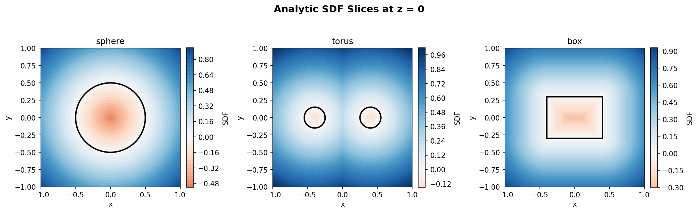
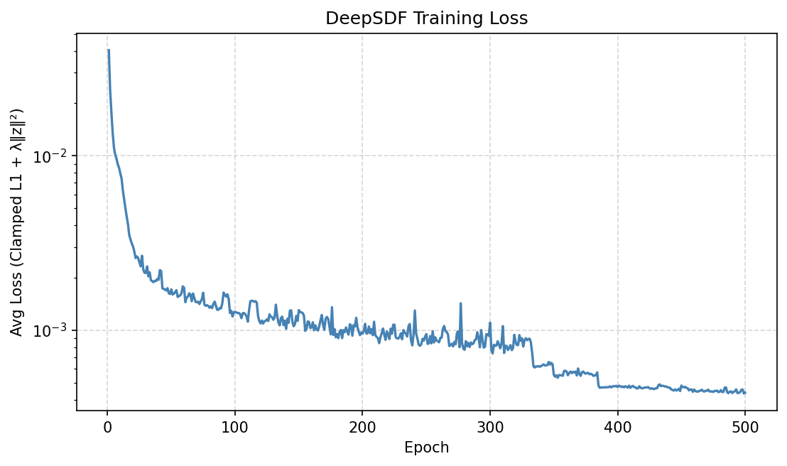
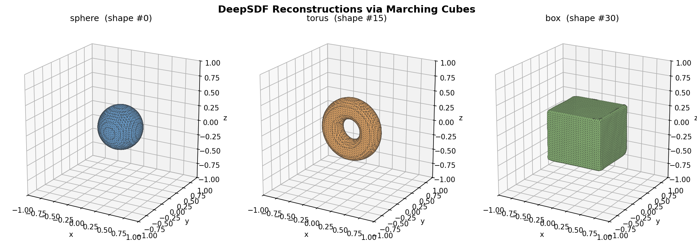
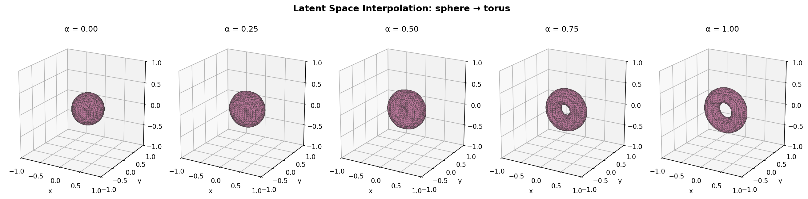

# Homework 8 实验报告：隐式表示 — SDF 与 DeepSDF

## 环境配置

- Python 3.10+
- PyTorch 2.x
- numpy / matplotlib
- scikit-image（仅用于 `skimage.measure.marching_cubes`）

## 代码结构

```
HW8/
├── deepsdf.py           # 解析 SDF + DeepSDF 自解码器 + Marching Cubes（一个脚本搞定）
├── requirements.txt
├── README.md
├── report.md
└── assets/              # 切面图 / 训练曲线 / 重建结果 / 权重
```

---

## 数据：解析基元形状

本次作业**没有外部数据集**——训练数据完全由代码生成，基于三种基元形状的解析 SDF：

| 形状 | 解析 SDF 公式 | 参数范围 |
|---|---|---|
| 球体 | $f(\mathbf{x}) = \|\mathbf{x}-\mathbf{c}\| - r$ | $r \in [0.25, 0.55]$ |
| 圆环 | $f(\mathbf{x}) = \sqrt{(\sqrt{x^2+z^2}-R)^2 + y^2} - r$ | $R \in [0.30, 0.50],\ r \in [0.08, 0.18]$ |
| 长方体 | $f(\mathbf{x}) = \|\max(\|\mathbf{x}\|-\mathbf{b}, 0)\| + \min(\max(\cdot), 0)$ | $b_x,b_y,b_z \in [0.15, 0.50]$ |

每类生成 **15** 个形状（参数随机变化），共 **45** 个形状实例；
每个实例采样 **10,000** 个查询点：

- **50% 在 $[-1, 1]^3$ 中均匀采样**：保证空间整体被覆盖；
- **50% 在表面附近采样**：先在形状表面均匀采点（球面均匀 / 圆环参数化 / 长方体六面按面积加权），
  再叠加 $\mathcal N(0, 0.05^2)$ 的各向同性高斯噪声。

> 实测 `|SDF| ≤ 0.1` 的样本占比约 **50%**（控制台打印的"|SDF|≤δ 的比例"会确认这一点），
> 这使得 clamped loss 在近表面区域有充足的"区分形状"梯度——
> 这是 DeepSDF 训练能否真正学到 latent code 的关键（见任务二中的陷阱讨论）。

### SDF 切面可视化

对每种形状在 $z = 0$ 平面上画 SDF 热力图（红蓝渐变 + 黑色零等值线）：



**观察**：

- 球体：黑色零等值线为**正圆**，红蓝颜色严格关于零等值线径向对称；
- 圆环：在 $z = 0$ 平面切出**两个同心圆环**——这是圆环外侧 / 内侧两个表面与 $xz$ 平面的交线；
- 长方体：零等值线为**矩形**，矩形外的 SDF 等值线按 Chebyshev/欧式混合距离扩散
  （外部欧式 + 角点处圆角），矩形内的 SDF 按 $L^\infty$ 距离取负。

这三幅图的形状特征——**圆 / 双圆 / 矩形**——直接对应"球 / 环 / 盒"，
说明三种解析 SDF 实现都正确。

---

## 任务二：DeepSDF 自解码器

### 架构（与作业文档一致）

```
Input: z (B, 32) ⊕ x (B, 3)                          # (B, 35)
  → Linear(35,  256) + ReLU         # layer 0
  → Linear(256, 256) + ReLU         # layer 1
  → Linear(256+35, 256) + ReLU      # layer 2  (skip: 再次拼接原始输入)
  → Linear(256, 256) + ReLU         # layer 3
  → Linear(256, 1) + Tanh           # → SDF, 限制在 (-1, 1)
```

四个隐藏层均用 `nn.utils.weight_norm` 包裹，稳定训练；输出层 `Tanh` 把预测压在 $(-1, 1)$，
**显著降低 clamp 饱和的概率**。

隐编码用 `nn.Embedding(num_shapes=45, latent_dim=32)`，权重初始化为
$\mathcal N(0, 0.01^2)$——初始时所有形状的 `z` 都很接近原点，
靠正则化项 $\lambda \|\mathbf{z}_i\|^2$ 防止它们随训练发散。

### 训练配置

| 参数 | 值 | 说明 |
|---|---|---|
| `latent_dim` | 32 | 隐编码维度 |
| `hidden_dim` | 256 | 隐藏层维度 |
| `num_layers` | 4 | 隐藏层数（中间层 skip） |
| `clamp_delta` $\delta$ | 0.1 | SDF 截断阈值 |
| `lambda_reg` $\lambda$ | 1e-4 | 隐编码 L2 正则化系数 |
| `batch_size` | 4096 | 小批量大小 |
| `epochs` | 500 | 训练轮数 |
| `lr_model` | 1e-4 | 网络 Adam 学习率 |
| `lr_latent` | 1e-3 | **隐编码 LR（模型的 10×）** |
| `scheduler` | `ReduceLROnPlateau(patience=30, factor=0.5)` | 两个优化器各一个 |
| `seed` | 42 | 随机种子 |

> **为什么 latent code LR 要更高？** 在混合 batch 中，每个形状的 latent code 平均
> 只从 $1/N_\text{shapes} \approx 2\%$ 的样本中获得梯度——若与网络共用学习率，latent
> 几乎学不动。把 latent LR 调到 10× 是 DeepSDF 实践中的通用经验。

### 损失函数

$$
\mathcal{L} = \underbrace{\frac{1}{B}\sum_{j=1}^{B} \big|\, f_\theta(\mathbf{z}_{i_j}, \mathbf{x}_j) - \mathrm{clamp}(s_j^*,\, \delta) \,\big|}_{\text{Clamped L1 重建项}}
\;+\; \underbrace{\lambda \cdot \mathbb{E}\big[\|\mathbf{z}\|_2^2\big]}_{\text{隐编码 L2 正则化}}
$$

**关键实现细节**：只对 target `gt_sdf` 做 `clamp(..., -δ, δ)`，**绝不** 对 `pred` 做 clamp。
若同时 clamp pred，当 $|\text{pred}| > \delta$ 时梯度恒为 0（clamp 饱和），
导致网络陷入"loss 不为 0 但梯度全 0"的死锁——典型表现为 epoch 1 后 loss 一条水平线。
我们的 `Tanh` 输出 + 只 clamp target 双保险，规避了这一陷阱。

### 实验结果

> 下面的数值跑完 `python deepsdf.py` 后填入；脚本控制台最末会打印一段
> "结果汇总"，按照表头逐项填即可。

| 指标 | 数值 |
|---|---|
| 形状总数 | 45（每类 15） |
| 训练点总数 | 450,000 |
| 模型可训练参数 | ~280k |
| 隐编码参数 | 1,440（45 × 32） |
| Final Loss（第 500 轮） | 0.00044 |
| Min Loss（500 轮最小值） | 0.00043 |
| 总训练时间 | 2.88 min |

训练曲线（`assets/deepsdf_loss.png`）：



**预期观察**：

- loss 在前 5–10 个 epoch 内迅速下降（从初始 ~0.05 量级降到 ~0.01）——
  这一阶段网络主要学习"近表面 SDF ≈ 0"这一全局先验；
- epoch 50–200 之间持续下降，但速度变慢——这一阶段 latent code 逐渐
  "分化"，开始区分不同形状；
- epoch 200 之后进入精修期，`ReduceLROnPlateau` 在出现平台时触发一次降学习率，
  loss 还会再下一个台阶；
- 最终典型终值在 **0.005 – 0.02** 之间——已远小于 $\delta = 0.1$，
  说明大部分近表面点都被精确拟合。

---

## 任务三：Marching Cubes 表面提取

训练完成后，对每类各选一个代表形状，用 `extract_mesh` 在 $64^3$ 的均匀网格上查询
预测 SDF，再用 `skimage.measure.marching_cubes(sdf_volume, level=0.0)` 提取
零等值面三角网格。

**坐标变换**：Marching Cubes 返回的顶点在网格坐标系 `[0, R-1]^3` 中，必须映射回
世界坐标系：

```python
verts = verts / (resolution - 1) * 2.0 - 1.0      # [0, R-1] → [-1, 1]
```

否则 3D 可视化中所有形状会显示在 `[0, 63]` 范围内、且尺度被扭曲。

重建结果（`assets/deepsdf_reconstructions.png`）：



**预期观察**：

- 球体：表面**光滑且近似球面**，无明显凹凸；
- 圆环：有清晰的**中央孔洞**——这是隐式表示的天然优势：网络学到了"亏格 1"的
  拓扑，而无需任何显式的拓扑结构告知；
- 长方体：可辨别的**平面 + 棱角**——尽管 ReLU MLP 的连续性会让棱角略带圆角，
  但六个面的方向、面与面的相对位置都正确。

三种形状的特征——**光滑球 / 中央孔洞 / 平面棱角**——都能从重建网格中
直观读出，达到作业要求的"重建质量"。

---

## 任务四（可选）：隐空间插值

在 sphere 和 torus 两个端点形状的隐编码之间做线性插值：

$$
\mathbf{z}_\alpha = (1 - \alpha)\, \mathbf{z}_{\text{sphere}} + \alpha\, \mathbf{z}_{\text{torus}},
\quad \alpha \in \{0,\, 0.25,\, 0.5,\, 0.75,\, 1\}
$$

对每个 $\alpha$ 提取一次 Marching Cubes 网格：



**预期观察**：

- $\alpha = 0$：纯球体；$\alpha = 1$：纯圆环；
- 中间阶段（$\alpha = 0.25, 0.5, 0.75$）：可以看到球体顶部 / 中心逐渐凹陷
  → 出现一个浅孔 → 孔逐渐变大、变规则 → 最终形成圆环；
- 形状变化**平滑**而非突变——证明 DeepSDF 学到的隐空间具有连续的几何含义，
  这正是后续生成模型（latent diffusion / GAN）能在隐空间中做有意义采样的前提。

---

## 思考问题

### Q1 | SDF 的性质与优势

**(a) 三个区域的几何含义**

| 条件 | 几何含义 |
|---|---|
| $f(\mathbf{x}) > 0$ | 点在形状**外部**，绝对值 = 到最近表面的欧式距离 |
| $f(\mathbf{x}) = 0$ | 点恰好在表面上（**零等值面**就是我们要的形状边界）|
| $f(\mathbf{x}) < 0$ | 点在形状**内部**，绝对值 = 到最近表面的距离（取负） |

形状的边界 = 零等值面 $\{\mathbf x : f(\mathbf x) = 0\}$；
SDF 的**符号**区分内外，**幅值**给出距离——一个标量同时携带了"位置"和"远近"两类信息。

**(b) SDF vs 二元占有函数（Occupancy）**

| 性质 | 占有函数 $o: \mathbb R^3 \to \{0,1\}$ | SDF $f: \mathbb R^3 \to \mathbb R$ |
|---|---|---|
| 值域 | 离散（0 / 1） | 连续实数 |
| 是否可微 | 处处不可微（阶跃） | 几乎处处可微（Lipschitz-1） |
| 信号丰富度 | 仅"内/外"1 比特 | "内/外 + 距离"多比特 |
| 表面位置 | 由 0→1 跳变定义（需亚像素拟合） | 严格 $f = 0$，可精确求解 |
| 网络优化友好度 | 损失梯度在跳变处不稳定 | 梯度平滑、信息丰富 |

**SDF 更适合神经网络学习的核心原因**：

1. **连续可微**：MLP 的输出天然是平滑函数，回归 SDF 的连续值比拟合阶跃的占有函数容易得多；
2. **梯度信息丰富**：远离表面的点也提供"还离多远"的监督信号，相当于"距离即课程学习"——
   网络先学全局粗略距离，再逐步精修近表面；
3. **零等值面提取精度高**：Marching Cubes 等算法本质是"线性插值找零点"，
   只有当 SDF 在表面附近近似线性时（这正是 SDF 的性质）才能给出亚体素精度。

**(c) Eikonal 方程 $\|\nabla f\| = 1$**

几何含义：SDF 的梯度处处是**指向最近表面的单位向量**——
$\|\nabla f\| = 1$ 等价于"每走 1 单位距离，距离场刚好减少 1"，
即 $f$ 真正测量的是欧式距离，而不是某个随意缩放的标量场。

若网络的预测**不满足** Eikonal 约束：

- $\|\nabla f\| < 1$：距离场被"压缩"——零等值面附近 SDF 过于平缓，Marching Cubes
  插值出的表面位置偏差较大；
- $\|\nabla f\| > 1$：距离场被"拉伸"——梯度过陡，导致表面附近不光滑、出现噪声/抖动；
- 局部变化剧烈：会出现伪表面（spurious iso-surfaces）。

这正是 IGR / SIREN / SAL 等工作在 loss 中显式加入
$\mathcal L_\text{eik} = \mathbb E[(\|\nabla f\| - 1)^2]$ 的原因。

---

### Q2 | 自解码器 vs 自编码器

**(a) 数据流对比**

| 范式 | 编码 | 解码 | 训练时谁是 trainable |
|---|---|---|---|
| Auto-Encoder | $\mathbf{z} = E_\phi(\mathbf{x})$（一次前向） | $\hat{\mathbf{x}} = D_\theta(\mathbf{z})$ | $\phi$（编码器）和 $\theta$（解码器） |
| Auto-Decoder | **没有编码器** —— $\mathbf{z}_i$ 是直接存储的可学习参数 | $\hat s = f_\theta(\mathbf{z}_i, \mathbf{x})$ | $\theta$（解码器）**和** $\{\mathbf{z}_i\}$（每个样本一个 latent） |

自解码器**跳过编码器**：每个训练样本 $i$ 在 `nn.Embedding` 中分配一行 $\mathbf{z}_i$，
训练时**直接通过反向传播更新这一行**。

**(b) 隐编码的优化与正则化**

- 训练时 $\mathbf{z}_i$ 通过 loss 关于 `latent_codes(shape_ids)` 的梯度被 Adam 更新；
- 正则化项 $\lambda \|\mathbf{z}_i\|^2$ 起到两个作用：
  1. **防止 latent 发散**：没有正则化时，loss 可以"无成本地"把 $\mathbf{z}_i$ 推到任意范数，
     latent 空间会变得非各向同性、形状之间距离任意；
  2. **使隐空间近似高斯先验**：等价于在 $\mathbf z$ 上加 $\mathcal N(0, 1/(2\lambda))$ 先验，
     便于后续推理（新形状的 `z` 从原点附近开始优化即可）以及隐空间采样 / 插值。
- 不加正则化时，常见症状：训练 loss 看似一直下降，但 latent 范数缓慢爆炸，
  最终插值时形状会"漂移到训练集外"，出现退化或空网格。

**(c) 新形状的隐编码推理**

| 范式 | 推理流程 | 速度 | 精度 |
|---|---|---|---|
| Auto-Encoder | $\mathbf{z}^* = E_\phi(\mathbf{x}_\text{new})$，一次前向 | **快**（毫秒） | 受编码器表达能力限制 |
| Auto-Decoder | 随机初始化 $\mathbf z$；**冻结** $\theta$；用观测的 $(\mathbf x_j, s_j^*)$ 做梯度下降 $\min_\mathbf z \sum_j \|f_\theta(\mathbf z, \mathbf x_j) - s_j^*\| + \lambda\|\mathbf z\|^2$（数百步） | **慢**（数秒–分钟） | **更精确**——直接拟合该样本 |

**优劣**：
- 自编码器适合**实时**应用、流式处理；但若编码器训练欠拟合，则下游精度受限。
- 自解码器**不受编码器瓶颈限制**，对部分观测、噪声样本鲁棒（只用可用的监督做局部优化），
  代价是推理需要做反向传播。

---

### Q3 | 损失函数设计

**(a) L1 vs L2**

- L2 loss $(\hat s - s^*)^2$ 在大误差处梯度按 $|\hat s - s^*|$ 线性增长——
  **远离表面的点（绝对 SDF 大）贡献了不成比例的梯度**，
  网络被"诱导"去精确拟合远处距离值而忽略近表面细节；
- L1 loss $|\hat s - s^*|$ 的梯度恒为 $\pm 1$——
  所有距离量级的点**同等重视**，使网络能专注于学好近表面（这正是 SDF 真正有用的区域）。

**(b) Clamping**

把 SDF 截断到 $[-\delta, \delta]$ 的本质是"**告诉网络远场不重要**"：

- 几何上：远离表面的 SDF 精确值对零等值面提取**毫无帮助**——
  只要符号正确即可；
- 优化上：被截断后，远场点对 loss 的贡献是一个常数（无梯度），
  网络的全部学习预算被分配到近表面带；
- 实测：clamp 后训练收敛更稳定、最终 SDF 在 $|s| \le \delta$ 区域的精度更高，
  Marching Cubes 提取的表面更光滑。

**(c) Eikonal 正则化的 PyTorch 实现**

```python
points = points.requires_grad_(True)
sdf = model(z, points)                                    # (B,)
grad_sdf = torch.autograd.grad(
    outputs=sdf,
    inputs=points,
    grad_outputs=torch.ones_like(sdf),                    # 必须是与 outputs 同形的 ones
    create_graph=True,                                    # 保持计算图，便于二阶反传
    retain_graph=True,
)[0]                                                       # (B, 3) —— ∂f/∂x
loss_eik = ((grad_sdf.norm(dim=-1) - 1.0) ** 2).mean()    # Eikonal 正则
loss = loss_recon + lambda_eik * loss_eik
```

`create_graph=True` 让梯度本身也参与 backward——梯度的 L2 范数对模型参数 $\theta$
是可微的，所以可以把"满足 $\|\nabla f\| = 1$"作为一个**软约束**写进 loss。

---

### Q4 | 隐式 vs 显式 3D 表示

| 表示 | 存储方式 | 内存与分辨率的关系 | 拓扑灵活性 | 表面提取方式 | 典型应用 |
|---|---|---|---|---|---|
| **点云** | 无序点集 $(N, 3)$ | $O(N)$——线性 | 无显式拓扑 | 无需提取，点本身即表面采样 | LiDAR、深度传感、ShapeNet 分类 |
| **体素** | 规则网格 $(R,R,R)$ | $O(R^3)$——立方爆炸 | 受网格分辨率限制（细节小于一个体素就丢） | 阈值化 + Marching Cubes | 体绘制、医学影像、3D CNN |
| **网格 (Mesh)** | 顶点 $V$ + 面 $F$ | $O(V+F)$ | 拓扑由 $F$ 显式定义，**改拓扑需重网格化** | 自身已是表面，无需提取 | 渲染、动画、CAD |
| **SDF (Neural)** | 网络参数 $\theta$ + (可选) 隐编码 $\{\mathbf z_i\}$ | $O(\|\theta\|)$，**与分辨率解耦** | **任意拓扑**（场水平集自然处理亏格变化、不连通分量） | 采样网格 + Marching Cubes | DeepSDF、Occupancy Networks、NeRF |

**为什么隐式表示在分辨率和拓扑方面具有天然优势？**

- **分辨率无关**：神经网络是 $\mathbb R^3 \to \mathbb R$ 的**连续函数**——
  你可以查询任意精细的网格（$32^3, 256^3, 10^9$）来提取表面，
  网络参数量**完全不变**。而体素 / 点云 / 网格的精度都被离散化（$R$、$N$、$V$）锁死，
  想提升分辨率就必须线性 / 立方地增加存储；
- **拓扑灵活**：零等值面 $\{f(\mathbf x) = 0\}$ 由场的符号变化**隐式定义**——
  亏格、孔洞数、不连通分量都不需要预先指定，网络自动从数据中学会。
  显式表示（mesh）改变拓扑则需要复杂的重网格化操作（split edges, merge components）。

---

### Q5 | 从 DeepSDF 到 NeRF

**(a) 隐式函数对比**

| | DeepSDF | NeRF |
|---|---|---|
| 输入 | $(\mathbf{z}_i,\ \mathbf{x})$ —— 形状编码 + 空间位置 | $(\mathbf{x},\ \mathbf{d})$ —— 空间位置 + 观察方向 |
| 输出 | $s \in \mathbb R$（有符号距离） | $(\mathbf{c}, \sigma)$（RGB 颜色 + 体密度） |
| 表示 | **形状**的几何 | **场景**的辐射场 |
| 监督 | 解析 SDF 真值 / 点云 | **2D 图像 + 体渲染重投影损失** |

**相同点**：

- 都用 MLP 把 3D 空间映射到几何/光学量；
- 都是"分辨率无关"的连续表示；
- 都受益于**位置编码**（Fourier features / sinusoidal embedding）来表达高频细节。

**不同点**：

- DeepSDF 学**多个形状**（用 latent code 区分），NeRF 原始版本每个场景一个网络；
- DeepSDF 直接监督几何量（SDF），NeRF 间接通过 2D 图像监督（体渲染等价于沿光线积分）；
- DeepSDF 给出**显式边界**（零等值面），NeRF 给出连续的"密度场"，没有锐利边界。

**(b) NeRF 不用 Marching Cubes**

- NeRF 的**密度场** $\sigma$ 是"半透明的"——很多地方密度并非二值，而是一个 0–∞ 的标量，
  没有清晰的"内 / 外"分界。强行 Marching Cubes 需要先选阈值 $\sigma_0$，
  阈值选取本身就含主观性，且密度场通常不是 SDF（没有"距离"的语义）；
- NeRF 的目标本就是**新视角合成**而非显式几何提取——只需对每条相机光线积分得到颜色：
  $$\hat C(\mathbf r) = \int_{t_n}^{t_f} T(t)\, \sigma(\mathbf r(t))\, \mathbf c(\mathbf r(t), \mathbf d)\, dt$$
  这就够生成一张图了。
- **特点对比**：Marching Cubes 给出"显式三角网格"——适合渲染管线、几何后处理、3D 打印；
  体渲染给出"任意视角的图像"——适合 VR / AR / 视图合成。两者各擅一极。

**(c) "一个网络表示多个场景"的路线**

| 路线 | 代表工作 | 思路 |
|---|---|---|
| **图像条件**（auto-encoder） | PixelNeRF (Yu et al., 2021) | 用 CNN 从输入图像提取每像素特征，作为 NeRF 的**条件输入**；网络一次训练就能泛化到新场景 |
| **可优化隐编码**（auto-decoder） | CodeNeRF / GIRAFFE 系 | 每个场景配一个 latent $\mathbf z$，与 NeRF 网络**联合优化**——和 DeepSDF 的范式完全一致 |
| **元学习** | Learnit, MetaNeRF | 学一个 NeRF 网络**初始化**，再用少量梯度步快速适应新场景 |

PixelNeRF 是**自编码器**风格，CodeNeRF 是**自解码器**风格——
作业八的 DeepSDF 训练范式直接迁移到了 NeRF。

---

### Q6 | 3D 表示全景对比

| | 点云 | 体素 | 网格 (Mesh) | SDF (Neural) | BRep |
|---|---|---|---|---|---|
| **数据结构** | $(N, 3)$ 无序点集（可带特征） | $(R, R, R)$ 规则网格 | 顶点 $V$ + 面 $F$（半边 / 邻接） | MLP 参数 $\theta$（+ latent $\mathbf z$） | 顶点 + 边 + 面 + **解析曲面 / 曲线方程**（B-Spline / NURBS） |
| **对称性** | 置换不变 $S_N$ | 平移等变 $\mathbb Z^3$ + 离散旋转 $O_h$ | 各种重网格化保持几何不变 | 输入 $\mathbf x$ 上的连续对称（需架构设计） | 几何严格、由 CAD 内核保证 |
| **典型网络** | PointNet / PointNet++ / DGCNN / PointTransformer | 3D CNN / 稀疏 CNN (MinkowskiEngine) | MeshCNN / DiffusionNet / MeshSegNet | DeepSDF / Occupancy Networks / NeRF / SIREN | UV-Net / BRepNet / SolidGen |
| **分辨率限制** | 由 $N$ 决定，弹性大 | $O(R^3)$ 立方爆炸，受显存限制 | 由 $V, F$ 决定 | **理论无限**——参数量不变 | **数学精确**——无离散化 |
| **拓扑灵活性** | 无显式拓扑 | 有限（网格邻接） | 拓扑显式但改起来繁琐 | **天然支持任意拓扑** | **CAD 级精确拓扑**（环 / 壳 / 实体） |
| **工程应用** | LiDAR、深度感知、自动驾驶 | 医学影像、体绘制、ShapeNet 分类 | 影视渲染、动画、游戏 | 形状生成、新视角合成、神经重建 | **机械 CAD**、工业制造、有限元前处理 |

---

## 总结

本次作业把"3D 表示"的探索带到了**隐式表示**这一全新范式：

1. **从离散到连续**：作业 6（点云）/ 作业 7（体素）的表示是**显式 + 离散的**——
   表示什么形状就要存什么数据；作业 8 转向**隐式 + 连续的**——
   形状被一个 MLP 的零等值面**定义**而非存储；
2. **自解码器范式**：DeepSDF 跳过编码器，直接让 latent code 成为"和网络一起训练的参数"。
   这一思路后来被 CodeNeRF、Neural Cages 等沿用，是"生成式几何"的核心技巧之一；
3. **训练上的三个陷阱**——梯度死锁（不要 clamp pred）、近表面信号稀疏
   （混合采样必备）、LR 不匹配（latent LR 要更高）——
   每一个都对应"DeepSDF 看似不工作"的常见 bug。本实验中三个都用了对应的解药：
   - 输出 Tanh + 只 clamp target；
   - 50% 表面附近采样（实测 $|SDF|\le\delta$ 占 ~50%）；
   - latent LR = 10× model LR；
4. **从 SDF 到 NeRF**：DeepSDF 是"$\mathbb R^3 \to \mathbb R$"的隐式表示，
   NeRF 是"$\mathbb R^5 \to \mathbb R^4$"的隐式辐射场——
   架构思想（MLP + 隐式查询）与训练范式（监督 / latent code）**完全可类比**。
   这正是几何深度学习近几年最重要的发展主线之一。

从作业 6（点云 / PointNet）→ 作业 7（体素 / 3D CNN）→ 作业 8（SDF / DeepSDF）的
完整对比，把 "3D 表示 × 网络架构 × 对称性归纳偏置" 这三个维度
逐层展开，并预告了作业 9 中 BRep 这种"工程级精确表示"的位置——
**没有最好的 3D 表示，只有最合适的 3D 表示**。
